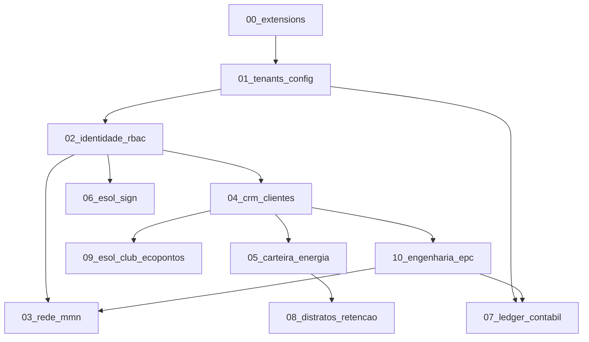

# 🗄️ Esol Energy — Esquema de Banco de Dados Modular

> **Banco:** PostgreSQL 15+ (Supabase)  
> **Versão do Schema:** v11  
> **Atualizado em:** Julho/2026

---

## 📋 Índice de Módulos

| # | Arquivo | Domínio | Tabelas | Enums | Triggers |
|:---:|:---|:---|:---:|:---:|:---:|
| 00 | `00_extensions.sql` | Extensões PostgreSQL | — | — | — |
| 01 | `01_tenants_config.sql` | Tenants, Tributação, Cupons, Combos | 5 | 2 | — |
| 02 | `02_identidade_rbac.sql` | Profiles, Roles, RBAC, Cap Table, OPEX | 5 | 4 | — |
| 03 | `03_rede_mmn.sql` | Rede MMN (ltree hierárquica) | 1 | — | — |
| 04 | `04_crm_clientes.sql` | CRM, Leads, Pipeline | 1 | 1 | — |
| 05 | `05_carteira_energia.sql` | Carteira GD/MLE (Recorrência) | 1 | 2 | — |
| 06 | `06_esol_sign.sql` | Assinaturas, KYC, Minutas Jurídicas | 2 | 2 | — |
| 07 | `07_ledger_contabil.sql` | Plano de Contas, Lançamentos, Hash Chain | 2 | 1 | 2 |
| 08 | `08_distratos_retencao.sql` | Distratos, Conformidade | 1 | — | — |
| 09 | `09_esol_club_ecopontos.sql` | EcoPoints, Resgates, Fidelidade | 2 | 1 | — |
| 10 | `10_engenharia_epc.sql` | EPC Turnkey (7 Fases Completas) | 7 | 9 | 2 |
| — | **TOTAL** | — | **27** | **22** | **4** |

---

## 🔗 Grafo de Dependências (Ordem de Execução)



**Regra:** Um módulo SÓ pode referenciar (FK) tabelas de módulos com número **menor** que o seu, com exceção do módulo `10_engenharia_epc.sql` que referencia `07_ledger_contabil.sql` (FK cruzada via triggers).

---

## 🚀 Script de Execução Orquestrada

### PowerShell (Windows)
```powershell
# Concatena todos os módulos na ordem correta e gera o monolítico
$modules = @(
  "00_extensions.sql",
  "01_tenants_config.sql",
  "02_identidade_rbac.sql",
  "03_rede_mmn.sql",
  "04_crm_clientes.sql",
  "05_carteira_energia.sql",
  "06_esol_sign.sql",
  "07_ledger_contabil.sql",
  "08_distratos_retencao.sql",
  "09_esol_club_ecopontos.sql",
  "10_engenharia_epc.sql"
)

$header = @"
-- ==============================================================================
-- 🗄️ ESOL ENERGY — ESQUEMA DE BANCO DE DADOS DDL COMPLETO (v11)
-- Banco de Dados: PostgreSQL (Supabase)
-- ⚠️  ESTE ARQUIVO É GERADO AUTOMATICAMENTE POR CONCATENAÇÃO DOS MÓDULOS.
-- ⚠️  NÃO EDITE DIRETAMENTE. Edite o módulo correspondente em docs/database/
-- ==============================================================================

"@

$output = $header
foreach ($mod in $modules) {
  $output += "`n`n"
  $output += (Get-Content "docs/database/$mod" -Raw)
}
$output | Set-Content "docs/esol_banco_dados_ddl_completo.sql" -Encoding UTF8
Write-Host "✅ Monolítico regenerado com sucesso!"
```

### Bash (Linux/Mac)
```bash
#!/bin/bash
# Concatena todos os módulos na ordem correta
cat \
  docs/database/00_extensions.sql \
  docs/database/01_tenants_config.sql \
  docs/database/02_identidade_rbac.sql \
  docs/database/03_rede_mmn.sql \
  docs/database/04_crm_clientes.sql \
  docs/database/05_carteira_energia.sql \
  docs/database/06_esol_sign.sql \
  docs/database/07_ledger_contabil.sql \
  docs/database/08_distratos_retencao.sql \
  docs/database/09_esol_club_ecopontos.sql \
  docs/database/10_engenharia_epc.sql \
  > docs/esol_banco_dados_ddl_completo.sql

echo "✅ Monolítico regenerado com sucesso!"
```

---

## 📝 Regras de Contribuição

1. **Onde editar:** Sempre edite o **módulo individual** (`docs/database/XX_nome.sql`), nunca o monolítico diretamente.
2. **Regenerar o monolítico:** Após editar um módulo, execute o script acima para regenerar o `esol_banco_dados_ddl_completo.sql`.
3. **Novo módulo:** Numere sequencialmente (`11_novo_modulo.sql`), atualize este README e o script de concatenação.
4. **FKs cruzadas:** Se o novo módulo referenciar tabelas de módulos com número maior, documente a dependência circular aqui.
5. **Enums existentes:** Para adicionar valores a enums existentes em outro módulo, use `ALTER TYPE ... ADD VALUE` no módulo que **usa** o novo valor.

---

## 🗺️ Mapa de FKs Cruzadas entre Módulos

| Módulo Origem | Módulo Destino | FK |
|:---|:---|:---|
| `10_engenharia_epc` | `07_ledger_contabil` | Trigger `trg_projeto_epc_concluido_ledger` → `ledger_lancamentos` |
| `10_engenharia_epc` | `03_rede_mmn` | Trigger `trg_projeto_epc_comissao_mmn` → `rede_mmn` |
| `08_distratos_retencao` | `06_esol_sign` | FK `assinatura_distrato_id` → `assinaturas_esol_sign` |

---

## 📂 Arquivo Monolítico de Referência

O arquivo `esol_banco_dados_ddl_completo.sql` (na raiz de `docs/`) é a **versão consolidada** de todos os módulos acima. Ele é mantido como referência de leitura e para compatibilidade com ferramentas que exigem um único arquivo SQL.

> ⚠️ **Não edite o monolítico diretamente.** Edite o módulo correspondente e regenere.
