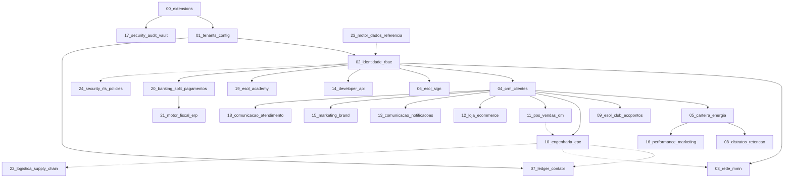

# 🗄️ Esol Energy — Esquema de Banco de Dados Modular

> **Banco:** PostgreSQL 15+ (Supabase)  
> **Versão do Schema:** v26 (Storage Buckets, RLS por Pasta, Cofre de Segurança)  
> **Atualizado em:** Julho/2026

---

## 📋 Índice de Módulos

| # | Arquivo | Domínio |
|:---:|:---|:---|
| 00 | `00_extensions.sql` | Extensões PostgreSQL (ltree, pgcrypto) |
| 01 | `01_tenants_config.sql` | Tenants, Tributação, Overhead, Cupons, Combos |
| 02 | `02_identidade_rbac.sql` | Profiles, Roles, RBAC, Cap Table, OPEX |
| 03 | `03_rede_mmn.sql` | Rede MMN (ltree hierárquica) |
| 04 | `04_crm_clientes.sql` | CRM, Leads, Pipeline, Personas, Throttling |
| 05 | `05_carteira_energia.sql` | Carteira GD/MLE (Recorrência) |
| 06 | `06_motor_assinaturas.sql` | Assinaturas, KYC, Minutas Jurídicas |
| 07 | `07_ledger_contabil.sql` | Plano de Contas, Lançamentos, Hash Chain |
| 08 | `08_distratos_retencao.sql` | Distratos, Conformidade, Funil WhatsApp |
| 09 | `09_clube_fidelidade.sql` | EcoPoints, Resgates, Fidelidade |
| 10 | `10_engenharia_epc.sql` | EPC Turnkey (7 Fases Completas) |
| 11 | `11_pos_vendas_om.sql` | Pós-Venda, O&M, Agendamentos, Avaliações |
| 12 | `12_loja_ecommerce.sql` | Catálogo de Produtos, Pedidos, Itens |
| 13 | `13_comunicacao_notificacoes.sql` | Templates, Fila de Notificações, Gatilhos |
| 14 | `14_developer_api.sql` | API Keys, Webhooks, Edge Functions, Logs |
| 15 | `15_marketing_brand.sql` | DAM, SMM, Artes Consultor, Campanhas |
| 16 | `16_performance_marketing.sql` | UTM, Server-Side CAPI, ROAS, Pixels |
| 17 | `17_security_audit_vault.sql` | Lixeira de Dados, Time Machine (Snapshots) |
| 18 | `18_comunicacao_atendimento.sql` | Tickets, Chat Interno, Ouvidoria, Protocolos |
| 19 | `19_esol_academy.sql` | Universidade EAD, Feed, Manuais de Vendas |
| 20 | `20_banking_split_pagamentos.sql` | BaaS, Split Recebíveis, Gateway (Asaas/Stripe) |
| 21 | `21_motor_fiscal_erp.sql` | Nota Fiscal, Autofaturamento, eNotas/Omie |
| 22 | `22_logistica_supply_chain.sql` | Logística, Tracking Rastreio Kits EPC |
| 23 | `23_motor_dados_referencia.sql` | Tarifas ANEEL, Snapshot/Rollback de Dados |
| 24 | `24_security_rls_policies.sql` | Row Level Security, Prevenção IDOR, MFA AAL2 |
| 25 | `25_supabase_storage_setup.sql` | Storage Buckets (7 Cofres), MIME Types, RLS de Pastas |

---

## 🔗 Grafo de Dependências (Ordem de Execução)



---

## 🚀 Script de Execução Orquestrada

### PowerShell (Windows)
```powershell
# Concatena todos os 25 módulos na ordem correta e gera o monolítico
$modules = @(
  "00_extensions.sql",
  "01_tenants_config.sql",
  "02_identidade_rbac.sql",
  "03_rede_mmn.sql",
  "04_crm_clientes.sql",
  "05_carteira_energia.sql",
  "06_motor_assinaturas.sql",
  "07_ledger_contabil.sql",
  "08_distratos_retencao.sql",
  "09_clube_fidelidade.sql",
  "10_engenharia_epc.sql",
  "11_pos_vendas_om.sql",
  "12_loja_ecommerce.sql",
  "13_comunicacao_notificacoes.sql",
  "14_developer_api.sql",
  "15_marketing_brand.sql",
  "16_performance_marketing.sql",
  "17_security_audit_vault.sql",
  "18_comunicacao_atendimento.sql",
  "19_esol_academy.sql",
  "20_banking_split_pagamentos.sql",
  "21_motor_fiscal_erp.sql",
  "22_logistica_supply_chain.sql",
  "23_motor_dados_referencia.sql",
  "24_security_rls_policies.sql"
)

$header = @"
-- ==============================================================================
-- 🗄️ ESOL ENERGY — ESQUEMA DE BANCO DE DADOS DDL COMPLETO (v25)
-- Banco de Dados: PostgreSQL (Supabase)
-- ⚠️  ESTE ARQUIVO É GERADO AUTOMATICAMENTE POR CONCATENAÇÃO DOS MÓDULOS.
-- ⚠️  NÃO EDITE DIRETAMENTE. Edite o módulo correspondente em docs/database/
-- ==============================================================================

"@

$output = $header
foreach ($mod in $modules) {
  $output += "`n`n"
  $output += (Get-Content "docs/database/$mod" -Raw)
}
$output | Set-Content "docs/esol_banco_dados_ddl_completo.sql" -Encoding UTF8
Write-Host "✅ Monolítico regenerado com sucesso!"
```

### Bash (Linux/Mac)
```bash
#!/bin/bash
# Concatena todos os 25 módulos na ordem correta
cat \
  docs/database/00_extensions.sql \
  docs/database/01_tenants_config.sql \
  docs/database/02_identidade_rbac.sql \
  docs/database/03_rede_mmn.sql \
  docs/database/04_crm_clientes.sql \
  docs/database/05_carteira_energia.sql \
  docs/database/06_motor_assinaturas.sql \
  docs/database/07_ledger_contabil.sql \
  docs/database/08_distratos_retencao.sql \
  docs/database/09_clube_fidelidade.sql \
  docs/database/10_engenharia_epc.sql \
  docs/database/11_pos_vendas_om.sql \
  docs/database/12_loja_ecommerce.sql \
  docs/database/13_comunicacao_notificacoes.sql \
  docs/database/14_developer_api.sql \
  docs/database/15_marketing_brand.sql \
  docs/database/16_performance_marketing.sql \
  docs/database/17_security_audit_vault.sql \
  docs/database/18_comunicacao_atendimento.sql \
  docs/database/19_esol_academy.sql \
  docs/database/20_banking_split_pagamentos.sql \
  docs/database/21_motor_fiscal_erp.sql \
  docs/database/22_logistica_supply_chain.sql \
  docs/database/23_motor_dados_referencia.sql \
  docs/database/24_security_rls_policies.sql \
  > docs/esol_banco_dados_ddl_completo.sql

echo "✅ Monolítico de v25 regenerado com sucesso!"
```
