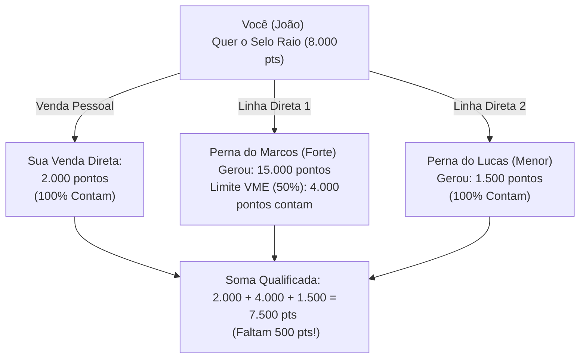

# 📘 MANUAL OFICIAL DE RECONHECIMENTO E SELOS
## PROGRAMA DE QUALIFICAÇÃO — VIGÊNCIA 2026

---

**Documento:** Manual de Selos, Metas e Campanhas de Incentivo  
**Ano Operacional:** 2026  
**Versão:** 1.0.3 (Pronto para Exportação em PDF)  
**Holding:** Esol Energy S.A.  
**Público-Target:** Consultores Independentes e Parceiros Indicadores  

---

## 🗺️ MENSAGEM INSTITUCIONAL
Bem-vindo ao **Programa de Reconhecimento e Selos 2026** da maior holding de transição energética do Brasil. A nossa missão é transformar a maneira como o país consome energia, e você, como parceiro comercial autônomo, é a nossa principal força de expansão.

Este manual contém todas as regras de metas e as campanhas de prêmios vigentes para o ano operacional de **2026**. Ele foi desenhado para ser transparente, meritocrático e matematicamente sustentável, garantindo o crescimento saudável do nosso ecossistema.

---

## 1. 🛡️ DIRETRIZES DE SEGURANÇA E RELAÇÃO JURÍDICA
Para garantir a integridade do ecossistema Esol e a sua segurança jurídica como parceiro independente, observe as seguintes regras:
*   **Independência Profissional:** O consultor é um parceiro comercial autônomo. Não há relação de subordinação, cumprimento de horários, exclusividade ou vínculo empregatício (CLT) com a Esol Energy. A atividade é baseada em livre indicação e corretagem de soluções de energia.
*   **Terminologia Proibida (CLT-Safe):** É expressamente proibido o uso de cargos corporativos (ex: *"Diretor"*, *"Presidente"*, *"Gerente"*, *"Supervisor"*, *"Coordenador"*) ou termos hierárquicos internos para se referir às qualificações obtidas. O programa adota exclusivamente nomenclaturas baseadas no Espaço e nos estados físicos da Energia (*Faísca, Chama, Fogueira, Nuvem, Raio, Trovão, Céu, Atmosfera, Órbita, Lua, Terra, Sol, Meteoro, Cometa, Estrela, Polaris, Constelação, Nebulosa, Supernova, Galáxia, Universo*).
*   **Desacoplamento de Prêmios (Campanhas Dinâmicas):** O alcance de um nível de selo no banco de dados representa apenas uma qualificação honorífica. Os presentes, prêmios ou viagens associados a cada nível pertencem a **Campanhas de Incentivo** dinâmicas criadas pela diretoria com validade e vigência predefinidas, podendo ser ajustados conforme a estratégia de mercado da holding.

---

## 2. 📊 COMO VOCÊ ACUMULA PONTOS
Os pontos são gerados a partir do faturamento real de cada negócio fechado por você (venda direta) ou pela sua equipe de consultores independentes (rede de indicação MMN):

### A. Sistemas Solares Turnkey (Cat #1 e #10)
*   Vendas até R$ 20.000,00: **200 pontos**
*   Vendas de R$ 20.001,00 a R$ 45.000,00: **500 pontos**
*   Vendas de R$ 45.001,00 a R$ 100.000,00: **1.200 pontos**
*   Vendas de R$ 100.001,00 a R$ 500.000,00: **4.500 pontos**
*   Vendas acima de R$ 500.001,00: **15.000 pontos**

### B. Recorrência: Energia por Assinatura (GD) e Mercado Livre (MLE)
*   Mensalidade/Consumo do cliente até R$ 500,00/mês: **10 pontos / mês ativo**
*   Mensalidade/Consumo do cliente de R$ 501,00 a R$ 2.000,00/mês: **40 pontos / mês ativo**
*   Mensalidade/Consumo do cliente de R$ 2.001,00 a R$ 10.000,00/mês: **200 pontos / mês ativo**
*   Mensalidade/Consumo do cliente acima de R$ 10.001,00/mês: **800 pontos / mês ativo**

### C. Loja Esol (Kits avulsos, Baterias, Carregadores) (Cat #2)
*   Carrinho de compras até R$ 5.000,00: **50 pontos**
*   Carrinho de compras de R$ 5.001,00 a R$ 15.000,00: **150 pontos**
*   Carrinho de compras de R$ 15.001,00 a R$ 50.000,00: **500 pontos**
*   Carrinho de compras acima de R$ 50.001,00: **1.500 pontos**

---

## 3. ⏳ REGRAS DE VALIDADE (JANELA DESLIZANTE DE 12 MESES)
Os pontos de qualificação não são zerados no primeiro dia de cada mês. Eles possuem validade de **365 dias** a partir da data de faturamento de cada negócio fechado.
*   *Como funciona:* No dia 1º de cada mês, os pontos gerados há mais de 12 meses expiram do seu saldo de qualificação. Isso garante que o selo reflita a produtividade atualizada da sua rede comercial nos últimos 365 dias.

---

## 4. ⚖️ REGRA DE EQUILÍBRIO (VOLUME MÁXIMO POR EQUIPE - VME DE 50%)
Para garantir a sustentabilidade do caixa e premiar o trabalho de expansão equilibrado, aplicamos a trava **VME de 50%**.
*   **Definição:** O consultor só pode aproveitar, no máximo, **50% da pontuação exigida** para o selo alvo vinda de uma única linha de indicação direta (equipe de um indicado direto).
*   **Objetivo:** Evitar o "Efeito Carona", estimulando o consultor a desenvolver novos parceiros e atuar em pelo menos **2 ou 3 equipes ativas**.

### Exemplo Visual de VME para o Selo Raio (8.000 pontos):

---

## 5. 🏆 NÍVEIS DE SELOS E PRÊMIOS DA CAMPANHA 2026
Abaixo estão os 21 selos de reconhecimento e a configuração oficial de prêmios vigentes para o ano de **2026**:

| Nível | Selo de Reconhecimento | pontos Mínimos | Insígnia Visual | Prêmio da Campanha Vigente (2026) |
| :---: | :--- | :---: | :---: | :--- |
| **L1** | **Semente** | 0 | 🌱 | **Smartphone & Kit Boas-Vindas:** Smartphone 5G de R$ 950,00 + Kit Premium. *(Liberado com 2.000 pts pessoais)*. |
| **L2** | **Raiz** | 2.500 | 🌳 | **Estação de Trabalho Móvel:** Notebook Lenovo/ASUS + Mochila Executiva de R$ 1.750,00. |
| **L3** | **Rocha** | 5.000 | 🪨 | **Apresentação Móvel de Impacto:** Kit Apresentador (Projetor Smart Samsung The Freestyle + Soundbar JBL) de R$ 2.400,00. |
| **L4** | **Gota** | 10.000 | 💧 | **Aceleração Comercial:** Auxílio de Custo Comercial de R$ 5.000,00 para ativação de mercado. |
| **L5** | **Nascente** | 15.000 | 🌊 | **Apresentação Digital & Treinamento:** Tablet iPad 10.2" com Caneta Digital + Imersão VIP de 3 dias na sede de R$ 6.000,00. |
| **L6** | **Rio** | 25.000 | 🏞️ | **Scooter Elétrica Premium:** Scooter 0km no valor de R$ 17.000,00 (frete incluso e entregue em seu nome). |
| **L7** | **Brisa** | 40.000 | 🍃 | **Férias Premium Nacionais:** Viagem de 5 dias para Fernando de Noronha/Porto de Galinhas com tudo pago + R$ 5.000,00 de Bônus. |
| **L8** | **Vento** | 60.000 | 💨 | **Inteligência de Mercado Global:** Viagem de 7 dias com acompanhante para a feira *Intersolar Europe em Munique* (Tudo Pago). |
| **L9** | **Ciclone** | 100.000 | 🌀 | **Hub de Vendas Regional:** Verba de R$ 35.000,00 para montagem e fachada do Escritório/Showroom local Esol. |
| **L10** | **Faísca** | 150.000 | ✨ | **Missão Internacional de Negócios:** Viagem de 10 dias para a China (fábricas BYD/Longi) c/ acompanhante + R$ 10.000,00. |
| **L11** | **Chama** | 250.000 | 🔥 | **Carro Hatch Premium 0km:** Hyundai HB20, Chevrolet Onix ou VW Polo quitado no valor de R$ 95.000,00. |
| **L12** | **Fogueira** | 400.000 | 🪵 | **Férias Volta ao Mundo:** Viagem de Volta ao Mundo (crédito de R$ 70.000,00) + R$ 30.000,00 de Bônus em Dinheiro. |
| **L13** | **Lua** | 600.000 | 🌙 | **SUV de Luxo 0km:** Jeep Compass, Toyota Corolla Cross ou BYD Song Plus quitado no valor de R$ 200.000,00. |
| **L14** | **Planeta** | 900.000 | 🪐 | **Sedan Elétrico Premium 0km:** BYD Seal ou Volvo EX30 quitado no valor de R$ 300.000,00. |
| **L15** | **Sol** | 1.500.000 | ☀️ | **Showroom Residencial Off-Grid:** Usina Solar Residencial Premium SolarEdge com Armazenamento por Baterias (R$ 100.000,00) + R$ 300.000,00 em Dinheiro. |
| **L16** | **Estrela** | 2.500.000 | ⭐ | **Sede Comercial Regional:** Escritório/Sala Comercial Premium quitada de R$ 500.000,00 + Relógio Rolex de R$ 100.000,00. |
| **L17** | **Constelação**| 4.000.000 | 🌌 | **Apartamento Frente Mar:** Cobertura de Alto Padrão Frente Mar quitada e escriturada no valor de R$ 1.2 Milhão. |
| **L18** | **Nebulosa** | 6.000.000 | ☁️ | **Superesportivo & Estilo de Vida:** Porsche Taycan, Audi e-tron ou BMW iX quitado (R$ 800.000,00) + R$ 600.000,00 em Dinheiro. |
| **L19** | **Supernova** | 10.000.000| 💥 | **Super Mansão de Luxo:** Mansão de Altíssimo Luxo em Condomínio Fechado quitada e escriturada de R$ 2.0 Milhões. |
| **L20** | **Galáxia** | 20.000.000| 🌀 | **Usina de 1MW & Renda Vitalícia:** Usina Solar 1MWp (R$ 3.5M) + Contrato de Arrendamento de R$ 35.000,00/mês. |
| **L21** | **Universo** | 35.000.000| 🪐 | **Usina de 2MW, Renda & Governança:** Usina de 2MWp (R$ 7.0M) + Aluguel de R$ 70.000,00/mês + Equity + Troféu + Conselho. |

---

## 6. 📥 PROCESSO DE AUDITORIA, VALIDAÇÃO E ENTREGA
*   **Notificação de Qualificação:** Quando o aplicativo detecta o acúmulo de pontos necessários e o cumprimento da regra VME, a qualificação é exibida como "Aguardando Auditoria".
*   **Prazo de Auditoria:** O backoffice da holding tem até **30 dias** para auditar a adimplência das vendas que geraram a pontuação (verificação de cancelamentos de assinaturas ou inadimplência).
*   **Entrega:** Uma vez aprovado, o prêmio físico é despachado para o endereço cadastrado do consultor independente, ou as viagens são agendadas pela equipe de concierge de marketing da holding.
