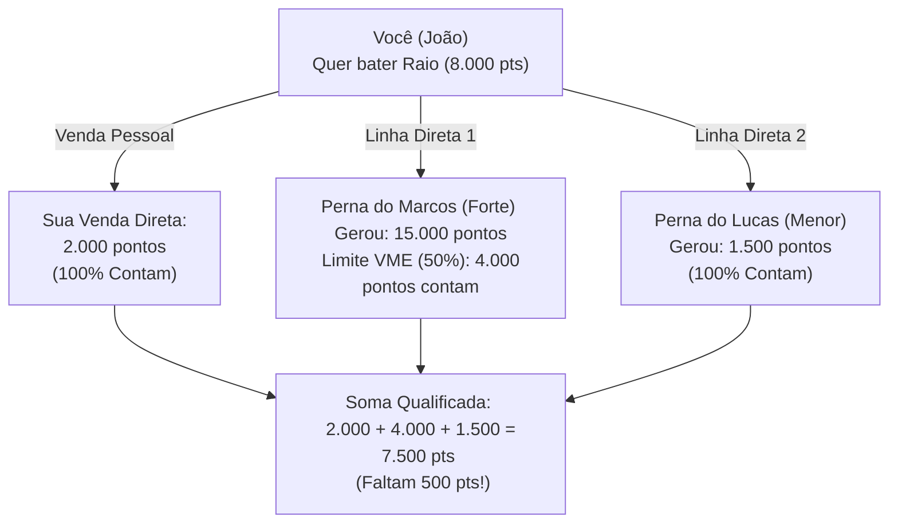

# 📘 MANUAL OFICIAL DE CARREIRA E PREMIAÇÕES
## ESOL CAREER — VIGÊNCIA 2026

---

**Documento:** Manual de Diretrizes, Metas e Campanhas  
**Ano Operacional:** 2026  
**Versão:** 1.0.2 (Pronto para Exportação em PDF)  
**Holding:** Esol Energy S.A.  
**Público-Alvo:** Consultores, Parceiros de Negócios e Líderes de Rede  

---

## 🗺️ MENSAGEM DA PRESIDÊNCIA
Bem-vindo ao **Esol Career 2026**, o programa de reconhecimento, gamificação e premiação da maior holding de transição energética do Brasil. A nossa missão é transformar a maneira como o país consome energia, e você é a nossa principal força de expansão.

Este manual contém todas as regras, pontuações e prêmios vigentes para o ano operacional de **2026**. Ele foi desenhado para ser transparente, meritocrático e matematicamente sustentável, garantindo que o seu crescimento seja sólido e vitalício.

---

## 1. 🛡️ DIRETRIZES DE SEGURANÇA E RELAÇÃO JURÍDICA
Para garantir a integridade do ecossistema Esol e a sua segurança jurídica, observe as seguintes regras:
*   **Independência Profissional:** O consultor é um parceiro comercial autônomo. Não há relação de subordinação, cumprimento de horários ou vínculo empregatício (CLT) com a Esol Energy.
*   **Terminologia Proibida (CLT-Safe):** É expressamente proibido o uso de cargos corporativos (ex: *"Diretor"*, *"Gerente"*, *"Presidente"*, *"Supervisor"*) para se referir às conquistas ou graduações do plano. O plano adota exclusivamente nomenclaturas baseadas no Espaço e nos estados físicos da Energia (*Faísca, Chama, Raio, Lua, Terra, Órbita, Cometa, Eclipse, Estrela, Sol, Constelação, Galáxia*).
*   **Desacoplamento Contratual (Campanhas Dinâmicas):** As graduações de nível são fixas na carreira do consultor. No entanto, os prêmios físicos ou financeiros associados a cada nível pertencem a **Campanhas de Incentivo** dinâmicas com validade e vigência predefinidas pela diretoria, podendo ser ajustados anualmente de acordo com a estratégia de caixa da holding.

---

## 2. 📊 COMO VOCÊ ACUMULA PONTOS
Os pontos são gerados a partir do faturamento real de cada venda fechada por você (venda direta) ou pela sua equipe de consultores indicados (rede MMN):

### A. Sistemas Solares Turnkey (Cat #1 e #10)
*   Vendas até R$ 20.000,00: **200 pontos**
*   Vendas de R$ 20.001,00 a R$ 45.000,00: **500 pontos**
*   Vendas de R$ 45.001,00 a R$ 100.000,00: **1.200 pontos**
*   Vendas de R$ 100.001,00 a R$ 500.000,00: **4.500 pontos**
*   Vendas acima de R$ 500.001,00: **15.000 pontos**

### B. Recorrência: Energia por Assinatura (GD) e Mercado Livre (MLE)
*   Mensalidade/Consumo do cliente até R$ 500,00/mês: **10 pontos / mês ativo**
*   Mensalidade/Consumo do cliente de R$ 501,00 a R$ 2.000,00/mês: **40 pontos / mês ativo**
*   Mensalidade/Consumo do cliente de R$ 2.001,00 a R$ 10.000,00/mês: **200 pontos / mês ativo**
*   Mensalidade/Consumo do cliente acima de R$ 10.001,00/mês: **800 pontos / mês ativo**

### C. Loja Esol (Kits avulsos, Baterias, Carregadores) (Cat #2)
*   Carrinho de compras até R$ 5.000,00: **50 pontos**
*   Carrinho de compras de R$ 5.001,00 a R$ 15.000,00: **150 pontos**
*   Carrinho de compras de R$ 15.001,00 a R$ 50.000,00: **500 pontos**
*   Carrinho de compras acima de R$ 50.001,00: **1.500 pontos**

---

## 3. ⏳ REGRAS DE VALIDADE (JANELA DESLIZANTE DE 12 MESES)
Os pontos de qualificação de carreira não são zerados no primeiro dia de cada mês. Eles possuem validade de **365 dias** a partir da data de faturamento de cada venda.
*   *Como funciona:* No dia 1º de cada mês, os pontos gerados há mais de 12 meses expiram do seu saldo de qualificação. Isso garante que a graduação reflita a atividade constante e a produtividade atualizada da sua rede comercial.

---

## 4. ⚖️ REGRA DE EQUILÍBRIO (VOLUME MÁXIMO POR EQUIPE - VME DE 50%)
Para garantir a sustentabilidade do caixa e premiar a liderança real, aplicamos a trava **VME de 50%**.
*   **Definição:** O consultor só pode aproveitar, no máximo, **50% da pontuação exigida** para o nível alvo vinda de uma única linha de indicação direta (equipe de um indicado).
*   **Objetivo:** Evitar o "Efeito Carona", forçando o consultor a desenvolver lateralidade e atuar em pelo menos **2 ou 3 equipes ativas**.

### Exemplo Visual de VME para o Nível Raio (8.000 pontos):

---

## 5. 🏆 NÍVEIS DE GRADUAÇÃO E PRÊMIOS DA CAMPANHA 2026
Abaixo estão os 12 níveis de prestígio e a configuração oficial de prêmios vigentes para o ano de **2026**:

| Nível | Graduação | pontos Mínimos | Insígnia Visual | Prêmio da Campanha Vigente (2026) |
| :---: | :--- | :---: | :---: | :--- |
| **L1** | **Faísca** | 0 | ✨ | **Kit Premium de Boas-Vindas:** Crachá PVC + Caderno Couro + Caneta Metal + Polo Oficial + Garrafa Térmica + Boné Trucker 3D. *(Liberado após acumular 1.000 pontos pessoais)*. |
| **L2** | **Chama** | 2.500 | 🔥 | **Smartphone Executivo:** Smartphone Corporativo no valor de R$ 900,00 para suporte comercial. |
| **L3** | **Raio** | 8.000 | ⚡ | **Notebook Corporativo:** Notebook Dell ou Lenovo de Alta Performance no valor de R$ 3.500,00. |
| **L4** | **Lua** | 20.000 | 🌙 | **iPad com Caneta Digital:** Tablet iPad de 10.2" com capa protetora + Viagem de Imersão VIP de 3 dias na sede corporativa. |
| **L5** | **Terra** | 50.000 | 🌍 | **Scooter Elétrica 0km:** Scooter Elétrica Urbana (Watts/Voltz no valor de R$ 15.000,00 quitada). |
| **L6** | **Órbita** | 120.000 | 💫 | **Viagem VIP Nacional:** Viagem de 5 dias com acompanhante para Resort 5 estrelas em Porto de Galinhas com tudo pago. |
| **L7** | **Cometa** | 300.000 | ☄️ | **Viagem VIP Internacional:** Viagem de 7 dias com acompanhante para a feira *Intersolar Europe em Munique, Alemanha*. |
| **L8** | **Eclipse** | 800.000 | 🌑 | **Carro Hatch Premium 0km:** Hyundai HB20, Chevrolet Onix ou VW Polo quitado no valor de R$ 95.000,00. |
| **L9** | **Estrela** | 2.000.000 | ⭐ | **SUV de Luxo 0km:** Jeep Compass, Toyota Corolla Cross ou BYD Song Plus quitado no valor de R$ 200.000,00. |
| **L10** | **Sol** | 5.000.000 | ☀️ | **Carro Elétrico Premium 0km:** BYD Seal ou Volvo EX30 quitado no valor de R$ 300.000,00. |
| **L11** | **Constelação**| 12.000.000 | 🌌 | **Imóvel Quitado:** Casa residencial ou apartamento de veraneio quitado no valor de até R$ 600.000,00. |
| **L12** | **Galáxia** | 35.000.000 | 🌀 | **Participação LPL Capped:** Participação Semestral de 1% do faturamento líquido da regional do Tenant + Troféu Estelar. |

---

## 6. 📥 PROCESSO DE AUDITORIA, VALIDAÇÃO E ENTREGA
*   **Notificação de Conquista:** Quando o aplicativo detecta o acúmulo de pontos necessários e o cumprimento da regra VME, a qualificação é congelada como "Aguardando Auditoria".
*   **Prazo de Auditoria:** O backoffice da holding tem até **30 dias** para auditar a adimplência das vendas que geraram a pontuação (verificação de fraudes ou cancelamentos de assinaturas).
*   **Entrega:** Uma vez aprovado, o prêmio físico é despachado para o endereço cadastrado do consultor, ou as viagens são agendadas pela equipe de concierge de marketing da holding.
