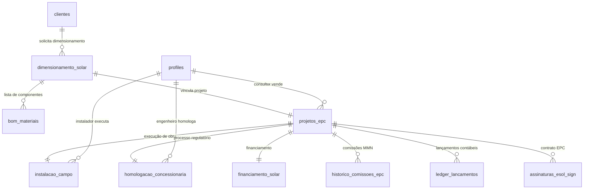
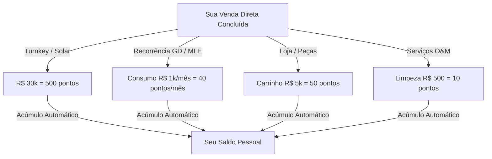
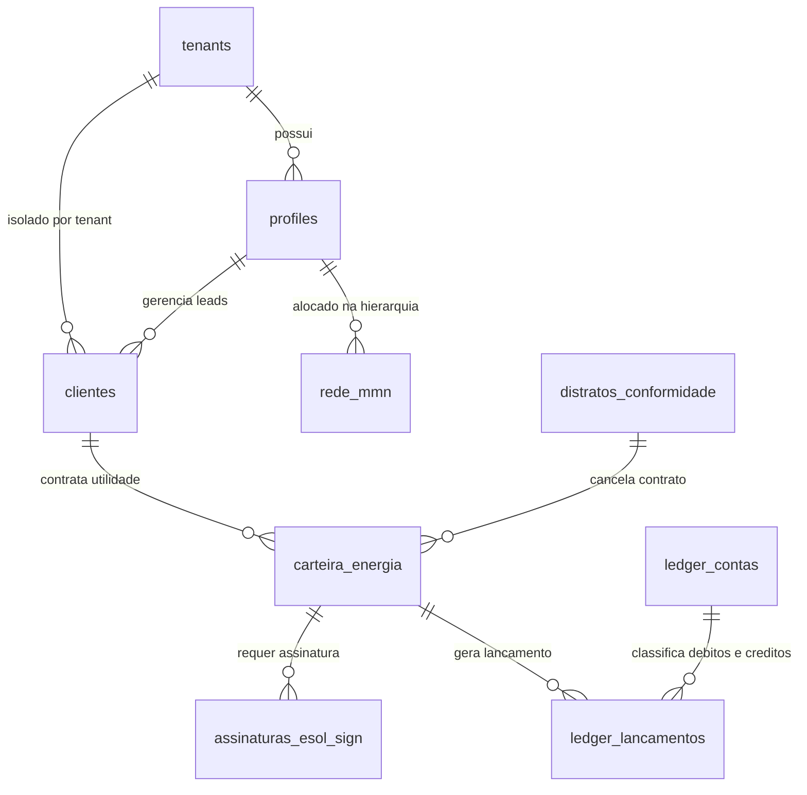
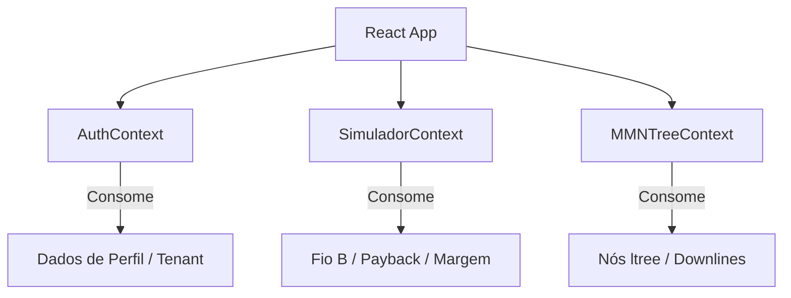
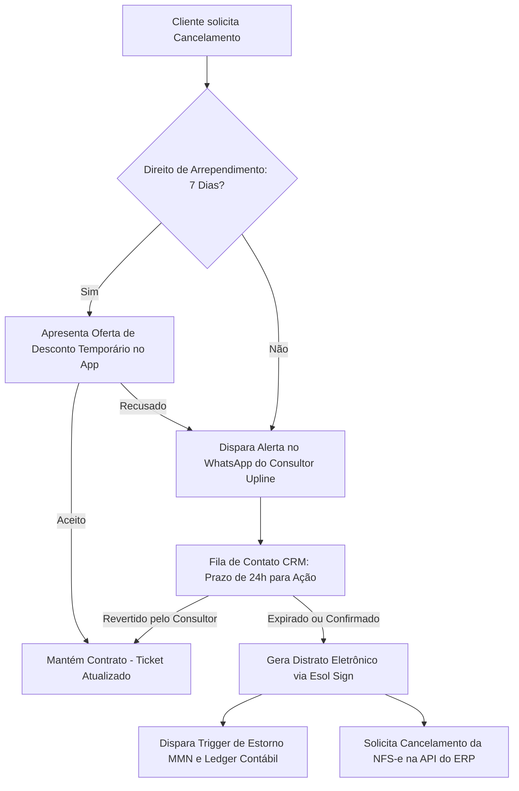
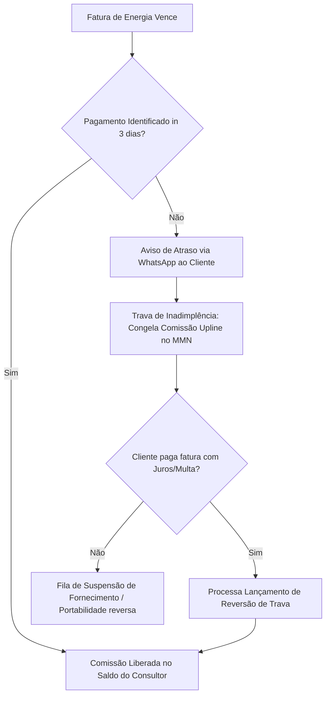
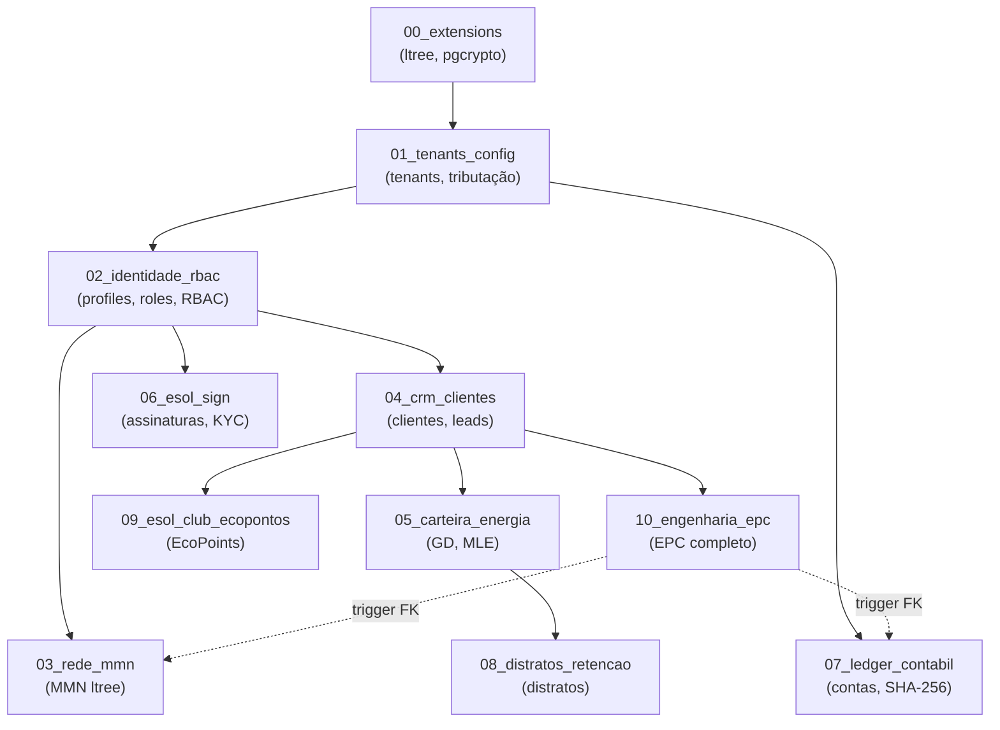

# 🗺️ Mapa Completo do Ecossistema Esol Energy (v10 — Definitivo com Recorrência e Resiliência B2B/B2C)

> Documento oficial de engenharia, arquitetura de negócios, conformidade legal, engenharia financeira e especificação técnica do ecossistema Esol Energy.
> Este documento é o mapa de construção unificado e serve como referência absoluta para todas as implementações de código.

---

## 1. VISÃO DO NEGÓCIO

### O que é a Esol Energy
Uma **plataforma 360° de energia renovável (EnergyTech)** que atua como um ecossistema digital unificado conectando consumidores, consultores de venda, instaladores, engenheiros credenciados e fornecedores de tecnologia. A captação de clientes e expansão da força comercial é impulsionada por um modelo de **Marketing Multinível (MMN) sem taxa de adesão**, baseado em **comissões recorrentes sólidas (royalties de energia)** e **override igualitário em 7 níveis** para crescimento sustentável.

### Pilares Fundamentais de Engenharia & Negócios
1. **Faturamento Direto Triangulado (Split de Pagamentos):** Proteção tributária em mais de 60% por meio do faturamento direto do distribuidor de equipamentos para o cliente, cindindo as notas fiscais de hardware e serviços.
2. **Camada de Resiliência de APIs (Provider Abstraction Layer):** Banco de dados centralizado e proprietário. A Esol detém a propriedade absoluta dos dados do cliente e roteia leads dinamicamente via painel administrativo, permitindo trocar de parceiro fornecedor (usina/comercializadora) sem impacto na rede MMN ou interrupção na telemetria.
3. **Foco 100% em Renda Passiva Recorrente (Royalties de Energia):** Produtos de consumo e utilidade (Geração Distribuída e Mercado Livre de Energia) remuneram a rede exclusivamente sobre a recorrência mensal, gerando uma carteira de renda passiva sólida para os parceiros comerciais.
4. **Selo Verde Esol:** Certificação ecológica exclusiva para os sistemas físicos instalados e homologados pela própria Esol Energy. Garante conformidade com a Lei 14.300/2022, origem limpa e redução de CO₂, sendo vetado para produtos de terceiros por razões de segurança jurídica.
5. **Motor de Assinatura Próprio (Esol Sign - R$ 0/mês):** Validação jurídica interna conforme a MP 2.200-2/2001 e Lei 14.063/2020, eliminando tarifas por documento assinado.
6. **Mecanismo Anti-Fraude e KYC:** Validação facial (Face Match) e cadastral integrada no onboarding do cliente para proteção legal da rede.
7. **Exatidão Centesimal:** Registro de todas as frações financeiras e energéticas com precisão de 4 casas decimais no banco de dados.
8. **Contabilidade em Partida Dobrada (Ledger):** Livro-razão imutável utilizando hashes SHA-256 para auditoria de comissões e splits tributários.
9. **Dois Motores de Comissão (Motor 1 e Motor 2):** Motor 1 (sobre preço de venda) para produtos próprios e Motor 2 (sobre receita/spread da Esol) para intermediações de parceiros, garantindo margem de lucro constante de 54-64% para a Esol.

---

## 2. PERFIS DE USUÁRIO DO ECOSSISTEMA (6 Perfis)

| Perfil | Função | Participa do MMN? |
| :--- | :--- | :--- |
| 👤 **Cliente Final** | Adquire sistemas, compra componentes ou assina planos de desconto de energia. | Opcional (indica e ganha descontos) |
| 🤝 **Consultor / Corretor** | Vende sistemas solares, prospecta contratos recorrentes e constrói equipe de vendas. | ✅ Sim |
| 🔧 **Instalador** | Executa obras de engenharia, instalações físicas e vistorias de O&M. | ✅ Sim |
| 📐 **Engenheiro Parceiro** | Realiza estudos de viabilidade técnica, dimensionamento e assina ART. | ❌ Não (recebe taxa de serviço por projeto) |
| 🏢 **Integrador White-Label** | Licencia a tecnologia Esol para rodar sob marca própria com catálogo personalizado. | ❌ Não (parceria de revenue share) |
| ⚙️ **Administrador** | Gerencia backoffice, conciliação contábil, aprovações e roteamento de APIs. | N/A |

---

### 2.1 Matriz de Acessos Administrativos & Níveis de Privilégio (RBAC / ABAC Hub)
Para garantir que futuros sócios, diretores, advogados, analistas e atendentes operem a plataforma com segurança total e privilégio mínimo de acesso, o perfil administrativo subdivide-se em **7 Níveis de Permissões (RBAC)**:

1. **👑 Nível 1: Super Admin / Sócios Executivos (C-Level & Founders):**
   - *Acesso:* 100% dos módulos do ecossistema.
   - *Permissões:* Criar/excluir administradores, alterar parâmetros do Motor Reverso (`lucro_alvo`), cadastrar novos SKUs e aprovar saques de grande porte. Exige 2FA biométrico obrigatório.

2. **⚖️ Nível 2: Admin Jurídico & Compliance (Advogados & Governança):**
   - *Acesso:* Esol Legal Vault, Esol Sign, Dossiês de Evidências e Gestão de Lock Screen.
   - *Permissões:* Upload e versão de minutas contratuais, disparo de re-aceites e notificações extrajudiciais. Sem acesso a aprovação de saques bancários.

3. **💰 Nível 3: Admin Financeiro & Tesouraria (CFO & Contabilidade Interna):**
   - *Acesso:* Ledger de Partidas Dobradas, Cockpit de Saques PIX e Faturamento.
   - *Permissões:* Autorizar saques via PIX/TED, emitir notas fiscais e conciliar repasses de geradoras. Sem permissão para alterar regras de comissão.

4. **🔧 Nível 4: Admin Operacional & Engenharia (Homologação & O&M):**
   - *Acesso:* Funil de Projetos Turnkey, Vistorias O&M e Selo Verde Esol.
   - *Permissões:* Atribuir engenheiros/instaladores, aprovar pareceres de acesso de distribuidoras e emitir certificações Selo Verde.

5. **📈 Nível 5: Admin de Vendas & Expansão MMN (Gerência de Rede):**
   - *Acesso:* Árvore de Rede MMN (`ltree`), Esol Career (12 Selos) e Relatórios de Vendas.
   - *Permissões:* Auditar qualificação de selos e acompanhar o crescimento da rede. Sem poder para alterar percentuais de repasse MMN.

6. **🎧 Nível 6: Admin Suporte & Helpdesk (Atendimento ao Cliente/Consultor):**
   - *Acesso:* Central de Chamados, auxílio no onboarding e re-envio de senhas.
   - *Permissões:* Atendimento a usuários. **Proteção LGPD:** Dados sensíveis (CPF, dados bancários, extratos detalhados) aparecem **mascarados (`***`)**.

7. **🔍 Nível 7: Auditoria Externa & Fisco (Read-Only Audit):**
   - *Acesso:* Leitura estrita (Read-Only) do Ledger Contábil e relatórios fiscais.
   - *Permissões:* Apenas visualização e exportação de auditoria contábil. Impossibilitado de criar, editar ou excluir qualquer registro no banco.

---

### 2.2 Esol Equity & Corporate Payroll Hub (Governança Societária & Custo de OPEX)
Para separar com rigor absoluto os **Sócios-Administradores Principais (Equity)** dos **Administradores Contratados e Funcionários (OPEX)**, o ecossistema incorpora o módulo de controle corporativo em 4 pilares:

1. **Cap Table & As 5 Opções de Remuneração dos Sócios/Donos:**
   - *Escolha de Recebimento pelo Sócio:* Cada sócio fundador/proprietário configura no seu painel como deseja receber seus proventos sob a lei brasileira:
     1. **Distribuição de Lucros / Dividendos 100% Isentos (Lei 9.249/95 Art. 10):** Lucro líquido apurado no Ledger (`3.1.01`) transferido para a conta do sócio **100% ISENTO de Imposto de Renda (IRPF)** e sem INSS.
     2. **Pró-Labore Fixo (Decreto 3.048/99):** Remuneração mensal pelo trabalho de gestão (com recolhimento de INSS para aposentadoria e IRPF).
     3. **Juros sobre o Capital Próprio - JCP (Lei 9.249/95 Art. 9º):** Remuneração do capital investido que economiza 34% de IRPJ/CSLL na holding Esol.
     4. **Mútuo Societário (Código Civil Art. 586):** Contrato de empréstimo remunerado ou antecipação pontual entre sócio e empresa.
     5. **Modelo Híbrido Flexível (Recomendado):** Pró-Labore Mínimo de Eficiência Fiscal + Distribuição Mensal/Trimestral de Dividendos Isentos.

2. **Gestão de OPEX & As 6 Modalidades Contratuais sob a Lei Brasileira:**
   - **6 Regimes de Contratação Permitidos:**
     1. *CLT Tradicional:* Suporte, atendimentos de rotina e funções operacionais contínuas (com CBO no eSocial).
     2. *CLT Intermitente (Art. 452-A CLT):* Técnicos de vistoria e inspetores O&M convocados sob demanda.
     3. *Prestação de Serviços PJ (Art. 442-B CLT & Lei 13.429/17):* CFOs contratados, devs sênior, engenheiros e especialistas.
     4. *Advogado Associado (Estatuto OAB Lei 8.906/94):* Bancada jurídica interna do Esol Legal Vault.
     5. *Estágio Supervisionado (Lei 11.788/08):* Estudantes de engenharia, direito, TI e administração supervisionados por titulares de Conselhos.
     6. *Acordo de Sócios / Equity & Vesting:* Founders e executivos C-Level (Pró-Labore + Dividendos isentos).
   - **Enquadramento em CBO, Conselhos de Classe & Sindicatos:** Vinculação obrigatória ao Código CBO MTE/eSocial (ex: `2143-05` Eng. Eletricista, `2410-05` Advogado, `2522-10` Contador) e órgãos de classe (**CREA/CFT, OAB, CRC, CRA**).
   - **Integração Automática com o Ledger Contábil:** Todo lançamento de folha debita automaticamente a conta `4.1.01.01` (Despesas com Pessoal Administrativo) e credita o banco operacional da empresa, mantendo o DRE atualizado.

3. **Bônus de Performance & Metas Corporativas:**
   - Possibilidade de atrelar bônus financeiros variáveis por metas cumpridas (ex: manter a margem líquida da empresa acima de 54%, zerar chamados de suporte em 24h ou homologar usinas abaixo de 10 dias).

---

### 2.3 Transição Tributária Progressiva & CNPJ Migration Gateway (Do MEI ao Grande Porte)
Para permitir que a Esol Energy nassa legalizada e enxuta sob o regime **MEI (Microempreendedor Individual)** e evolua de forma 100% dinâmica no banco de dados à medida que faturar e escalar, o sistema incorpora a **Arquitetura de Transição Tributária em 4 Fases**:

1. **🌱 FASE 1: Operação Inicial MEI (Teto até R$ 81.000,00 / ano):**
   - Operação enxuta de arranque. Recolhimento fixo DAS (~R$ 75/mês). 1 Titular (sem sócios no contrato). Isenção simplificada de imposto de renda sobre a distribuição do lucro apurado.
   - **Termômetro Automático do Teto MEI:** O sistema monitora o faturamento acumulado no ano. Ao atingir **85% do teto (R$ 68.850,00)**, o dashboard dispara um alerta recomendando a migração preventiva para ME.

2. **🌿 FASE 2: Microempresa (ME no Simples Nacional - Teto até R$ 360.000,00 / ano):**
   - Desenquadramento do MEI e transição para SLU (Sociedade Unipessoal) ou LTDA.
   - **Recursos Destravados:** Permite emissão ilimitada de NFS-e, contratação flexível da equipe (6 modalidades), ativando Pró-Labore + Dividendos Isentos e os 7 níveis da Matriz RBAC de Permissões.

3. **🌳 FASE 3: Empresa de Pequeno Porte (EPP no Simples Nacional - Teto até R$ 4.800.000,00 / ano):**
   - Entrada formal de novos sócios no Cap Table (`public.socios_cap_table`).
   - Apuração trimestral de lucros no Ledger Contábil e habilitação completa do Esol Equity & Corporate Payroll Hub.

4. **🏢 FASE 4: Lucro Presumido ou Lucro Real (Faturamento Acima de R$ 4,8 Milhões / ano):**
   - Holding Esol Energy de grande porte, abertura de filiais white-label, faturamento direto triangulado completo com benefício fiscal de ICMS/ISS, Juros sobre o Capital Próprio (JCP) e isenção total de dividendos sob a Lei 9.249/95.

*   **Migração sem Parar a Operação (CNPJ Migration Gateway):** Ao alterar o regime na Junta Comercial/Receita, o administrador altera o campo `regime_atual` na tabela `config_tributaria_tenant`. **100% dos dados históriccos, contratos assinados no Esol Sign, clientes e a árvore MMN de 7 níveis permanecem intocados e operando sem nenhuma interrupção!**

---

## 3. PORTFÓLIO (11 Categorias em 3 Canais de Venda)

### 🟢 CANAL 1 — MMN (8 Categorias com Override Igualitário em 7 Níveis)

| # | Categoria | Tipo de Produto | Motor de Comissão | Modelo de Faturamento |
| :--- | :--- | :--- | :--- | :--- |
| 1 | 🏠 **Sistema Solar Completo** | Projeto turnkey (equipamentos + serviços + ART + Selo Verde) | **Motor 1** (15% TDTC) | Faturamento único / Financiamento |
| 2 | 🛒 **Loja Esol (Produtos)** | E-commerce de kits, inversores, painéis, baterias, EV chargers e IoT. | **Motor 1** (por SKU) | Compra única |
| 3 | ⚡ **Energia por Assinatura (GD)** | Assinatura de créditos solares de usinas parceiras (B2C/B2B leve) | **Motor 2** (36% receita) | **100% Recorrente Mensal** |
| 4 | 🔌 **Mercado Livre de Energia (MLE)** | Agenciamento/migração de PMEs para comercializadora varejista | **Motor 2** (36% receita) | **100% Recorrente Mensal** |
| 5 | 📊 **Monitoramento Remoto** | SaaS de telemetria e análise de desempenho de usinas físicas | **Motor 1** (25% TDTC) | Assinatura mensal |
| 6 | 🔧 **Manutenção (O&M)** | Assistência corretiva, reparos e substituição de inversores | **Motor 1** (10% TDTC) | Serviço único |
| 7 | 🧹 **Limpeza de Painéis** | Lavagem química e física especializada de módulos solares | **Motor 1** (12% TDTC) | Serviço único |
| 8 | 🛡️ **Seguros Solares** | Seguro de danos e perda de receita para sistemas instalados | **Motor 2** (36% receita) | **Recorrente Mensal** |

*Nota: A categoria de "Usados" foi eliminada por falta de escalabilidade inicial. Equipamentos de Internet das Coisas (IoT) foram integrados na Loja Esol (SKUs de automação/medição) e no canal de indicações corporativas B2B.*

### 🟡 CANAL 2 — INDICAÇÃO CORPORATIVA DIRETA (2 Produtos B2B)
leads estratégicos de grande porte repassados ao comercial interno da Esol. Paga comissão de indicação única (2% a 5% da margem Esol) para o consultor direto, sem espalhar na rede MMN.

| # | Categoria | Descrição |
| :--- | :--- | :--- |
| 9 | 💡 **Eficiência Energética & IoT** | Projetos de engenharia e instalação de IoT industrial para redução de perdas energéticas em grandes empresas. |
| 10 | 🏗️ **Usina Solar de Investimento** | Construção e homologação de fazendas solares (GD Comercial) de R$ 500k a R$ 5M+ para investidores. |

### 🔵 CANAL 3 — LICENCIAMENTO (1 Produto)

| 11 | 🏢 **White-Label** | Licenciamento da infraestrutura digital da Esol para integradores regionais que desejam atuar sob marca própria. |

---

## 4. DETALHAMENTO DE PROCESSO DOS PRODUTOS CHAVE

### 4.1 🏠 Sistema Solar Completo & Selo Verde Esol (Categoria #1)
O cliente final contrata a solução turnkey onde a Esol cuida do dimensionamento, engenharia, fornecimento, logística, instalação e homologação.
#### 📋 Jornada Completa do Cliente: Do Primeiro Contato à Geração de Energia

Abaixo está o mapeamento detalhado de etapas para a contratação e entrega de sistemas físicos turnkey:

1. **⚡ Dimensionamento Inteligente (Motor de Cálculos — Módulo 3)**
   O consultor faz o upload ou insere os dados da fatura de energia do lead. A plataforma calcula em tempo real:
   *   *Consumo histórico e média mensal* (kWh).
   *   *Tarifas locais da concessionária* (com incidência de Fio B conforme a Lei 14.300/2022).
   *   *Irradiação solar local* (banco de dados integrado de 5.500+ municípios).
   *   *Dimensionamento técnico:* potência recomendada do inversor e quantidade ideal de módulos (kWp).
   *   *Payback e VPL:* retorno de investimento calculado e projeção de economia total para os próximos 25 anos.
   *   **Resultado:** Geração automática de uma proposta comercial altamente profissional em formato PDF.

2. **📦 Seleção e Configuração de Kits (Loja Esol — Módulo 7)**
   *   *Kit Pronto:* Seleção de pacotes homologados e pré-configurados.
   *   *Kit Personalizado:* O consultor monta componente por componente, e o sistema valida dinamicamente os limites elétricos de MPPT para evitar incompatibilidade entre inversores e painéis.

3. **💰 Precificação sob o Motor Reverso (Módulo 3)**
   O preço final de venda do projeto é calculated dinamicamente de trás para frente, cobrindo com precisão:
   *   Custo real do kit com distribuidor + frete e logística local.
   *   Remuneração de instalação e engenharia parceira (taxa de homologação + ART).
   *   Overhead da Esol, provisões fiscais e a margem de comissão da rede MMN (15% TDTC).
   *   **Garantia:** O lucro corporativo mínimo da Esol configurado no admin é 100% blindado por esta fórmula de markup reverso.

4. **🏦 Simulação de Financiamento Integrado**
   O aplicativo conecta-se com parceiros bancários (Solfácil, BV, Santander) para simular parcelas. O objetivo é que o valor mensal da parcela de financiamento seja menor do que a economia imediata gerada na conta de luz, fazendo com que o sistema se pague desde o primeiro dia.

5. **✍️ Contrato e Biometria Digital (Esol Sign — Módulo 13)**
   O cliente assina digitalmente o contrato direto no celular. O motor de assinaturas captura metadados, geolocalização e fotos dos documentos/selfie para processar o KYC (verificação facial contra fraudes).

6. **🚚 Faturamento Triangular e Split de Pagamentos**
   Para blindagem fiscal, o banco realiza o split do pagamento: o valor de hardware é quitado diretamente ao distribuidor (Aldo Solar, Sou Energy), que fatura o produto em nome do cliente. O valor do serviço e comissões da rede é transferido para a Esol, que liquida os saldos de parceiros e consultores.

7. **📐 Elaboração e Engenharia de Homologação**
   O engenheiro técnico parceiro assume o projeto na fila operacional do Portal da Engenharia. Ele elabora o diagrama elétrico e estrutural e emite a Anotação de Responsabilidade Técnica (ART) no CREA.

8. **🔧 Instalação Física em Campo (Módulo 9)**
   O instalador parceiro recebe os equipamentos no endereço do cliente e executa a montagem dos trilhos, painéis e inversores. Para receber sua taxa de instalação, ele preenche obrigatoriamente um checklist fotográfico de qualidade pelo app, atestando a qualidade mecânica e elétrica.

9. **🔌 Ligação e Homologação na Concessionária**
   A Esol solicita a vistoria de ligação junto à concessionária local (ex: Enel, CPFL). A concessionária faz a vistoria técnica e substitui o relógio medidor por um modelo bidirecional.

10. **🟢 Geração e Ativação do Selo Verde Esol**
    O sistema começa a gerar créditos na conta de luz do cliente. A Esol emite eletronicamente o *Selo Verde Esol* para o cliente e ativa a telemetria remota do inversor no aplicativo do consultor para fins de acompanhamento.


#### Números reais de referência:

| Porte | Potência | Painéis | Investimento | Economia Mensal | Payback | Economia 25 anos |
| :--- | :--- | :--- | :--- | :--- | :--- | :--- |
| Casa pequena | 3-5 kWp | 6-10 | R$ 12.000-20.000 | R$ 250-450 | 3-4 anos | R$ 75.000-135.000 |
| Casa grande | 6-10 kWp | 12-20 | R$ 20.000-40.000 | R$ 450-900 | 3-5 anos | R$ 135.000-270.000 |
| Comércio | 15-50 kWp | 30-100 | R$ 50.000-180.000 | R$ 1.500-6.000 | 3-5 anos | R$ 450.000-1.800.000 |
| Indústria | 50-500 kWp | 100-1.000 | R$ 180.000-1.500.000 | R$ 6.000-60.000 | 4-6 anos | R$ 1.800.000-18.000.000 |

*   **Selo Verde Esol:** Certificação ecológica registrada no banco de dados Esol. Ao concluir a instalação física de um sistema turnkey próprio da Esol, o cliente recebe em seu painel digital e na ART do projeto a chancela do *Selo Verde Esol*, atestando a origem limpa dos componentes, compensação de CO₂ estimada e conformidade legal com a Lei 14.300/2022. Para fins de segurança jurídica, essa chancela é **estritamente restrita** a projetos integralmente vistoriados e validados pelo corpo técnico de engenharia da Esol.
*   **Split Triangular de Pagamento:** Ao fechar a venda, o banco distribuidor liquida o valor do kit diretamente para o distribuidor homologado (ex: Aldo Solar) e o valor de serviços de engenharia/MMN para a Esol, isentando a Esol de tributar o hardware físico.

---

#### 4.1.1 As 7 Fases Operacionais do Solar Turnkey (EPC Completo)
Para integrar a engenharia de campo com os motores financeiro, tributário e jurídico da Esol, cada projeto Turnkey se divide em **7 Fases Sequenciais**, cada uma com representação formal no banco de dados e integração automática com o Ledger Contábil:

1. **Fase 1: Engenharia & Dimensionamento Físico-Elétrico (`dimensionamento_solar`):** Leitura de fatura de energia via OCR/IA, cálculo da potência necessária ($P_{\text{kWp}}$) com base nas HSP (Horas de Sol Pleno) NASA/CRESESB e Fator de Desempenho (PR $\approx 80\%$), e seleção do arranjo de painéis/inversores. Persiste todos os cálculos na tabela `public.dimensionamento_solar` com suporte a múltiplas revisões/cenários por cliente. **Fórmula principal:**
   $$P_{\text{kWp}} = \frac{\text{Consumo Médio Mensal (kWh)}}{30 \times \text{HSP Local} \times \text{PR (0.80)}}$$
   *Inclui o Simulador de Lotes (Persona F):* O cliente informa a área do terreno em m², o sistema calcula automaticamente a área útil (67%), quantidade de painéis, potência kWp, geração kWh/mês e lucro líquido por GD.

2. **Fase 2: Suprimentos & Procurement (`bom_materiais`):** Geração da Lista de Materiais BOM (Módulos, Inversores, String Box, Cabos, Fixadores) e cotação automática via API nos maiores distribuidores de hardware do Brasil (Solfácil, Edeltec, WDC, Aldo, Fotus) para obter o menor custo FOB/CIF. Cada item é registrado com SKU, marca, quantidade, preço unitário e distribuidor na tabela `public.bom_materiais`.

3. **Fase 3: Obras, Instalação & ART (`instalacao_campo`):** Execução da instalação física de campo por equipe própria ou credenciada (custo por Wp), contratação de frete rodoviário e emissão da ART no CREA/CFT. O **checklist fotográfico obrigatório de 4 categorias** (estrutura mecânica, cabeamento CC/CA, inversor instalado, string box) é registrado na tabela `public.instalacao_campo`. O pagamento do instalador **SÓ é liberado** após checklist 100% aprovado.

4. **Fase 4: Homologação Regulatória na Concessionária (`homologacao_concessionaria`):** Elaboração do projeto executivo elétrico, protocolo da Solicitação de Acesso (Parecer de Acesso) na concessionária local (CPFL, Enel, Cemig) e acompanhamento da troca para o Medidor Bidirecional. Rastreado na tabela `public.homologacao_concessionaria` com status progressivo de 7 estados (do `elaborando_projeto` ao `ativo_gerando`).

5. **Fase 5: DRE do Projeto & Motor Reverso (`projetos_epc`):** Cálculo em tempo real da DRE da venda, persistido na tabela `public.projetos_epc` com a seguinte decomposição:
   $$\begin{aligned}
   \text{Preço Final} &= \frac{C_{\text{fixos}}}{1 - (\text{tributo } 6\% + \text{overhead } 5\% + \text{TDTC } 15\%) - \text{lucro\_alvo } 20\%} \\[8pt]
   \text{Onde: } C_{\text{fixos}} &= \text{BOM} + \text{Frete} + \text{Mão de Obra} + \text{ART/Homologação}
   \end{aligned}$$
   **Trava Cega (Margin Floor Guardrail):** Constraint `CHECK` no banco garante que nenhum projeto avance além da fase de dimensionamento se a margem líquida for < 20%.

6. **Fase 6: Financiamento Fintech & Meios de Pagamento (`financiamento_solar`):** Análise de crédito instantânea (CPF/CNPJ) via API dos bancos solares (BV, Santander, Solfácil, BB) em até 84x com 120 dias de carência, ou liquidação à vista no PIX c/ desconto (3% a 5%). Registrado na tabela `public.financiamento_solar` com status de 8 estados (do `analise_credito` ao `quitado`).

7. **Fase 7: Legal Vault & Assinatura Biométrica (Esol Re-Sign):** Emissão do Contrato EPC de Empreitada (`contrato_epc_empreitada` no enum `documento_categoria`) com garantias (25 anos de eficiência de módulos, 10 anos inversor, 1 ano instalação) e assinatura biométrica digital facial + geolocalização.

**Integração Automática ao Concluir o Projeto:**
Ao marcar a fase como `concluido`, dois triggers automáticos executam em cascata:
- **`trg_projeto_epc_concluido_ledger`:** Gera lançamentos de Partida Dobrada no Ledger Contábil (Receita Turnkey + Provisão TDTC MMN), emite o **Selo Verde Esol** automaticamente e registra a data de conclusão.
- **`trg_projeto_epc_comissao_mmn`:** Distribui automaticamente as comissões na árvore MMN (8% N0 + 1% por nível N1 ao N7 = 15% TDTC total) e registra no `historico_comissoes_epc`.



---

#### 4.1.2 Interfaces TypeScript do Módulo EPC (Frontend)
Para que o time de desenvolvimento frontend renderize o funil de obras EPC e o Simulador de Lotes (Persona F), as seguintes interfaces TypeScript são utilizadas:

```typescript
// ═══════════════════════════════════════════════════════════════
// INTERFACES DO MÓDULO DE ENGENHARIA SOLAR TURNKEY (EPC)
// ═══════════════════════════════════════════════════════════════

// Dimensionamento Solar (Fase 1 — Motor de Engenharia)
export interface IDimensionamentoSolar {
  id: string;
  clienteId: string;
  consultorId: string;
  versao: number;
  aprovado: boolean;

  // Dados da Fatura
  concessionaria: string;
  tipoTarifa: 'b1_residencial' | 'b2_rural' | 'b3_comercial' | 'a4_industrial_media_tensao';
  tensaoEntrada: 'monofasico_127v' | 'bifasico_220v' | 'trifasico_220v' | 'trifasico_380v';
  historicoConsumo12m: number[]; // 12 valores kWh
  consumoMedioMensalKwh: number;
  tarifaKwhConcessionaria: number;
  fioBPercentual: number;

  // Engenharia Solar
  hspLocal: number;
  performanceRatio: number;
  potenciaKwp: number;
  quantidadeModulos: number;
  potenciaModuloWp: number;
  tipoModulo: string;
  tipoInversor: string;
  potenciaInversorKw: number;
  tipoEstrutura: 'telhado_ceramico' | 'telhado_fibrocimento' | 'telhado_metalico' | 'laje_plana' | 'solo_terreno' | 'carport_estacionamento';

  // Simulador de Lotes (Persona F)
  areaTerrenoM2?: number;
  areaUtilM2?: number;
  fatorAproveitamentoTerreno: number;

  // Resultados
  geracaoEstimadaMensalKwh: number;
  geracaoEstimadaAnualKwh: number;
  economiaMensalReais: number;
  paybackAnos: number;
  vplEconomia25Anos: number;
  co2EvitadoKgAno?: number;
}

// Projeto EPC Completo (Coração do Módulo Turnkey)
export type ProjetoEpcFase =
  | 'dimensionamento'
  | 'procurement_bom'
  | 'instalacao_campo'
  | 'homologacao'
  | 'dre_motor_reverso'
  | 'financiamento'
  | 'legal_vault_assinatura'
  | 'concluido'
  | 'cancelado';

export interface IProjetoEPC {
  id: string;
  clienteId: string;
  consultorId: string;
  dimensionamentoId: string;
  numeroProjeto: string; // Ex: 'EPC-2026-0001'
  faseAtual: ProjetoEpcFase;

  // Motor Reverso — DRE do Projeto
  custoBomHardware: number;
  custoFreteLogistica: number;
  custoMaoObraInstalacao: number;
  custoArtHomologacao: number;
  custoTotalFixo: number;

  percentualImpostos: number;   // 0.0600
  percentualOverhead: number;   // 0.0500
  percentualTdtc: number;       // 0.1500
  percentualLucroAlvo: number;  // 0.2000

  precoTabelaAncorado: number;
  descontoAplicadoTotal: number;
  precoFinalVenda: number;

  valorImpostos: number;
  valorOverhead: number;
  valorTdtcMmn: number;
  lucroLiquidoEsol: number;
  margemLiquidaPercentual: number; // >= 0.2000

  // Selo Verde Esol
  seloVerdeEmitido: boolean;
  seloVerdeDataEmissao?: string;
  seloVerdeNumeroCertificado?: string;

  // Timestamps por Fase
  dataInicioProjeto: string;
  dataAprovacaoProposta?: string;
  dataPedidoBom?: string;
  dataInicioObra?: string;
  dataFimObra?: string;
  dataProtocoloConcessionaria?: string;
  dataVistoriaConcessionaria?: string;
  dataMedidorBidirecional?: string;
  dataGeracaoAtiva?: string;
  dataConclusao?: string;

  // SLA
  slaInstalacaoDias: number;  // 15
  slaHomologacaoDias: number; // 30
  slaVistoriaDias: number;    // 45
}

// BOM — Item da Lista de Materiais (Fase 2)
export interface IBomMaterial {
  id: string;
  dimensionamentoId: string;
  tipoComponente: string;
  skuProduto?: string;
  descricao: string;
  marca: string;
  quantidade: number;
  potenciaWp?: number;
  precoUnitario: number;
  precoTotal: number;
  distribuidorParceiro: string;
  freteEstimado: number;
  prazoEntregaDias?: number;
}

// Instalação de Campo (Fase 3)
export interface IInstalacaoCampo {
  id: string;
  projetoEpcId: string;
  instaladorId: string;
  engenheiroArtId?: string;
  custoPorWp: number;
  potenciaInstaladaKwp: number;
  custoTotalMaoObra: number;
  fotosEstruturaMecanica: string[];
  fotosCabeamentoCcCa: string[];
  fotosInversorInstalado: string[];
  fotosStringBox: string[];
  checklistCompleto: boolean;
  artNumeroRegistro?: string;
  artConselho?: string;
  artUf?: string;
  artArquivoUrl?: string;
  status: 'agendada' | 'em_andamento' | 'checklist_pendente' | 'aprovada' | 'rejeitada';
}

// Financiamento Solar (Fase 6)
export interface IFinanciamentoSolar {
  id: string;
  projetoEpcId: string;
  clienteId: string;
  modalidade: 'pix_a_vista' | 'cartao_credito' | 'financiamento_bancario' | 'boleto_bancario';
  bancoParceiro?: string;
  valorTotalFinanciado: number;
  entradaValor: number;
  numeroParcelas?: number;
  taxaJurosMensal?: number;
  valorParcelaMensal?: number;
  carenciaDias: number;
  descontoPix: number;
  scoreCreditoAprovado?: number;
  status: 'analise_credito' | 'aprovado' | 'reprovado' | 'liberado' | 'quitado';
}
```

---

### 4.2 🛒 Loja Esol (Categoria #2)
E-commerce oficial para venda de partes físicas e equipamentos solares sem necessidade de contratação de serviços associados.
*   **MODO 1: KITS PRONTOS (Combos pré-configurados pelo admin)**
    Pacotes com preço fechado, calculado pelo Motor Reverso com margem individual.
    *   *Exemplo:* Kit Solar Residencial 5kWp (10x Painéis + 1 Inversor + Cabos + Estrutura) custa R$ 11.200 do distribuidor. Com lucro_alvo de 20%, o preço de venda é de R$ 14.000.
*   **MODO 2: KIT PERSONALIZADO (Monte seu Kit - Diferencial Esol)**
    O consultor ou cliente seleciona no aplicativo o painel (SKU A), inversor (SKU B) e estrutura (SKU C). O sistema realiza a validação técnica de compatibilidade elétrica (Ex: potência do painel compatível com limites de MPPT do inversor) e calcula o preço sob o Motor Reverso baseando-se no custo individual de cada SKU + margem de lucro_alvo configurada no painel administrativo para cada produto.
*   **MODO 3: COMPONENTES AVULSOS**
    Componentes solares individuais (Painéis, Inversores, Stringbox, cabos e fixadores), baterias residenciais (ex: BYD), carregadores veiculares de várias potências e equipamentos IoT de telemetria.
*   **Automação e IoT:** Inclusão de medidores inteligentes de energia IoT no rol de produtos físicos da loja, permitindo que instaladores ou clientes comprem para equipar usinas existentes.

---

### 4.3 ⚡ Geração Distribuída / Energia por Assinatura (Categoria #3)
Modelo voltado ao mercado B2C e B2B de baixa tensão (Grupo B - residências e pequenos negócios).
*   **100% Recorrência Sem Adesão:** Sem taxa de adesão ou taxas de setup. A Esol conecta o cliente com usinas parceiras (ex: Órigo Energia, Re Energisa, Juntos Energia).
*   **Remuneração:** O cliente recebe créditos mensais na sua fatura da distribuidora (Enel, CPFL, Cemig) e paga um boleto para a usina correspondente aos créditos consumidos com 10-20% de desconto.
*   **Margem Esol:** A usina parceira paga para a Esol uma comissão mensal (ex: 5% a 10% da receita faturada do cliente). Desta receita da Esol, **36%** é enviado para o Motor 2 e distribuído na rede MMN (15% direto ao consultor + 3% por nível em 7 níveis).

---

### 4.4 🔌 Mercado Livre de Energia (Categoria #4)
Modelo voltado ao mercado B2B de alta e média tensão (Grupo A - indústrias, comércios médios e supermercados).
*   **100% Recorrência:** A Esol atua como corretora/agente de comercializadoras varejistas (ex: Enel Comercializadora, Clarke Energia, Auren).
*   **Remuneração:** O cliente passa a pagar duas faturas: uma para a distribuidora local (pelo uso dos fios e postes) e outra para a comercializadora varejista (pela energia no atacado). A economia líquida de energia varia de 15% a 35%.
*   **Margem Esol:** A comercializadora repassa à Esol um valor mensal recorrente por MWh consumido (ex: R$ 3,00/MWh) ou uma porcentagem da fatura de energia do cliente. Deste repasse, **36%** é injetado no Motor 2 do MMN (15% para o vendedor + 3% por nível).
*   **Temporal Safety (Segurança Contratual):** O banco de dados Core da Esol monitora o período de fidelidade (lock-in) de cada contrato de energia (ex: 24 a 36 meses) e os prazos legais de aviso prévio de 180 dias. Se houver necessidade de troca de comercializadora por infração de contrato, o sistema avisa o momento exato de realizar a portabilidade para o novo parceiro sem quebrar regras contratuais.

---

### 4.5 🏗️ Usina Solar para Investimento (Categoria #10 — Indicação B2B)
Um investidor de grande porte contrata a Esol para desenvolver uma usina solar que gerará créditos para o mercado livre ou para compensação distribuída.

#### 🏢 Modelo de Negócio da Usina Solar B2B

##### **O Investidor:**
*   Adquire ou realiza o arrendamento de um terreno adequado para a usina.
*   Aporta o investimento de **R\$ 500.000,00 a R\$ 5.000.000,00+** para a infraestrutura física.
*   Injeta a energia gerada na rede de média ou baixa tensão da concessionária local.
*   Obtém o retorno financeiro via venda de créditos estruturados para consumidores.

##### **A Esol Energy:**
*   Elabora e assina o projeto técnico de engenharia da usina.
*   Fornece toda a tecnologia e hardware via distribuidores homologados.
*   Realiza os trâmites regulatórios de homologação junto à concessionária de energia.
*   Direciona a força de vendas do MMN (Cat. #3) para capturar os clientes finais dos créditos gerados.
*   **Comissionamento:** A Esol repassa de **2% a 5% da margem líquida** do projeto diretamente ao consultor que indicou o lead B2B.


#### Números reais de referência (Usina de 500 kWp):
*   **Investimento Total:** R$ 1.650.000 (Equipamentos: R$ 1.200.000 | Terreno: R$ 200.000 | Instalação e Engenharia: R$ 250.000)
*   **Geração Mensal:** ~65.000 kWh/mês (Atende cerca de 130 residências)
*   **Receita Líquida do Investidor:** R$ 49.450/mês
*   **Payback:** ~33 meses (~2,8 anos) | ROI: ~36%/ano
*   **Receita Total em 25 anos:** ~R$ 14.800.000
*   **Regulação:** Lei 14.300/2022 (Fio B progressivo).

---

## 5. MODELO DE REDE (MMN) E DOIS MOTORES DE COMISSÃO

### 5.1 Motor Reverso com Proteção de Margem
A fórmula do Motor Reverso garante que o valor final do projeto turnkey ou kits da loja cubra todos os impostos, custos de hardware, custos de distribuição MMN (TDTC), despesas de estrutura e garanta a margem de lucro mínima definida pela Esol:

$$\text{Preço Final (P)} = \frac{C_{\text{fixos}}}{1 - (tributo + overhead + garantia + \text{TDTC}) - lucro_{\text{alvo}}}$$

#### **Percentual e Propósito do Overhead Administrativo (`overhead = 5,0%`):**
*   **Percentual Padrão Configurado:** **5,0%** (parametrizável de 5,0% a 8,0% no Cockpit Contábil por SKU/Categoria).
*   **O que o Overhead Administrativo Cobre (As 12 Categorias de Custos Indiretos OPEX & Ativos):**
    O `overhead` é a reserva financeira autossustentável destinada a cobrir 100% dos custos da unidade administrativa central da Esol Energy:
    1. **Ativos Imobiliários & Sede:** Compra/aluguel de imóveis, condomínio, IPTU, laudo do **Corpo de Bombeiros (AVCB/CLCB)**, alvarás, manutenção predial, água, luz e segurança armada.
    2. **Frota de Veículos Corporativos:** Compra/aluguel de carros (Localiza), **IPVA**, **Licenciamento Anual (DETRAN)**, **Emplacamento**, oficinas, combustível, pedágios (Sem Parar) e Seguro Total de Frota.
    3. **Equipamentos, TI & Mobiliário:** Compra/leasing de notebooks, servidores, monitores, impressoras, mesas/cadeiras ergonômicas (NR-17), manutenção e seguro de hardware.
    4. **SST & Medicina do Trabalho (eSocial):** PGR (NR-01), PCMSO (NR-07), LTCAT, exames ASO, envio de eventos eSocial (`S-2210`, `S-2220`, `S-2240`), EPIs e treinamentos NR-10/35.
    5. **Redes de Benefícios Corporativos:** Cartão flexível (Caju/Flash), Plano de Saúde/Odonto (Bradesco), Gympass, seguro de vida e Apoio Psicológico PAE.
    6. **Viagens Corporativas, Passagens & Hotéis:** Passagens aéreas/terrestres, hotéis executivos, Uber e ajudas de custo de deslocamento.
    7. **Telecomunicações, Celulares & Conectividade:** Smartphones corporativos (iPhone/Android), planos 5G (Vivo/Claro/TIM), PABX VoIP 0800 e fibra dedicada.
    8. **Palestras, Capacitação & Eventos:** Palestrantes contratados, workshops internos, treinamentos técnicos e inscrição na Intersolar/CBGD.
    9. **Alimentação Corporativa & Catering:** VR/VA da equipe, almoços de negócios com bancos/usinas, catering e coffee breaks institucionais.
    10. **Pessoal Administrativo & Encargos:** Salários e honorários (CFO, Advogados, Devs, Engenheiros, Suporte) + INSS patronal e FGTS sob CBO.
    11. **Tecnologia, Nuvem & Softwares:** Servidores Supabase/Cloudflare, licenças (Google Workspace, Microsoft, ERP), APIs de biometria/WhatsApp.
    12. **Serviços Terceirizados & Conselhos:** Anuidades dos conselhos de classe (**CREA/CFT, OAB, CRC, CRA**), contabilidade, auditoria e marcas no INPI.
    *   *Resultado:* Cada venda realizada no ecossistema paga automaticamente a estrutura administrativa da Esol, garantindo que o `lucro_alvo` (lucro líquido limpo da empresa) permaneça **100% preservado no caixa**!

*   **Termômetro de Saúde do Overhead (Cockpit dos Donos - Super Admin Level 1):**
    No Dashboard dos Sócios, a plataforma exibe o indicador em tempo real que compara a **Arrecadação de Overhead (5% das Vendas)** contra o **Custo Real de Pessoal (OPEX Payroll + Servidores)**:
    - 🟢 **Status Verde (Consumo < 85%):** Operação saudável com margem livre em reais (ex: R$ 40.000/mês disponíveis) para contratar novos funcionários.
    - 🟡 **Status Amarelo (Consumo 85% a 99%):** Alerta no painel indicando aproximação do teto de contratação da folha.
    - 🔴 **Status Vermelho (Consumo >= 100% - Estouro de Folha):** Trava automática no botão "Contratar Novo Funcionário", exigindo aprovação em 2FA dos sócios para ajustar temporariamente a taxa de overhead ou pausar contratações.
    - 🔬 **Simulador Pré-Contratação:** O sócio simula o salário negociado de um novo membro antes de admiti-lo, descobrindo o impacto exato na margem de caixa na mesma hora.

O administrador configura o `lucro_alvo` (lucro mínimo) e o percentual de comissão da rede (TDTC) por SKU ou tipo de produto no Cockpit Contábil.

---

### 5.1.2 Precificação Ancorada & Escopo de Cupons (Turnkey, Loja Esol, SaaS & O&M)
Para proporcionar **gordura de negociação comercial** aos consultores e permitir a aplicação de cupons institucionais **sem colocar em risco a margem limpa da empresa nem romper contratos com fornecedores**, o Motor Reverso adota a seguinte diretriz de aplicabilidade:

1. **Escopo de Aplicação de Cupons e Ancoragem:**
   - ✅ **PERMITIDO (Cupons & Ancoragem Comercial):** Aplicável nas Categorias #1 (**Solar Turnkey**), #2 (**Loja Esol** por SKU), #5 (**SaaS Telemetria IoT**) e #6/#7 (**Limpeza e O&M de Painéis**). Nestas quatro categorias de hardware, produtos e serviços próprios, o preço de tabela é calculado com ancoragem (ex: **34% no Turnkey**, **70% no SaaS**, **50% no O&M** e **Piso + 18% na Loja**), criando de 14% a 30% de gordura negociável acima do piso inviolável (**20% Turnkey**, **40% SaaS**, **30% O&M** e **piso individual por SKU na Loja**).
   - ⛔ **PROIBIDO / ISENTO (Sem Cupons ou Ancoragem):** Categoria #3 (**Assinatura GD**), Categoria #4 (**Mercado Livre MLE**) e Categoria #8 (**Seguros Solares**). Por dependerem estritamente de tabelas repassadas por geradoras, comercializadoras no atacado e seguradoras, essas categorias mantêm seus **preços e repasses fixos**, perfeitamente correlacionados com o Pool MMN/Indique e Ganhe (ex: **64,0% de retenção líquida na Esol** + **36,0% no MMN/EcoPontos**).

2. **A Cascata de Descontos e Cupons (Empilhamento Restrito às Categorias Permitidas):**
   - *Camada 1 (Cupom de Campanha Mkt):* Cupons cadastrados no banco (`SOLARBLACK5`, `TELEMETRIA30`) aplicando de 3% a 5% de abatimento.
   - *Camada 2 (Desconto Balcão do Consultor):* O consultor desliza a barra de desconto no app (0% a 5%), escolhendo se consome a gordura da tabela ou cede uma fatia da sua própria comissão de Venda Direta N0.
   - *Camada 3 (Desconto Pgto à Vista / PIX):* Abatimento especial de 3% a 5% por eliminar taxas de gateway e juros bancários.
   - *Camada 4 (Desconto de Combo / Cross-sell):* Desconto de 2% a 4% ao adquirir componentes da loja ou planos de manutenção no mesmo pedido.

3. **Trava Cega de Proteção de Margem Piso por SKU/Categoria (Margin Floor Guardrail):**
   - Não importa quantas camadas de cupom o cliente empilhe, **o Motor Reverso bloqueia a emissão da proposta se a margem líquida final for cair abaixo do piso mínimo histórico da categoria ou produto (ex: < 20% no Turnkey, < 40% no SaaS, < 30% no O&M ou < `lucro_alvo_piso` do SKU na Loja)**.
   - *Solicitação de Alçada (Level 2):* Se o desconto estourar o piso, a proposta é bloqueada no app e exige aprovação formal do Diretor Comercial (Level 2) no Cockpit Admin.

---

### 5.6 Consultor Sales Cockpit & Matriz de Matching de Personas (Recomendador Inteligente)
Para garantir que o consultor saiba **exatamente o que oferecer, como oferecer e quando combinar produtos (venda casada transparente ou venda avulsa)** para qualquer necessidade de cliente ou integrador, a plataforma incorpora o **Recomendador de Vendas Inteligente** no aplicativo do consultor:

1. **As 10 Personas de Compradores Mapeadas no App:**
   - **Persona A (Residencial Próprio):** Quer valorizar a casa e zerar a luz $\rightarrow$ *Recomendação:* **Solar Turnkey #1** + Combo Proteção (Seguro #8 + O&M #6).
   - **Persona B (Inquilino / Imóvel Alugado):** Quer economia sem obra $\rightarrow$ *Recomendação:* **Assinatura GD #3** + Milhagem Esol Club.
   - **Persona C (PME & Indústria Grupo A):** Quer reduzir OPEX corporativo $\rightarrow$ *Recomendação:* **Mercado Livre MLE #4** + SaaS Telemetria IoT #5.
   - **Persona D (Investidor Solar B2B):** Quer rentabilidade líquida > 2% ao mês $\rightarrow$ *Recomendação:* **Usina Solar B2B #10** + Gestão GD #3.
   - **Persona E (Dono de Usina Existente):** Quer recuperar geração e proteger ativo $\rightarrow$ *Recomendação:* **Limpeza & O&M #6/#7** + SaaS IoT #5 + Seguro #8.
   - **Persona F (Dono de Lote/Terreno de QUALQUER TAMANHO em m²):** O cliente informa a área do seu terreno (ex: 200m², 500m², 750m², 2.500m² ou 10.000m²) e o consultor digita no app $\rightarrow$ *Recomendação:* **Simulador Dinâmico de Lotes + Usina B2B #10** (Calcula automaticamente: Área útil de 67% $\rightarrow$ Número de Painéis 585W $\rightarrow$ Potência kWp $\rightarrow$ Geração kWh/mês $\rightarrow$ **Lucro Líquido R$/mês por GD**).
   - **Persona G (Baterias & Nobreak Solar BESS):** Quer proteção contra apagões e energia à noite $\rightarrow$ *Recomendação:* **Sistemas Híbridos #1 + Baterias LiFePO4 #2** (BYD/Deye c/ chaveamento zero milissegundos).
   - **Persona H (Sobra de Créditos Solares):** Tem usina própria gerando excedente e quer vender $\rightarrow$ *Recomendação:* **Monetização de Excedente de GD #3 (Esol Shared Grid)** (Aloca créditos para outros consumidores e deposita R$ líquido na conta bancária do cliente).
   - **Persona I (Comprador de Kits Prontos / Customizados):** Integrador ou cliente que quer cotar kit completo sob medida $\rightarrow$ *Recomendação:* **Montador de Kits da Esol Store #2** (Cotação instantânea de Kits Express 3.3kWp a 75kWp ou montagem customizada com travamento de `lucro_alvo_piso`).
   - **Persona J (Comprador A La Carte de Componentes & EV Chargers):** Cliente buscando comprar carregador elétrico, microinversor ou peças avulsas $\rightarrow$ *Recomendação:* **Carrinho Rápido Esol Store #2** (Wallbox 7.4kW/22kW, Microinversores, Baterias avulsas e cabos com link de pagamento imediato).

2. **Diagnóstico Guiado & Ferramentas do App:**
   - O consultor digita os dados do cliente (área em m², consumo kWh, lista de componentes da loja ou necessidade de kit). O app calcula em tempo real os preços, comissões e propostas em PDF.

3. **Venda "Junto vs. Separado" (Menu A La Carte):**
   - *Junto (Combo Recomendado):* Solução completa (equipamento + pós-venda + gestão) com desconto de combo.
   - *Separado (A La Carte):* Se o cliente quiser apenas o kit, o carregador EV ou o projeto básico, o app gera o orçamento individual em 1 segundo.

### 5.6.1 Especificação Funcional do Cockpit de Vendas (Novo Projeto)

O Cockpit de Vendas é a **tela principal do consultor** no app. É dividido em **7 módulos de tela**, cada um conectado a um ou mais motores e tabelas do banco de dados.

---

#### MÓDULO 1 — Cards de Atalho Rápido (Barra Superior)
**Objetivo:** O consultor não precisa navegar menus. Tudo que ele faz no dia-a-dia é um clique.

```
┌──────────┐ ┌──────────┐ ┌──────────┐ ┌──────────┐ ┌──────────┐ ┌──────────┐
│ + Novo   │ │ ⚡ Cotar │ │ 📄 Nova  │ │ 🐷 Finan-│ │ 🧮 Simu- │ │ 📊 Meu   │
│ Cliente  │ │ Kit/Loja │ │ Proposta │ │ ciamento │ │ lador    │ │ Resultado│
│          │ │          │ │          │ │          │ │ Solar    │ │          │
└──────────┘ └──────────┘ └──────────┘ └──────────┘ └──────────┘ └──────────┘
```

| Card | Ação | Rota | Motor Envolvido |
|:---|:---|:---|:---|
| + Novo Cliente | Cadastra lead no CRM | `/app/novo` | — |
| ⚡ Cotar Kit/Loja | Cotação de kits prontos ou customizados | `/app/cotacoes` | Motor Reverso |
| 📄 Nova Proposta | Gera proposta comercial em PDF | `/app/propostas/nova` | Motor Reverso + Motor 1 |
| 🐷 Financiamento | Simula parcelas em financeiras parceiras | `/app/financiamentos` | — |
| 🧮 Simulador Solar | Calcula engenharia solar completa | `/app/simulador-solar` | Motor de Engenharia |
| 📊 Meu Resultado | KPIs pessoais e comissões acumuladas | `/app/parceiro/financeiro` | Motor 1 + Motor 2 |

*Tabelas envolvidas:* `clientes`, `cotacoes`, `propostas`, `parametros_comerciais`, `dimensionamento_solar`

---

#### MÓDULO 2 — Seletor de Persona (Recomendador Inteligente)
**Objetivo:** O consultor seleciona o **perfil do cliente** e o sistema recomenda automaticamente quais produtos oferecer, em combo ou avulso.

**Fluxo de Tela:**
```
┌─────────────────────────────────────────────────────────────┐
│  🎯 QUAL É O PERFIL DO SEU CLIENTE?                        │
│                                                             │
│  [ A ] Dono de casa (quer zerar a luz)                      │
│  [ B ] Inquilino / Alugado (sem obra)                       │
│  [ C ] Empresa PME / Indústria (OPEX)                       │
│  [ D ] Investidor Solar (rentabilidade)                     │
│  [ E ] Dono de Usina (manutenção)                           │
│  [ F ] Dono de Lote/Terreno (m²)                            │
│  [ G ] Quer Bateria / Nobreak                               │
│  [ H ] Tem sobra de créditos (vender)                       │
│  [ I ] Quer Kit Pronto ou Customizado                       │
│  [ J ] Quer componente avulso / EV Charger                  │
│                                                             │
│  [ 🔍 RECOMENDAR PRODUTOS ]                                 │
├─────────────────────────────────────────────────────────────┤
│  📦 RESULTADO DA RECOMENDAÇÃO:                              │
│                                                             │
│  ✅ Produto Principal: Solar Turnkey #1 (15% TDTC)          │
│  ➕ Combo Proteção: Seguro #8 + O&M #6 (-4% combo)         │
│  💰 Sua Comissão Estimada: R$ 3.200 (8% Motor 1)           │
│                                                             │
│  [ 📄 GERAR PROPOSTA ]  [ 🧮 SIMULAR ENGENHARIA ]          │
└─────────────────────────────────────────────────────────────┘
```

**Matriz de Recomendação (Regras de Negócio no Backend):**

| Persona | Produto Principal | Cross-sell (Combo) | Motor | Canal |
|:---:|:---|:---|:---:|:---:|
| A | Solar Turnkey #1 | Seguro #8 + O&M #6 | Motor 1 | MMN |
| B | Assinatura GD #3 | Esol Club (EcoPontos) | Motor 2 | MMN |
| C | Mercado Livre MLE #4 | SaaS Telemetria IoT #5 | Motor 2 | MMN |
| D | Usina Solar B2B #10 | Gestão GD #3 | — | Indicação B2B |
| E | Limpeza #7 + O&M #6 | SaaS IoT #5 + Seguro #8 | Motor 1 | MMN |
| F | Simulador Lotes → Usina #10 | GD compartilhada #3 | — | Indicação B2B |
| G | Sistemas Híbridos #1 + Baterias #2 | Monitoramento #5 | Motor 1 | MMN |
| H | Monetização Excedente GD #3 | Limpeza #7 (otimizar geração) | Motor 2 | MMN |
| I | Montador de Kits Esol Store #2 | Seguro #8 | Motor 1 | MMN |
| J | Carrinho Rápido Esol Store #2 | — | Motor 1 | MMN |

*Tabelas envolvidas:* `clientes` (campo `persona_tipo`), `combos_produtos_esol`, `cupons_promocionais`

*Nova coluna necessária no banco:* `clientes.persona_tipo ENUM('A','B','C','D','E','F','G','H','I','J')`

---

#### MÓDULO 3 — Simulador Solar (Motor de Engenharia)
**Objetivo:** O consultor digita os dados de consumo ou área do terreno e o motor calcula toda a engenharia.

**Duas Entradas Possíveis:**

| Modo | Input do Consultor | Cálculo | Output |
|:---|:---|:---|:---|
| **Por Consumo** | Consumo médio em kWh/mês (da fatura de luz) | $P_{kWp} = \frac{kWh}{30 \times HSP \times 0.80}$ | kWp, módulos, inversor, geração, economia, payback |
| **Por Área (m²)** | Área total do lote/terreno em m² | Área útil (67%) → painéis → kWp → kWh/mês | Capacidade máxima, geração, lucro mensal GD |

**Tela:**
```
┌─────────────────────────────────────────────────────────────┐
│  🧮 SIMULADOR SOLAR ESOL — MOTOR DE ENGENHARIA              │
├─────────────────────────────────────────────────────────────┤
│                                                             │
│  Como deseja simular?                                       │
│  (●) Pela conta de luz (consumo kWh/mês)                    │
│  ( ) Pela área do terreno (m²)                              │
│                                                             │
│  Consumo Médio Mensal: [ 450 ] kWh/mês                      │
│  Estado/Cidade:        [ Goiânia - GO  ▼ ]                  │
│  HSP Automático:       [ 4.92 ] h/dia (calculado)           │
│  Tarifa de Energia:    [ R$ 0,85 ] /kWh                     │
│                                                             │
│  [ 🔬 CALCULAR DIMENSIONAMENTO ]                            │
│                                                             │
├─────────────────────────────────────────────────────────────┤
│  📊 RESULTADO DA ENGENHARIA:                                │
│                                                             │
│  • Potência Necessária:    3.81 kWp                         │
│  • Módulos 585W:           7 unidades                       │
│  • Inversor Recomendado:   Deye SUN-5K-SG04LP3-EU (5kW)    │
│  • Geração Estimada:       411 kWh/mês                      │
│  • Economia Mensal:        R$ 349,35                        │
│  • Payback Estimado:       4.2 anos                         │
│  • VPL em 25 anos:         R$ 78.450,00                     │
│  • CO₂ Evitado:            2.1 toneladas/ano                │
│                                                             │
│  💰 SUA COMISSÃO (Motor 1 — 8% direto):  R$ 1.920,00       │
│  🏢 Receita Esol (Lucro Alvo 20%):       R$ 4.800,00       │
│                                                             │
│  [ 📄 GERAR PROPOSTA ]  [ 📥 SALVAR DIMENSIONAMENTO ]      │
└─────────────────────────────────────────────────────────────┘
```

*Tabelas envolvidas:* `dimensionamento_solar`, `bom_materiais`, `projetos_epc`, `parametros_comerciais`

*Motores acionados:* Motor de Engenharia → Motor Reverso (precificação) → Motor 1 (preview comissão)

---

#### MÓDULO 4 — Preview de Comissão em Tempo Real
**Objetivo:** O consultor vê **quanto vai ganhar** antes de fechar o negócio. Isso motiva a venda.

**Regras:**
- **Motor 1 (produtos próprios):** Comissão = `preco_venda × TDTC% × fatia_N0%`
- **Motor 2 (receita parceiro):** Comissão = `receita_mensal_esol × 36% × fatia_N0%` (recorrente!)
- A tela mostra a comissão **única** (Motor 1) e a **recorrente mensal** (Motor 2) separadamente.

```
┌─────────────────────────────────────────────────────────────┐
│  💰 PREVIEW DE COMISSÃO — [Nome do Cliente]                  │
├─────────────────────────────────────────────────────────────┤
│                                                             │
│  Produto: Solar Turnkey 3.81 kWp                            │
│  Preço de Venda (Motor Reverso): R$ 24.000,00               │
│                                                             │
│  ┌─── Comissão Única (Motor 1) ───────────────────────┐     │
│  │  TDTC Total: 15% = R$ 3.600,00                     │     │
│  │  Sua Parte (N0 — 8%): R$ 1.920,00                   │     │
│  │  Rede N1-N7 (7%): R$ 1.680,00                       │     │
│  └─────────────────────────────────────────────────────┘     │
│                                                             │
│  ┌─── Cross-sell: Seguro Solar (Motor 2) ─────────────┐     │
│  │  Repasse Mensal da Seguradora: R$ 30,00/mês         │     │
│  │  Sua Comissão Mensal (15%): R$ 4,50/mês              │     │
│  │  Em 12 meses: R$ 54,00 | Em 5 anos: R$ 270,00       │     │
│  └─────────────────────────────────────────────────────┘     │
│                                                             │
│  📊 TOTAL COMISSÃO ESTIMADA:                                │
│  • Pagamento Único: R$ 1.920,00                             │
│  • Recorrência Mensal: R$ 4,50/mês (perpétuo)              │
│                                                             │
└─────────────────────────────────────────────────────────────┘
```

*Tabelas envolvidas:* `propostas`, `parametros_comerciais`, `combos_produtos_esol`, `historico_comissoes_epc`

---

#### MÓDULO 5 — Mini-BI Pessoal (Meus Resultados)
**Objetivo:** O consultor acompanha seu desempenho sem depender do admin.

**KPIs exibidos:**

| KPI | Fonte | Fórmula |
|:---|:---|:---|
| Pipeline Ativo (R$) | `clientes` | SUM(valor_estimado) WHERE status IN (contato, proposta_enviada, negociacao) |
| Taxa de Conversão (%) | `clientes` | concluidos / (concluidos + perdidos) × 100 |
| Comissão Acumulada (R$) | `historico_comissoes_epc` | SUM(valor_comissao) WHERE mes_ref = mês_atual |
| Recorrência Mensal (R$) | `carteira_energia` | SUM(comissao_mensal_consultor) WHERE status = 'ativo' |
| Clientes Ativos | `clientes` | COUNT WHERE status NOT IN (concluido, perdido) |
| Tempo Médio de Fechamento | `clientes` | AVG(fechado_em - created_at) em dias |
| Leads Frios (alerta) | `clientes` | COUNT WHERE dias_sem_contato >= 3 |

**Gráficos:**
1. Barras — Faturamento Mensal (últimos 6 meses)
2. Pizza — Distribuição por Persona (A-J)
3. Linha — Evolução de Comissão Recorrente (Motor 2)

*Tabelas envolvidas:* `clientes`, `propostas`, `historico_comissoes_epc`, `carteira_energia`

---

#### MÓDULO 6 — Catálogo de 8 Categorias MMN
**Objetivo:** O consultor acessa todas as 8 linhas de produto do ecossistema, não apenas cotações genéricas.

```
┌─────────────────────────────────────────────────────────────┐
│  📦 CATÁLOGO ESOL ENERGY — O QUE VOCÊ PODE VENDER           │
├─────────────────────────────────────────────────────────────┤
│                                                             │
│  ┌────────┐  ┌────────┐  ┌────────┐  ┌────────┐            │
│  │🏠 #1   │  │🛒 #2   │  │⚡ #3   │  │🔌 #4   │            │
│  │Turnkey │  │Loja    │  │GD      │  │MLE     │            │
│  │Motor 1 │  │Motor 1 │  │Motor 2 │  │Motor 2 │            │
│  └────────┘  └────────┘  └────────┘  └────────┘            │
│                                                             │
│  ┌────────┐  ┌────────┐  ┌────────┐  ┌────────┐            │
│  │📊 #5   │  │🔧 #6   │  │🧹 #7   │  │🛡️ #8   │            │
│  │SaaS IoT│  │O&M     │  │Limpeza │  │Seguros │            │
│  │Motor 1 │  │Motor 1 │  │Motor 1 │  │Motor 2 │            │
│  └────────┘  └────────┘  └────────┘  └────────┘            │
│                                                             │
│  Cada card mostra: Comissão %, Tipo Motor, Ação (Vender)    │
└─────────────────────────────────────────────────────────────┘
```

Ao clicar numa categoria, o sistema abre o fluxo específico:
- **#1 Turnkey:** Simulador Solar → Proposta → Contrato
- **#2 Loja:** Carrinho de produtos → Checkout
- **#3 GD:** Cadastro de assinatura → Contrato GD
- **#4 MLE:** Formulário de migração → Contrato MLE
- **#5 SaaS:** Ativação de plano → Proposta de telemetria
- **#6 O&M:** Agendamento de visita → Orçamento
- **#7 Limpeza:** Agendamento → Orçamento
- **#8 Seguros:** Simulação de apólice → Contratação

*Tabelas envolvidas:* Todas as 27 tabelas do ecossistema, conforme categoria

---

#### MÓDULO 7 — Construtor de Combos & Cupons
**Objetivo:** O consultor aplica descontos de forma segura, com as travas do Motor Reverso.

**Fluxo:**
1. Consultor seleciona os produtos no carrinho (ex: Turnkey + Seguro + Limpeza)
2. O Motor Reverso calcula o preço individual e o **desconto de combo** automaticamente (2-4%)
3. O consultor pode adicionar:
   - Cupom institucional (SOLARBLACK5) — Camada 1
   - Desconto balcão (slider 0-5%) — Camada 2
   - Desconto PIX à vista (3-5%) — Camada 3
4. O Motor Reverso exibe a **trava cega** em tempo real:
   ```
   Margem Atual: 28% ██████████████░░░░ 
   Piso Mínimo:  20% ████████████
   Status: ✅ APROVADO — Margem acima do piso
   ```
5. Se a margem cair abaixo do piso: 🔴 **BLOQUEADO** — Requer aprovação do Diretor (Level 2)

*Tabelas envolvidas:* `combos_produtos_esol`, `cupons_promocionais`, `parametros_comerciais`

---

#### Tabelas do Banco Necessárias para o Cockpit (Novas vs. Existentes)

| Tabela | Módulo DDL | Existe? | Uso no Cockpit |
|:---|:---|:---:|:---|
| `clientes` | 04_crm_clientes | ✅ | CRM, Pipeline, Personas |
| `propostas` | (código legado) | ✅ | Geração de propostas |
| `parametros_comerciais` | 01_tenants_config | ✅ | Motor Reverso, TDTC |
| `combos_produtos_esol` | 01_tenants_config | ✅ | Construtor de combos |
| `cupons_promocionais` | 01_tenants_config | ✅ | Aplicação de cupons |
| `dimensionamento_solar` | 10_engenharia_epc | ✅ | Simulador Solar |
| `bom_materiais` | 10_engenharia_epc | ✅ | Lista de materiais |
| `projetos_epc` | 10_engenharia_epc | ✅ | DRE, preço, status |
| `historico_comissoes_epc` | 10_engenharia_epc | ✅ | Preview e histórico de comissões |
| `carteira_energia` | 05_carteira_energia | ✅ | GD/MLE, recorrência Motor 2 |
| `rede_mmn_consultores` | 03_rede_mmn | ✅ | Override N1-N7 |
| `financiamento_solar` | 10_engenharia_epc | ✅ | Simulação de financiamento |

> **Coluna nova necessária:** Adicionar `persona_tipo` na tabela `clientes` (Módulo `04_crm_clientes.sql`) para armazenar o perfil do cliente identificado pelo consultor.

---

### 5.1.1 Arquitetura de Pool Unificado de Comissão (TDTC)
Para impedir pagamentos duplos (MMN + Indique e Ganhe) e garantir a estabilidade do caixa da Esol, o sistema adota a **Lei do Pool Único de Comissão**:

$$\text{TDTC Teto} = \text{Bônus Indicador (EcoPontos)} + \text{Desconto Amigo} + \text{Comissão Gestor MMN (N0)} + \text{Overrides da Rede (N1 ao N7)}$$

1. **Venda Direta Tradicional pelo Consultor MMN:**
   - Consultor N0 recebe **100% da fatia de Venda Direta** (ex: 8% no Turnkey, 15% na GD).
   - Rede N1-N7 recebe **100% dos Overrides** (ex: 7% no Turnkey, 21% na GD).
   - Margem Esol é **100% preservada**.

2. **Venda Originada por Indicação de Cliente Final (Esol Club / App):**
   - A fatia da Venda Direta (ex: 8% no Turnkey, 15% na GD) é **subdividida internamente no nó de origem**:
     * **Cliente Indicador:** Recebe uma parcela da venda direta convertida em **EcoPontos** (ex: 2,5% no Turnkey, 5% no repasse de GD por streaming).
     * **Cliente Indicado (Amigo):** Recebe o **Desconto Âncora / Promocional** embutido na proposta técnica ou a economia autossustentável apresentada na Landing Page do link.
     * **Consultor MMN Gestor da Carteira:** Recebe a parcela restante da venda direta por atuar como tutor/gestor da carteira (ex: 4,25% no Turnkey, 10% no repasse de GD).
     * **Rede N1 ao N7:** Mantém **100% dos Overrides intactos** (1% por nível no Turnkey, 3% por nível na GD).
   - **Garantia Contábil:** O valor total distribuído é **rigorosamente idêntico** em ambos os cenários, garantindo lucro líquido constante para a Esol.

---

### 5.2 Override Igualitário — Inovação Esol
Diferente das estruturas comerciais tradicionais (onde as comissões diminuem à medida que a profundidade da rede aumenta), a Esol adota o modelo de **Override Igualitário**. Todos os níveis da linha de patrocínio (N1 ao N7) recebem exatamente a mesma taxa percentual de repasse. Isso remove o incentivo de focar apenas no primeiro nível, promovendo uma base forte e treinamento contínuo de novas equipes, mantendo o custo global de comissionamento da Esol totalmente previsível e limitado por produto.

---

### 5.3 Motor 1: Comissão sobre Preço de Venda
O Motor 1 é aplicado aos produtos de fabricação e execução direta da Esol, nos quais a empresa detém o controle total sobre a precificação final de venda.

| Categoria | Produto | TDTC (Total Distribuído) | Vendedor Direto (N0) | Override Horizontal (N1 ao N7) |
| :---: | :--- | :---: | :---: | :---: |
| **#1** | 🏠 Sistema Solar Turnkey | 15% | 8% | 1% por nível (Total 7%) |
| **#5** | 📊 Monitoramento Remoto | 25% | 18% | 1% por nível (Total 7%) |
| **#2** | 🛒 Loja Esol (Kits, Inversores, EV Chargers) | *Paramétrico por SKU* | *Paramétrico por SKU* | 1% por nível (Total 7%) |
| **#6** | 🔧 Manutenção (O&M) | 10% | 6,5% | 0,5% por nível (Total 3,5%) |
| **#7** | 🧹 Limpeza de Painéis | 12% | 8,5% | 0,5% por nível (Total 3,5%) |

*Nota: A margem de segurança retida pela Esol sobre o preço final #### 📋 Exemplos Práticos de Recorrência do Motor 2

##### **1. Energia por Assinatura (Geração Distribuída)**
*   **Fatura Mensal do Cliente:** R\$ 600,00
*   **Repasse da Usina Parceira para a Esol (5%):** R\$ 30,00/mês
*   *Direto (15%):* R\$ 4,50/mês para o Consultor N0.
*   *Override (3%):* R\$ 0,90/mês para cada um dos Líderes do nível N1 ao N7.
*   *Retido Esol (64%):* R\$ 19,20/mês direcionados para o caixa operacional.

##### **2. Mercado Livre de Energia (MLE)**
*   **Consumo da PME:** 20 MWh/mês
*   **Comissão da Comercializadora para a Esol (R$ 4,00/MWh):** R\$ 80,00/mês
*   *Direto (15%):* R\$ 12,00/mês para o Consultor N0.
*   *Override (3%):* R\$ 2,40/mês para cada um dos Líderes do nível N1 ao N7.
*   *Retido Esol (64%):* R\$ 51,20/mês direcionados para o caixa operacional.

##### **3. Seguros Solares**
*   **Mensalidade da Apólice:** R\$ 200,00/mês
*   **Corretagem repassada para a Esol:** R\$ 30,00/mês
*   *Direto (15%):* R\$ 4,50/mês para o Consultor N0.
*   *Override (3%):* R\$ 0,90/mês para cada um dos Líderes do nível N1 ao N7.
*   *Retido Esol (64%):* R\$ 19,20/mês direcionados para o caixa operacional.

---

### 5.5 Canal de Indicação Corporativa (Produtos B2B)
Não há distribuição multinível (sem 7 níveis). O consultor recebe uma taxa de indicação direta calculada sobre a margem da Esol.

| Categoria | Produto | Comissão de Indicação | Sobe 7 níveis? |
| :--- | :--- | :--- | :--- |
| **Cat #9** | 💡 Eficiência Energética | 2% a 5% da margem líquida Esol | ❌ Não (apenas direto) |
| **Cat #10** | 🏗️ Usina Solar de Investimento | 2% a 5% da margem líquida Esol | ❌ Não (apenas direto) |

---

### 5.5.1 Diretrizes de Pagamento Mensal, Cancelamento Automático e Cancelamento Administrativo
Para manter a operação simples, transparente e 100% segura sem criar travas burocráticas no aplicativo do consultor, o sistema adota 3 diretrizes mandantes:

1. **Pagamento Mensal Pós-Efetivação (100% Quitada):**
   - As comissões da árvore MMN (36%) e o Bônus de Produtividade Direta (4%) são apurados e pagos no ciclo de fechamento mensal.
   - O dinheiro e os pontos só são liberados se o negócio estiver **100% concluído, auditado e pago** pelo cliente ou geradora parceira no mês de apuração.
   - O Motor Reverso assegura que a Esol retenha seus 60% de Lucro Líquido automaticamente em todas as transações efetivadas.

2. **Cancelamento Automático (Estorno via API / Gateway Bancário):**
   - Se uma venda for cancelada ou distratada, o evento notifica o módulo financeiro da Esol.
   - **Fluxo Automatizado (Via API/Gateway):** O gateway bancário executa a devolução ao cliente e, com a confirmação (`refund.success`), o Supabase estorna automaticamente os pontos e comissões pendentes na árvore MMN.

3. **Cancelamento Administrativo com Upload de Comprovante (Fallback Financeiro PIX/TED):**
   - **Fluxo Manual com Comprovante:** Se o estorno ao cliente for realizado manualmente via transferência ou PIX externo, o operador financeiro realiza o upload do **Comprovante de Devolução (Print/PDF do PIX ou TED)** no painel da Esol.
   - **Computação e Recálculo Automático:** Ao salvar o arquivo no Supabase Storage (`refund_proofs/`), o banco de dados **computa automaticamente a reversão** de saldos, abate os pontos no `points_ledger` e recalcula as comissões da árvore sem necessidade de intervenção matemática manual.

---

### 5.5.2 Programa Esol Club — Jornada Gamificada "Indique e Ganhe" (EcoPontos & Fatura Zero)
Para impulsionar o crescimento viral orgânico do ecossistema Esol com Custo de Aquisição de Clientes (CAC) reduzido e retenção perpétua de assinantes (Zero Churn), o sistema incorpora o programa **Esol Club** direcionado exclusivamente para contas de **Clientes Finais**:

1. **Moeda Digital Interna (EcoPontos Esol - EP):**
   - Regra de Conversão: **100 EcoPontos (EP) = R$ 1,00 de Desconto ou Benefício** (1 EP = R$ 0,01).
   - **Modelo de Streaming de Pontos (Payback Imediato & Risco Zero):**
     Para garantir payback imediato e lucro líquido positivo desde o primeiro mês, a Esol não distribui bônus Upfront em dinheiro/pontos em produtos recorrentes. Os pontos são creditados de forma **fracionada e condicional ao pagamento mensal**:
     *   *#1. Sistema Solar EPC Turnkey:* **50.000 EP** (R$ 500) liberados em lote único para o indicador, porém **somente após a quitação de 100% da obra** ou liberação total do financiamento pelo banco. (O indicado não ganha pontos; o link oferece R$ 250 de desconto técnico embutido no markup).
     *   *#2. Loja Esol ( wallbox / kit > R$ 1k):* **5.000 EP** (R$ 50) liberados em lote único pós-entrega física do produto.
     *   *#3. Geração Distribuída (GD Assinatura):* **500 EP** (R$ 5,00) creditados **mensalmente por 10 meses** (total de 5.000 EP) na carteira do indicador, contanto que a fatura do amigo indicado esteja paga no respectivo mês.
     *   *#4. Mercado Livre (MLE):* **2.000 EP** (R$ 20,00) creditados **mensalmente por 10 meses** (total de 20.000 EP) na carteira do indicador, condicionado ao pagamento da mensalidade livre.
     *   *#5. Monitoramento SaaS:* **150 EP** (R$ 1,50) creditados **mensalmente por 10 meses** (total de 1.500 EP).
     *   *#6/#7. Limpeza e O&M:* **3.000 EP** (R$ 30) liberados pós-conclusão física e pagamento do serviço.
     *   *#8. Seguros Solares:* **200 EP** (R$ 2,00) creditados **mensalmente por 10 meses** (total de 2.000 EP).

2. **O Funil do Link de Indicação (Marketing & Valor Percebido):**
   - **Sem Pontos para o Indicado:** O amigo convidado **não recebe pontos de boas-vindas**, eliminando custos redundantes.
   - **Link Persuasivo de Alto Impacto:** O link gerado no aplicativo direciona o indicado a uma Landing Page dinâmica e personalizada:
     *   *Gatilho Social:* *"Seu amigo [Nome do Indicador] economizou R$ X este mês com a Esol e enviou um convite exclusivo para você economizar até 20% na sua conta de luz sem investir nada!"*
     *   *Simulador Expresso:* Um widget interativo onde o amigo insere seu consumo mensal e vê instantaneamente sua economia estimada em 1, 5 e 25 anos.
     *   *Selo Verde Dinâmico:* Demonstrativo de redução de emissões de CO₂ e árvores salvas se ele realizar a transição.

3. **O Catálogo de Resgate (Esol Club Catalog):**
   Os EcoPontos acumulados podem ser trocados ativamente pelo cliente por:
   - *Desconto na Conta de Luz (GD/MLE):* Lotes mínimos de resgate de **5.000 EP** (R$ 50), limitados a 50% da fatura mensal.
   - *Voucher da Loja Esol (Componentes):* Lote de **10.000 EP** (R$ 100 de desconto em acessórios).
   - *Limpeza de Painéis Gratuita:* **35.000 EP** (Esol paga R$ 200 ao instalador credenciado, economizando a margem).
   - *Brindes de Marca:* **8.000 EP** por Boné Esol, **12.000 EP** por Camiseta Dry-Fit, **18.000 EP** por Garrafa Térmica (Custo de fabricação 60% menor para a Esol).

4. **Trilha Gamificada de Embaixadores Solares (GD e MLE):**
   Subir de nível de embaixador no app aumenta o valor da recorrência de EcoPontos mensais recebidos por indicação ativa:
   - 🌱 **Conector Verde (1 a 3 indicações GD):** Recebe **500 EP** mensais por amigo por 10 meses.
   - 🌳 **Guardião Solar (4 a 9 indicações GD):** Recebe **600 EP** mensais por amigo por 10 meses (+20% de bônus).
   - ⚡ **Mestre da Transição (10 a 24 indicações GD):** Recebe **750 EP** mensais por amigo por 10 meses (+50% de bônus).
   - 👑 **Lenda Fatura Zero (25+ indicações GD):** Recebe **1.000 EP** mensais por amigo por 10 meses (+100% de bônus) + Troféu Físico Esol.

5. **Blindagem e Travas Financeiras do Motor Reverso:**
   - *Liberação Condicional Recorrente:* Nos produtos recorrentes, os pontos são liberados apenas após a confirmação do repasse da geradora parceira à Esol no mês correspondente. Se o amigo cancelar a assinatura, os repasses de pontos cessam imediatamente.
   - *Abatimento Limitado a 50% por Fatura:* O desconto acumulado abate no máximo 50% do valor da fatura mensal do cliente, garantindo que a Esol receba fluxo de caixa contínuo.
   - *Validade e Expiração Anual:* Os EcoPontos acumulados têm validade até o dia **31 de dezembro do ano corrente**. No dia 1º de janeiro, os pontos não resgatados expiram automaticamente, eliminando o passivo contábil da Esol e gerando senso de urgência de troca no fim do ano.
   - *Rollover de Saldo (Dentro do Ano):* EcoPontos excedentes não expiram de um mês para o outro, acumulando-se livremente até a data limite de 31 de dezembro do ano vigente.

6. **Integração com a Carteira do Consultor MMN (Alavancagem de Rede sob Pool Unificado TDTC):**
   - *Vínculo de Origem:* Todo Cliente Final pertence à carteira do **Consultor MMN** que realizou sua prospecção ou cadastro inicial.
   - *Mecânica de Split no Pool de Venda Direta (Seção 5.1.1):* Quando o cliente indica um amigo no aplicativo, o sistema não gera custo adicional para a Esol. A comissão de Venda Direta (ex: 8% no Turnkey ou 15% do repasse na GD) é fatiada entre o **Cliente Indicador** (EcoPontos) e o **Consultor MMN da Carteira** (comissão de tutoria/fechamento).
   - *Manutenção dos Overrides da Rede MMN (7 Níveis):* A linha ascendente de liderança do Consultor MMN **continua recebendo 100% dos Overrides (7% no Turnkey e 21% na GD)** sobre o novo contrato indicado pelo cliente final.
   - *Fluxo B2B Corporativo / Turnkey:* Em projetos de grande porte indicados por clientes, o lead é enviado no painel do **Consultor MMN da carteira** para visita presencial, homologação da proposta e fechamento (recebendo sua fatia de fechamento + overrides de rede).

---

### 5.5.3 Renovação Anual Contratual & Prova de Vida Digital (Esol Re-Sign)
Para evitar que a Esol pague comissões perpétuas para "contas fantasmas", inativas ou de titulares falecidos, o ecossistema adota um mecanismo de **Conformidade Jurídica e Prova de Vida Digital R$ 0,00**:

1. **Vigência de 12 Meses do Termo de Parceria Comercial:**
   - Todo consultor MMN assina o Termo de Parceria Comercial Autônoma com validade de **12 meses (1 ano civil)**. O contrato **não renova automaticamente por inércia**, exigindo o ato consciente do consultor.

2. **Renovação Digital 100% Gratuita (Custo R$ 0,00):**
   - A renovação **NÃO cobra taxa de licença, não exige compra de produtos e não impõe metas de faturamento sufocantes**. Trata-se de um procedimento de atualização contratual, bancária e legal.

3. **Prova de Vida por Biometria Facial (Esol Sign):**
   - No fluxo de renovação no app, o consultor realiza o escaneamento biométrico facial (Face Match R$ 0,00) para atestar que o titular está vivo, ativo e com dados bancários/PIX conferidos, protegendo o repasse financeiro contra fraudes.

4. **Modo Lock Screen & Prazos de Congelamento (Conforme Código Civil Brasileiro):**
   - *Pré-Aviso (30 dias antes):* Faltando 30 dias para expirar, o app exibe um banner informativo azul. Notificações por e-mail e WhatsApp são enviadas a 15, 7 e 1 dia do vencimento.
   - *Vencimento do Contrato (Modo Lock Screen - Dia 0):* Na data exata de expiração dos 12 meses sem renovação, o painel do consultor entra em **Modo Lock Screen Exclusivo**.
   - *Prazo de Congelamento Retido (180 dias / 6 meses):* O acesso às funcionalidades do app (CRM, visualização da árvore de rede, emissão de propostas) fica **TEMPORARIAMENTE CONGELADO por até 180 dias**. As comissões e overrides continuam sendo calculadas e acumuladas em background no livro-razão (`ledger_lancamentos`) em nome do consultor durante todo esse período.
   - *Régua Notificatória Legal:* Notificações registradas são enviadas aos 30, 60, 90, 120 e 150 dias de congelamento. Aos 150 dias, o sistema dispara a **Notificação Extrajudicial Digital** concedendo o prazo final impreterível de 30 dias para renovação gratuita.
   - *Liberação Instantânea Pós-Assinatura:* Em qualquer momento dentro dos 180 dias, assim que o consultor realiza a biometria facial (Esol Sign - 30 segundos) e aceita os termos atualizados, o painel é **LIBERADO IMEDIATAMENTE NA HORA**, descongelando os saldos acumulados e ativando saques via PIX.

5. **Abandono Contratual, Compactação Dinâmica & Prescrição Legal (Art. 206 do Código Civil):**
   - *Rescisão por Abandono (Aos 180 dias):* Transcorridos 180 dias (6 meses) de congelamento sem a realização da renovação gratuita ou prova de vida, o Termo de Parceria é resolvido de pleno direito por **Abandono de Contrato Civil (Art. 475 do Código Civil)**.
   - *Compactação Dinâmica de Árvore (Dynamic Compression):* A rede MMN do consultor inativo é promovida para o patrocinador acima no 181º dia, garantindo a continuidade e o fluxo de ganhos da equipe ativa.
   - *Prescrição Trienal de Saldos (Art. 206, § 3º, III do Código Civil):*
     * O saldo financeiro acumulado até a data da inativação permanece guardado na conta de provisão de contingência da Esol durante o prazo prescricional de **3 anos (conforme Art. 206, § 3º, III do CCB)**.
     * Em caso de falecimento do titular, seus herdeiros legais habilitados por inventário/alvará judicial podem solicitar o resgate do saldo acumulado dentro do prazo prescricional de 3 anos.
     * Transcorrido o prazo de 3 anos sem manifestação nem reintegração, o saldo prescreve de pleno direito e é revertido para o fundo de inovação e tecnologia da Esol.

6. **Princípio da Irretroatividade Contratual e Respeito à Temporalidade (Art. 5º, XXXVI da CF/88 & Art. 421 do CCB):**
   - *Proteção do Ato Jurídico Perfeito:* Quando uma nova minuta contratual é publicada no Esol Legal Vault (ex: `v2.0`), a nova versão **NÃO altera retroativamente os contratos assinados no passado sob a versão anterior (`v1.0`)**. O contrato antigo permanece integralmente protegido pelo Princípio do Ato Jurídico Perfeito (Art. 5º, XXXVI da Constituição Federal).
   - *Transição em Três Modos Legais:*
     * **Modo Prospectivo (Novos Cadastros):** A nova minuta `v2.0` passa a ser exigida automaticamente apenas para os novos consultores/clientes que se cadastrarem a partir da data da publicação.
     * **Modo de Renovação Ciclica (Esol Re-Sign):** Quem já possui contrato vigente sob a `v1.0` permanece regido por ela até o término dos seus 12 meses. A atualização para a `v2.0` ocorre voluntariamente no ato da renovação anual.
     * **Modo Termo Aditivo Regulatório (Mudanças Emergenciais da ANEEL/Governo):** Se houver alteração impositiva de lei federal, o sistema dispara um Termo Aditivo no Esol Sign concedendo um **Prazo de Transição Notificado (30 dias)** para o re-aceite do usuário, garantindo transparência total e ausência de alteração unilateral abusiva.

---

### 5.6 Programa de Reconhecimento e Selos (Esol Career)

Para manter a força de vendas motivada no longo prazo, o ecossistema incorpora o **Esol Career** como um sistema de gamificação de selos de qualificação. O programa mapeia **exatamente 12 níveis de selos** de forma progressiva. Esta quantidade ampliada permite passos menores entre os selos iniciais (gerando recompensa rápida de atividade) e estende a meta para parceiros de alto faturamento, sem interferir na regra de repasse financeiro de 7 níveis de rede.

---

#### 1. Separação Estrutural de Lógica e Blindagem Trabalhista
Para manter a conformidade jurídica total do ecossistema e evitar riscos de passivo trabalhista (vínculo CLT), o sistema adota duas regras de segurança:
*   **Terminologia Não-Empregatícia (CLT-Safe):** Fica terminantemente proibido o uso de termos corporativos como *"Diretor"*, *"Presidente"*, *"Gerente"*, *"Supervisor"* ou *"Coordenador"*. Todos os 12 níveis de selos possuem nomes puramente simbólicos inspirados em elementos da física solar e espacial.
*   **Desacoplamento de Prêmios (Campanhas de Incentivo Dinâmicas):** O alcance de um selo no banco de dados concede apenas a **Qualificação do Selo** (que é fixa). Os presentes, prêmios ou viagens associados a esse selo **não são fixos no código**; eles são gerenciados por **Campanhas de Incentivo** dinâmicas criadas no painel do administrador, com datas de início e fim. Isso permite que a diretoria da Esol altere os prêmios conforme a conveniência de caixa e estratégias de mercado.

---

#### 2. Regra de Mérito Direto (Exclusividade Pessoal)
*   **Origem dos pontos:** Os pontos de qualificação acumulados vêm **exclusivamente das Vendas Diretas Pessoais** realizadas pelo próprio consultor. Não há soma de pontos vindos de indicações ou pernas descendentes (MMN) para fins de selos ou rankings.
*   **Ausência de VME:** Por ser um modelo baseado 100% no mérito e esforço de vendas diretas do próprio consultor, não existe aplicação de trava VME (Volume Máximo por Equipe) para acúmulo de pontos. O parceiro é livre e qualifica-se de acordo com o seu próprio faturamento de vendas diretas pessoais.

---

#### 3. Tabela Geral de Atribuição de Pontos do Portfólio
Esta é a tabela mestra que o banco de dados Supabase utiliza para converter o faturamento das vendas diretas pessoais do consultor em pontos no ledger:

##### **A. Sistemas Solares Turnkey (Cat #1 e #10)**
*   Preço de venda até R$ 20.000,00: **200 pontos**
*   Preço de venda de R$ 20.001,00 a R$ 45.000,00: **500 pontos**
*   Preço de venda de R$ 45.001,00 a R$ 100.000,00: **1.200 pontos**
*   Preço de venda de R$ 100.001,00 a R$ 500.000,00: **4.500 pontos**
*   Preço de venda acima de R$ 500.001,00: **15.000 pontos**

##### **B. Loja Esol (Kits avulsos, Baterias, EV Chargers - Cat #2)**
*   Carrinho de compras até R$ 5.000,00: **50 pontos**
*   Carrinho de compras de R$ 5.001,00 a R$ 15.000,00: **150 pontos**
*   Carrinho de compras de R$ 15.001,00 a R$ 50.000,00: **500 pontos**
*   Carrinho de compras acima de R$ 50.001,00: **1.500 pontos**

##### **C. Energia Assinatura (GD) e Mercado Livre (MLE) (Recorrência Mensal Ativa)**
*   Mensalidade/Consumo do cliente até R$ 500,00/mês: **10 pontos / mês** ativo
*   Mensalidade/Consumo do cliente de R$ 501,00 a R$ 2.000,00/mês: **40 pontos / mês** ativo
*   Mensalidade/Consumo do cliente de R$ 2.001,00 a R$ 10.000,00/mês: **200 pontos / mês** ativo
*   Mensalidade/Consumo do cliente acima de R$ 10.001,00/mês: **800 pontos / mês** ativo

##### **D. Serviços de O&M (Manutenção e Limpeza - Cat #6 e #7)**
*   Valor do serviço até R$ 500,00: **10 pontos**
*   Valor do serviço de R$ 501,00 a R$ 2.000,00: **50 pontos**
*   Valor do serviço acima de R$ 2.001,00: **150 pontos**

##### **E. Regra do Cálculo do Bônus de Produtividade Direta (Pool de 4%)**
O Bônus de Produtividade Direta é calculado mensalmente de forma proporcional aos pontos de vendas diretas pessoais obtidos no Ranking Mensal:
1.  **Montante do Fundo:** O sistema separa 4% da receita de intermediação recebida pela Esol no mês.
2.  **Soma de Pontos Ativos:** O sistema soma todos os pontos pessoais de quem pontuou no mês ($\sum Pontos$).
3.  **Valor Unitário do Ponto:** Divide-se o Fundo pela soma de pontos ativos para definir o valor financeiro do ponto ($V_{ponto}$).
4.  **Repasse Individual:** O consultor recebe:
    $$\text{Bônus} = Pontos_{pessoais} \times V_{ponto}$$
    *(Consultores com 0 pontos de venda direta no mês recebem R$ 0,00 de bônus).*

*Nota: Os pontos do consultor são apurados em três tracks de rankings paralelos: Ranking Mensal (que zera no 1º dia de cada mês para pagamento de bônus e urgência de vendas), Ranking Anual (acumulado no ano civil para convenção nacional) e Ranking Permanente (acúmulo perpétuo para selos honoríficos).*

---

#### 4. Os 21 Selos de Qualificação, Insígnias e Bordões do Painel
O aplicativo exibe o selo obtido pelo consultor de forma visual e motivadora. Cada nível possui uma insígnia digital única (figura) e um lema oficial (bordão) que aparecem em destaque no header do seu dashboard, utilizando termos divididos em 4 Elementos da Natureza e 3 Coletivos do Espaço e do Divino:

| Nível | Nomenclatura Oficial | pontos Mínimos | Insígnia Visual (Figura no Painel) | Bordão Oficial de Motivação (Painel do Consultor) |
| :---: | :--- | :---: | :--- | :--- |
| **L1** | **Semente** | 0 pontos | 🌱 **Semente** (Fundação) | *"A primeira semente plantada germina em grande floresta."* |
| **L2** | **Raiz** | 100 pontos | 🌳 **Raiz** (Sustentabilidade) | *"Firmeza interna que sustenta o crescimento comercial."* |
| **L3** | **Rocha** | 300 pontos | 🪨 **Rocha** (Solidez) | *"A fundação inabalável que resiste a qualquer tempestade."* |
| **L4** | **Gota** | 600 pontos | 💧 **Gota** (Unidade do Fluxo) | *"A menor unidade de água que inicia o grande fluxo."* |
| **L5** | **Nascente** | 1.000 pontos | 🌊 **Nascente** (Origem do Fluxo) | *"A fonte inesgotável onde nasce a grande corrente."* |
| **L6** | **Rio** | 1.500 pontos | 🏞️ **Rio** (Caminho do Fluxo) | *"A força contínua da água gerando caminhos de abundância."* |
| **L7** | **Brisa** | 2.000 pontos | 🍃 **Brisa** (Leveza e Altitude) | *"O sopro sutil que prenuncia a mudança de atmosfera."* |
| **L8** | **Vento** | 2.800 pontos | 💨 **Vento** (Movimento e Altitude) | *"A força invisível que move moinhos e expande horizontes."* |
| **L9** | **Ciclone** | 3.800 pontos | 🌀 **Ciclone** (Expansão Máxima) | *"A velocidade e energia concentrada que transforma o mercado."* |
| **L10** | **Faísca** | 5.000 pontos | ✨ **Faísca** (Ignição do Fogo) | *"O calor inicial que desperta a grande chama de liderança."* |
| **L11** | **Chama** | 6.500 pontos | 🔥 **Chama** (Brilho do Fogo) | *"O brilho radiante que aquece e ilumina toda a equipe."* |
| **L12** | **Fogueira** | 8.000 pontos | 🪵 **Fogueira** (União do Fogo) | *"O centro de união e energia que atrai a todos ao redor."* |
| **L13** | **Lua** | 10.000 pontos | 🌙 **Lua** (Luz Satélite) | *"A luz reflexiva que guia os passos na escuridão."* |
| **L14** | **Terra** | 12.500 pontos | 🌍 **Terra** (Nosso Lar) | *"A solidez de construir uma base comercial firme no nosso planeta."* |
| **L15** | **Sol** | 15.000 pontos | ☀️ **Sol** (A Estrela Central) | *"A fonte suprema de energia limpa que gera vida."* |
| **L16** | **Meteoro** | 18.000 pontos | ☄️ **Meteoro** (Impacto Rápido) | *"Velocidade e brilho intenso marcando época no mercado."* |
| **L17** | **Cometa** | 22.000 pontos | 🌠 **Cometa** (Cauda de Luz) | *"A trajetória de luz brilhante que atrai a atenção de todos."* |
| **L18** | **Supernova** | 26.000 pontos | 💥 **Supernova** (Explosão Estelar) | *"A maior liberação de luz e energia gerando novos horizontes."* |
| **L19** | **Triunfo** | 30.000 pontos| 🏆 **Triunfo** (Conquista Gloriosa) | *"A celebração monumental de superar todas as barreiras do mercado."* |
| **L20** | **Plenitude** | 40.000 pontos| 💎 **Plenitude** (Abundância e Paz) | *"A satisfação e abundância de quem alcançou a estabilidade total."* |
| **L21** | **Legado** | 50.000 pontos| 👑 **Legado** (Marca Perpétua) | *"A conquista definitiva que ultrapassa as barreiras do tempo e das gerações."* |

---

#### 5. Estruturação de Selos por Grupos Estratégicos (Campanha 2026):

---

#### **1️⃣ GRUPO: TERRA (L1 a L3) — "A Fundação"**
*Foco: A Fundação, a Firmeza e a Ativação Pessoal (A Semente do Negócio).*
*   **L1 (Semente) $\rightarrow$** *Bônus de Produtividade Direta:* Recebe qualificação para o bônus mensal com base em suas vendas diretas. Combo Marca opcional (Crachá, Caderno, Polo, Boné, Squeeze) debitado do saldo acumulado do consultor.
*   **L2 (Raiz) $\rightarrow$** *Bônus de Produtividade Direta:* Recebe qualificação para o bônus mensal com base em suas vendas diretas. Combo Marca opcional debitado do saldo acumulado.
*   **L3 (Rocha) $\rightarrow$** *Bônus de Produtividade Direta:* Recebe qualificação para o bônus mensal com base em suas vendas diretas. Combo Marca opcional debitado do saldo acumulado.

---

#### **2️⃣ GRUPO: ÁGUA (L4 a L6) — "O Fluxo"**
*Foco: A Fluidez, o Fluxo de Caixa e o Crescimento (O Movimento Comercial).*
*   **L4 (Gota) $\rightarrow$** *Bônus de Produtividade Direta:* Recebe qualificação para o bônus mensal com base em suas vendas diretas. Combo Marca opcional debitado do saldo acumulado.
*   **L5 (Nascente) $\rightarrow$** *Bônus de Produtividade Direta:* Recebe qualificação para o bônus mensal com base em suas vendas diretas. Combo Marca opcional debitado do saldo acumulado.
*   **L6 (Rio) $\rightarrow$** *Bônus de Produtividade Direta:* Recebe qualificação para o bônus mensal com base em suas vendas diretas. Combo Marca opcional debitado do saldo acumulado.

---

#### **3️⃣ GRUPO: AR (L7 a L9) — "A Expansão"**
*Foco: A Velocidade, a Altitude e a Expansão Comercial (A Liderança Regional).*
*   **L7 (Brisa) $\rightarrow$** *Bônus de Produtividade Direta:* Recebe qualificação para o bônus mensal com base em suas vendas diretas. Combo Marca opcional debitado do saldo acumulado.
*   **L8 (Vento) $\rightarrow$** *Bônus de Produtividade Direta:* Recebe qualificação para o bônus mensal com base em suas vendas diretas. Combo Marca opcional debitado do saldo acumulado.
*   **L9 (Ciclone) $\rightarrow$** *Bônus de Produtividade Direta:* Recebe qualificação para o bônus mensal com base em suas vendas diretas. Combo Marca opcional debitado do saldo acumulado.

---

#### **4️⃣ GRUPO: FOGO (L10 a L12) — "A Energia"**
*Foco: A Ignição Máxima, o Calor e a Luz Própria (A Liderança Nacional).*
*   **L10 (Faísca) $\rightarrow$** *Bônus de Produtividade Direta:* Recebe qualificação para o bônus mensal com base em suas vendas diretas. Combo Marca opcional debitado do saldo acumulado.
*   **L11 (Chama) $\rightarrow$** *Bônus de Produtividade Direta:* Recebe qualificação para o bônus mensal com base em suas vendas diretas. Combo Marca opcional debitado do saldo acumulado.
*   **L12 (Fogueira) $\rightarrow$** *Bônus de Produtividade Direta:* Recebe qualificação para o bônus mensal com base em suas vendas diretas. Combo Marca opcional debitado do saldo acumulado.

---

#### **5️⃣ GRUPO: O SISTEMA SOLAR (L13 a L15) — "Os Astros"**
*Foco: Os Astros Orbitais e a Conquista de Grandes Bens (A Consolidação Patrimonial).*
*   **L13 (Lua) $\rightarrow$** *Bônus de Produtividade Direta:* Recebe qualificação para o bônus mensal com base em suas vendas diretas. Combo Marca opcional debitado do saldo acumulado.
*   **L14 (Terra) $\rightarrow$** *Bônus de Produtividade Direta:* Recebe qualificação para o bônus mensal com base em suas vendas diretas. Combo Marca opcional debitado do saldo acumulado.
*   **L15 (Sol) $\rightarrow$** *Bônus de Produtividade Direta:* Recebe qualificação para o bônus mensal com base em suas vendas diretas. Combo Marca opcional debitado do saldo acumulado.

---

#### **6️⃣ GRUPO: FENÔMENOS ESPACIAIS (L16 a L18) — "O Impacto"**
*Foco: Velocidade, Impacto e Brilho Supremo (Status Corporativo e Prestige).*
*   **L16 (Meteoro) $\rightarrow$** *Bônus de Produtividade Direta:* Recebe qualificação para o bônus mensal com base em suas vendas diretas. Combo Marca opcional debitado do saldo acumulado.
*   **L17 (Cometa) $\rightarrow$** *Bônus de Produtividade Direta:* Recebe qualificação para o bônus mensal com base em suas vendas diretas. Combo Marca opcional debitado do saldo acumulado.
*   **L18 (Supernova) $\rightarrow$** *Bônus de Produtividade Direta:* Recebe qualificação para o bônus mensal com base em suas vendas diretas. Combo Marca opcional debitado do saldo acumulado.

---

#### **7️⃣ GRUPO: O LEGADO (L19 a L21) — "A Consagração"**
*Foco: A Consagração Máxima, Abundância e Renda Passiva Vitalícia (A Governança).*
*   **L19 (Triunfo) $\rightarrow$** *Bônus de Produtividade Direta:* Recebe qualificação para o bônus mensal com base em suas vendas diretas. Combo Marca opcional debitado do saldo acumulado.
*   **L20 (Plenitude) $\rightarrow$** *Bônus de Produtividade Direta:* Recebe qualificação para o bônus mensal com base em suas vendas diretas. Combo Marca opcional debitado do saldo acumulado.
*   **L21 (Legado) $\rightarrow$** *Bônus de Produtividade Direta:* Recebe qualificação para o bônus mensal com base em suas vendas diretas. Combo Marca opcional debitado do saldo acumulado.

---

#### 6. Manual Prático e Visual do Consultor (Qualificação de Selos)

Este guia rápido e didático deve ser exibido no aplicativo do consultor (na aba "Selos e Prêmios") para que ele entenda o funcionamento do programa de selos de forma intuitiva:

##### **A. Como você Acumula pontos (Fluxo de Geração)**
Sempre que você realiza uma venda direta pessoal, o sistema converte o valor em pontos. Não há acúmulo de pontos vindo de terceiros (rede MMN) para fins de classificação de selos e rankings.



##### **B. A Regra do Prazo (Os 3 Rankings Coexistentes)**
*   **Seu Ranking Mensal (Visível no App) zera no 1º dia de cada mês!** Isso gera a necessidade de vendas constantes todo mês.
*   **O Ranking Anual e Permanente (Ocultos no App):** Acumulam seus pontos pessoais ao longo do ano civil e de forma perpétua, respectivamente, para qualificações e premiações especiais promovidas pela diretoria.

##### **C. Sem Travas Complexas (Transparência Total)**
Diferente dos planos antigos do mercado que usavam travas complexas de equipe (VME), o programa Esol é **100% focado no seu mérito pessoal**. Subir no ranking de selos depende exclusivamente da sua produção direta. A sua rede MMN serve para lhe gerar renda passiva recorrente em dinheiro em até 7 níveis, sem qualquer interferência na pontuação dos seus selos.

##### **D. Como resgatar o prêmio?**
1.  **Atingiu a meta de qualificação:** O aplicativo exibirá um confete digital e uma notificação de conquista.
2.  **Validação de Adimplência:** O sistema do backoffice verifica se as vendas que geraram os pontos estão ativas e com a primeira fatura paga.
3.  **Resgate:** Você clica em "Solicitar Resgate" diretamente no painel e escolhe receber o item físico quitado ou o bônus correspondente.

---


## 6. SIMULAÇÃO FINANCEIRA CONSOLIDADA

### O que o Consultor Ganha (Comissão Direta):
*   🏠 Sistema Solar de R$ 30.000 (8% direto) $\rightarrow$ **R$ 2.400,00** (Faturamento único)
*   🛒 Kit avulso 5kWp de R$ 14.000 (8% direto) $\rightarrow$ **R$ 1.120,00** (Faturamento único)
*   🔋 Bateria BYD de R$ 12.000 (8% direto) $\rightarrow$ **R$ 960,00** (Faturamento único)
*   🚗 Carregador EV de R$ 4.500 (11% direto) $\rightarrow$ **R$ 495,00** (Faturamento único)
*   📊 Monitoramento de R$ 59,00/mês (18% direto) $\rightarrow$ **R$ 10,62/mês** (Recorrente)
*   🔧 Manutenção de R$ 500 (6,5% direto) $\rightarrow$ **R$ 32,50** (Único)
*   🧹 Limpeza de R$ 400 (8,5% direto) $\rightarrow$ **R$ 34,00** (Único)
*   ⚡ Energia Assinatura (comissão Esol R$ 30/mês) $\rightarrow$ **R$ 4,50/mês** (Recorrente)
*   🔌 Mercado Livre (comissão Esol R$ 80/mês) $\rightarrow$ **R$ 12,00/mês** (Recorrente)
*   🛡️ Seguro (corretagem Esol R$ 30/mês) $\rightarrow$ **R$ 4,50/mês** (Recorrente)
*   💡 Indicação Eficiência (margem Esol R$ 1.400) $\rightarrow$ **R$ 70,00** (Único B2B)
*   ⚡ Indicação Usina (margem Esol R$ 200.000) $\rightarrow$ **R$ 10.000,00** (Único B2B)

---

### Simulação Mensal — Consultor Ativo com Equipe:
##### **Ganhos Pessoais (Vendas Diretas do Consultor):**
*   **1x Sistema Solar Completo (Turnkey):** R\$ 2.400,00 (Faturamento único)
*   **1x Carregador EV de Parede:** R\$ 495,00 (Faturamento único)
*   **3x Serviços de Manutenção:** R\$ 97,50 (Faturamento único)
*   **2x Serviços de Limpeza de Placas:** R\$ 68,00 (Faturamento único)
*   **20x Clientes de Telemetria/Monitoramento:** R\$ 212,40/mês (Renda recorrente)
*   **10x Clientes de Assinatura de Energia (GD):** R\$ 45,00/mês (Renda recorrente)
*   **5x Seguros Solares:** R\$ 22,50/mês (Renda recorrente)
*   **Subtotal de Ganhos Pessoais:** **R\$ 3.060,50** (Único) + **R\$ 279,90/mês** (Recorrente)

##### **Override da Equipe (Rede de 5 Pessoas no Downline Direto/Indireto):**
*   **5x Sistemas Turnkey da Equipe:** R\$ 1.500,00 (Override único)
*   **5x Carregadores EV da Equipe:** R\$ 225,00 (Override único)
*   **100x Clientes de Monitoramento da Equipe:** R\$ 59,00/mês (Override recorrente)
*   **50x Clientes de Assinatura da Equipe:** R\$ 45,00/mês (Override recorrente)
*   **Subtotal de Override da Equipe:** **R\$ 1.725,00** (Único) + **R\$ 104,00/mês** (Recorrente)

> [!IMPORTANT]
> **Resumo Geral Financeiro do Consultor:**
> *   **Ganhos Únicos Acumulados no Mês:** R\$ 4.785,50
> *   **Renda Passiva Mensal Recorrente Acumulada:** R\$ 383,90/mês
> *   **Faturamento Líquido Mensal Estimado:** **R\$ 5.169,40**


---

### 6.2 PILAR OPERACIONAL & FINANCEIRO: MODELAGEM MATEMÁTICA E DRE DE SUSTENTABILIDADE DO MMN RECORRENTE

Para garantir a viabilidade operacional e a solvência de caixa da Esol Energy em longo prazo, o ecossistema opera sob o princípio da **Sustentabilidade Centesimal Blindada**. A distribuição de comissões na rede MMN do Motor 2 é matematicamente limitada, impedindo que o crescimento geométrico da rede gere passivos superiores à receita bruta recebida.

Abaixo está o detalhamento matemático completo, as fórmulas de fluxo de caixa, as simulações de escala geométrica e a DRE contábil gerencial projetada para o novo sistema.

---

#### 1. Equações de Fluxo de Caixa Unitário (GD e MLE)

A receita da Esol sobre os produtos de utilidade recorrente provém do **Spread de Compensação** (GD) ou da **Taxa de Intermediação por Volume** (MLE).

##### **Equação 1.1: Geração Distribuída (GD) — Faturamento Mensal do Cliente**
Seja $F_c$ o faturamento total da conta de luz do cliente na concessionária sem impostos adicionais, e $C_{inj}$ a parcela correspondente à energia injetada em créditos pela usina solar parceira ($C_{inj} \approx 0,90 \times F_c$).
*   O cliente recebe o desconto contratado $D_{pct}$ (ex: $15\% = 0,15$) sobre os créditos injetados.
*   O valor cobrado do cliente pela usina/geradora ($V_{cob}$) é:
    $$V_{cob} = C_{inj} \times (1 - D_{pct})$$
*   A Esol recebe da usina parceira a comissão contratada de repasse $R_{pct}$ (ex: $7\% = 0,07$) sobre os créditos injetados:
    $$Rec_{bruta} = C_{inj} \times R_{pct}$$

##### **Equação 1.2: Mercado Livre de Energia (MLE) — Faturamento Mensal por Consumo**
Seja $C_{mwh}$ o consumo mensal da PME em MWh (ex: $25\text{ MWh}$) e $T_{com}$ a tarifa de intermediação fixa repassada pela comercializadora à Esol por MWh ativo (ex: $R_{com} = \text{R\$ } 4,00/\text{MWh}$):
    $$Rec_{bruta} = C_{mwh} \times T_{com}$$

##### **Equação 1.3: O Split Contábil (Regra de Ouro do Motor 2)**
Toda receita que entra no caixa da Esol proveniente do Motor 2 ($Rec_{bruta}$) é fracionada em duas partes imutáveis:
1.  **MMN Pool ($Split_{mmn} = 36\%$):** Destinado à remuneração dos consultores.
2.  **Esol Retained ($Split_{esol} = 64\%$):** Destinado ao caixa corporativo.

$$\begin{aligned}
Split_{mmn} &= Rec_{bruta} \times 0,36 \\
Split_{esol} &= Rec_{bruta} \times 0,64
\end{aligned}$$

---

#### 2. Distribuição Centesimal das Comissões MMN (7 Níveis)

A comissão de $36\%$ alocada ao MMN é dividida de forma igualitária para evitar o colapso financeiro da rede e incentivar a liderança ativa.

*   **Vendedor Direto (Nível 0):** Recebe $15\%$ da $Rec_{bruta}$.
*   **Linha de Liderança (Nível 1 ao Nível 7):** Recebe $3\%$ da $Rec_{bruta}$ por nível (totalizando $21\%$).

##### **Tabela Centesimal de Fluxo Financeiro (GD vs. MLE)**

A tabela abaixo simula o faturamento e a distribuição de centavos exatos para um cliente residencial de GD e uma empresa comercial de MLE.

| Parâmetro | Cenário A: GD B2C (Residencial) | Cenário B: MLE B2B (Supermercado) |
| :--- | :--- | :--- |
| **Métrica do Cliente** | Conta de Luz: R\$ 600,00/mês | Consumo: 25 MWh/mês (Fatura: ~R\$ 20k) |
| **Crédito Gerado / Injetado** | R\$ 540,00 em créditos solar | 25 MWh de energia |
| **Desconto do Cliente** | 15% de economia (Economiza: R\$ 81,00) | 20% de economia (Economiza: R\$ 4.000,00) |
| **Comissão Bruta Recebida Esol**| 7% do crédito = **R\$ 37,8000** | R\$ 4,00/MWh = **R\$ 100,0000** |
| **Split MMN Total (36%)** | **R\$ 13,6080** | **R\$ 36,0000** |
| ├── N0: Consultor Direto (15%) | R\$ 5,6700 | R\$ 15,0000 |
| ├── N1: Indicador / Líder 1 (3%) | R\$ 1,1340 | R\$ 3,0000 |
| ├── N2: Líder 2 (3%) | R\$ 1,1340 | R\$ 3,0000 |
| ├── N3: Líder 3 (3%) | R\$ 1,1340 | R\$ 3,0000 |
| ├── N4: Líder 4 (3%) | R\$ 1,1340 | R\$ 3,0000 |
| ├── N5: Líder 5 (3%) | R\$ 1,1340 | R\$ 3,0000 |
| ├── N6: Líder 6 (3%) | R\$ 1,1340 | R\$ 3,0000 |
| └── N7: Líder 7 (3%) | R\$ 1,1340 | R\$ 3,0000 |
| **Split Esol Retido (64%)** | **R\$ 24,1920** | **R\$ 64,0000** |
| ├── Buffer de Inadimplência (10%)| R\$ 3,7800 | R\$ 10,0000 |
| └── Lucro Líquido Esol (54%) | R\$ 20,4120 | R\$ 54,0000 |

---

#### 3. Projeção Geométrica de Escala e Custo Limite (Sustentabilidade MMN)

Diferente de sistemas de MMN insustentáveis que utilizam matrizes binárias ou de ciclo fechado, o modelo da Esol possui uma **Barreira de Pagamento Capped** (Limite Teto).
Como o total pago à rede está travado em $36\%$, o custo total da Esol com comissão por cliente **nunca** excederá $36\%$, independente do tamanho da rede ou do número de níveis abaixo dele. 

##### **Prova Matemática de Limitação:**
Se um cliente fechar no nível $K$ de uma rede, a Esol pagará comissão para o indicador imediato (nível $K$) e para os 7 níveis acima (nível $K-1$, $K-2$, ..., $K-7$).
Se a árvore contiver 100 níveis, os níveis superiores a $K-7$ não recebem comissão por aquela transação específica. O custo marginal de comissionamento de qualquer cliente no ecossistema é constante e igual a:
$$\text{Custo Marginal} = 15\% + (7 \times 3\%) = 36\%$$
Isso garante o **Índice de Sustentabilidade Criptográfica (ISC) da Esol = 1,00 (Sem Risco de Caixa)**.

##### **Simulação Geométrica de Expansão de Rede (Duplicação por Fator 3):**
Se cada consultor recrutar 3 novos consultores ativos, e cada um trouxer uma média de **5 clientes ativos de GD** (comissão média Esol: R\$ 37,80/mês):

$$\begin{aligned}
\text{Consultores por Nível (N)} &= 3^N \\
\text{Total de Consultores na Rede} &= \sum_{N=0}^{7} 3^N = 3.280 \text{ consultores}
\end{aligned}$$

*   **Total de Clientes Ativos na Carteira Global:** $3.280 \times 5 = 16.400\text{ clientes}$
*   **Faturamento Mensal Recebido pela Esol:** $16.400 \times \text{R\$ } 37,80 = \text{R\$ } 619.920,00/\text{mês}$
*   **Repasse Total pago para a Rede MMN (36%):** $\text{R\$ } 223.171,20/\text{mês}$
*   **Caixa Retido pela Esol (64%):** $\text{R\$ } 396.748,80/\text{mês}$
    *   *Buffer de Segurança de Inadimplência (10%):* R\$ 61.992,00/mês
    *   *Margem Livre de Caixa / Lucro da Esol (54%):* R\$ 334.756,80/mês

---

#### 4. Demonstrativo de Resultados do Exercício Projetado (DRE Gerencial do Novo Ecossistema)

Abaixo está o DRE gerencial projetado para a Fase 2, considerando uma rede estável de 1.000 consultores ativos trazendo 5 clientes de GD e 1 cliente de MLE cada um.

```
DEMONSTRATIVO DE RESULTADOS DO EXERCÍCIO (DRE GERENCIAL ANUAL PROJETADO)
Base: 5.000 clientes GD ativos (comissão R$ 37,80) + 1.000 clientes MLE ativos (comissão R$ 100,00)

  RECEITA OPERACIONAL BRUTA (ROB) ───────────────────────► R$ 3.468.000,00
  ├── Receita GD Assinatura (5.000 x R$ 37,80 x 12)        R$ 2.268.000,00
  └── Receita MLE Varejista (1.000 x R$ 100,00 x 12)       R$ 1.200.000,00

  (-) Deduções e Impostos Fiscais (Simples Nacional 6%) ─► R$  (208.080,00)
  ────────────────────────────────────────────────────────────────────────
  RECEITA OPERACIONAL LÍQUIDA (ROL) ─────────────────────► R$ 3.259.920,00

  (-) CUSTO DOS SERVIÇOS PRESTADOS (CSP) ────────────────► R$ (1.248.480,00)
  ├── Repasse MMN N0 (15% da Receita Bruta)                 R$  (520.200,00)
  └── Repasse MMN N1-N7 (21% da Receita Bruta)              R$  (728.280,00)
  ────────────────────────────────────────────────────────────────────────
  LUCRO BRUTO ───────────────────────────────────────────► R$ 2.011.440,00 (61,7% da ROL)

  (-) DESPESAS OPERACIONAIS (SG&A e Infraestrutura) ─────► R$  (144.000,00)
  ├── Servidores (Supabase Team + Cloudflare Workers)      R$   (36.000,00)
  ├── APIs de KYC e Bureau de Crédito                      R$   (48.000,00)
  └── Suporte ao Cliente, Marketing e Administrativo       R$   (60.000,00)

  (-) PROVISÕES / BUFFER DE INADIMPLÊNCIA (10% ROB) ─────► R$  (346.800,00)
  ────────────────────────────────────────────────────────────────────────
  LUCRO LÍQUIDO ANUAL DA ESOL ENERGY ────────────────────► R$ 1.520.640,00 (46,6% da ROL)
```

Este DRE prova a sustentabilidade estrutural do negócio: mesmo pagando comissão de 7 níveis na rede e provisionando 10% para inadimplência, a Esol Energy mantém um Lucro Líquido anual de **R\$ 1.520.640,00** (cerca de R\$ 126.720,00 mensais) na Fase 2 de crescimento, garantindo solidez para investir no desenvolvimento contínuo da tecnologia.

---

## 7. COMPARATIVO COMPETITIVO (Esol vs. iGreen)

| Métrica | iGreen | Esol Energy | Vantagem Esol |
| :--- | :--- | :--- | :--- |
| **Taxa de Entrada** | R$ 1.200,00 | **R$ 0,00** | Renda democrática |
| **Catálogo de Produtos** | 2 categorias | **8 categorias MMN** | Portfólio abrangente |
| **Loja de Hardware** | ❌ Não possui | **✅ Sim (4 modos de compra)** | E-commerce próprio |
| **Kit Personalizado** | ❌ Não possui | **✅ Sim (Montagem Inteligente)** | Flexibilidade de escolha |
| **Indicações Corporativas** | Não disponível | **✅ 2 (Usinas e Eficiência)** | Alta comissão B2B |
| **Níveis de Profundidade** | 5 níveis (decrescente) | **7 níveis (igualitário)** | Maior ganho na base |
| **Comissão Nível 7 vs N1** | Nível 7 reduzido | **Nível 7 = Nível 1 (1%)** | Justo e igualitário |
| **Garantia de Margem** | Margem flutuante | **✅ Motor Reverso com Trava** | Proteção contra prejuízo |
| **Resiliência do Fornecedor** | Preso a um parceiro | **✅ Camada de Rota Dinâmica** | Blindagem contra quebra |
| **Selo Verde** | Certificação terceirizada | **✅ Selo Verde Esol (Turnkey)** | Autoridade de marca |

---

## 8. MÓDULOS DA PLATAFORMA DIGITAL (15 Módulos)

### Módulo 1: SITE PÚBLICO (Landing Page & Simulador B2C)
*   **Landing Page de Alta Conversão:** Estrutura responsiva com depoimentos, blog de notícias do mercado solar e FAQ.
*   **Simulador Simplificado:** Entrada de consumo em R$ e localização (Estado) para calcular a economia aproximada em usina solar, geração por assinatura ou mercado livre.
*   **Captura de Leads:** Integração direta com o CRM do consultor que compartilhou o link personalizado.

### Módulo 2: PAINEL DO CONSULTOR (CRM & Extrato de Recorrência)
*   **Dashboard Comercial:** Acompanhamento do funil de vendas, leads pendentes, propostas enviadas e convertidas.
*   **Link de Indicação Exclusivo:** Geração de convites para novos consultores (link de cadastro na árvore de rede).
*   **Minha Carteira de Energia:** Exibição da receita passiva acumulada e telemetria da carteira de clientes (MWh gerados pelos clientes do MMN).

### Módulo 3: MOTOR DE CÁLCULOS (Engine de Dimensionamento & Roteador de Leads)
*   **Engine de Dimensionamento:** Motor de cálculo técnico parametrizado com tabelas tarifárias da ANEEL (90+ concessionárias) e irradiação solar de 5.500+ municípios brasileiros.
*   **Roteador de APIs (Abstrator):** Camada de software que lê o consumo e o CEP do lead e redireciona os dados para o endpoint do fornecedor que oferece a maior comissão recorrente na região (Ex: Órigo em SP, Cemig Sim em MG).
*   **Validação de Compatibilidade:** Valida a compatibilidade elétrica de painéis (corrente/tensão de circuito aberto) com os limites de MPPT do inversor no kit personalizado.

### Módulo 4: REDE MMN (Gestão da Árvore de Profundidade)
*   **Árvore Hierárquica:** Processamento de relacionamentos de indicação em 7 níveis de profundidade estruturado no PostgreSQL via extensão `ltree`.
*   **Conciliação MMN:** Separação de comissões por categoria: 1% de override por nível (Motor 1) e 3% de override por nível (Motor 2).

### Módulo 5: FINANCEIRO & LEDGER CONTÁBIL
*   **Ledger Contábil de Partida Dobrada:** Registro de débitos e créditos imutáveis (com hashes SHA-256 de bloco de transação).
*   **Precisão Numérica:** Precisão de 4 casas decimais para evitar perdas ou inconsistências centesimais ao dividir frações de centavos entre múltiplos níveis da rede.
*   **Gestão de Saldos:** Controle de saques, tarifas bancárias de transferência e retenção provisória de comissões sob carência.

### Módulo 6: PÓS-VENDA & O&M
*   **Agendamento Técnico:** Acompanhamento de vistorias, manutenções corretivas e agendamentos de limpeza.
*   **Módulo de Telemetria:** Dashboard integrado com inversores físicos para monitorar a geração de energia em tempo real (SaaS de monitoramento).

### Módulo 7: LOJA ESOL (E-Commerce & Montagem de Kits)
*   **Catalogo Solar:** Gerenciamento de combos, painéis, inversores, estruturas, carregadores EV, baterias e sensores inteligentes.
*   **Checkout Reverso:** Cálculo de preço final do carrinho de compras usando a alíquota individual de comissão da rede (TDTC) e lucro_alvo do SKU configurado pelo administrador.

### Módulo 8: INICIATIVAS B2B (Módulo de Indicações Corporativas)
*   **Auditoria de Eficiência:** Formulário para indicar indústrias para consultoria energética e retrofit LED.
*   **Prospecção de Usinas:** Envio de dados de investidores de fazendas solares (GD Comercial).

### Módulo 9: PORTAL DO INSTALADOR (Aplicativo de Campo)
*   **Dashboard Operacional:** Visualização de ordens de serviço pendentes, em andamento e concluídas.
*   **Checklist Fotográfico de Qualidade:** Envio obrigatório de fotos da estrutura mecânica, cabeamento CC/CA, inversor e stringbox instalada. Liberação automática do pagamento de instalação somente após checklist aprovado.

### Módulo 10: PORTAL DA ENGENHARIA (Aprovação Técnico-Operacional)
*   **Fila de Projetos:** Engenheiros credenciados recebem dados de novos contratos para cálculo estrutural e projeto elétrico.
*   **Emissão de Documentação:** Centralizador de upload de memoriais descritivos e arquivos de Anotação de Responsabilidade Técnica (ART).

### Módulo 11: MÓDULO WHITE-LABEL
*   **Multi-Tenancy:** Customização visual (logos, cores primárias, domínio próprio) e catálogo próprio de produtos para integradores regionais licenciados.

### Módulo 12: COMUNICAÇÃO (WhatsApp e E-mail)
*   **WhatsApp Redirect:** Links parametrizados com dados dinâmicos do lead/proposta para facilitação do contato direto do consultor.
*   **E-mails Automáticos:** Disparo de notificações e contratos de forma gratuita via Resend ou Brevo.

### Módulo 13: MOTOR DE CONTRATOS (Esol Sign - R$ 0/mês)
*   **Esol Sign:** Motor próprio de assinatura digital, capturando assinaturas biométricas (selfie com documento de identidade) e dados técnicos do dispositivo (IP, geolocalização e data/hora oficial sincronizada pelo NTP.br).
*   **Verificação cadastral (KYC):** Validação automatizada de dados em bureaus governamentais para prevenção de fraudes em CPFs/CNPJs.

### Módulo 14: COCKPIT CONTÁBIL GERENCIAL (Módulo ERP)
*   **Planejamento Tributário:** Painel para alternância e monitoramento dos CNPJs ativos e regras do regime tributário (MEI, Simples Nacional ou Lucro Presumido).
*   **Integração Contábil:** Sincronização automatizada com ERP brasileiro (Omie/Bling) para controle de compras, faturamento triangular e eSocial de colaboradores.

### Módulo 15: ADMINISTRAÇÃO & BACKOFFICE CENTRAL
*   **Painel Admin:** Gerenciamento master de usuários, parametrização de comissões MMN, reajustes tarifários das concessionárias e conciliação financeira do ledger.

---

## 9. CONFORMIDADE LEGAL COMPLETA

### 9.1 Tributária
*   **Operação Triangular de Split:** Emissão de nota fiscal de mercadorias emitida pelo distribuidor diretamente ao consumidor final, associada à emissão de NFS-e de intermediação comercial emitida pela Esol (conforme a IN RFB 1.861/2018), eliminando a tributação de bitributação de mercadorias.
*   **Monitoramento MEI:** Alertas automáticos no Cockpit Contábil sobre a proximidade do teto de faturamento do MEI (R$ 81.000,00/ano) com fluxo assistido de transição para o Simples Nacional.

### 9.2 Trabalhista (Anti-Vínculo CLT)
*   Contratos de parceria comercial de corretores e instaladores cadastrados na rede MMN estruturados com base na Lei 13.467/2017 (Reforma Trabalhista) e no Código Civil Brasileiro.
*   Presença obrigatória de cláusulas de **não-exclusividade**, **não-pessoalidade** (o parceiro pode delegar a terceiros a venda/instalação) e **autonomia de horários** (sem subordinação trabalhista), com remuneração atrelada exclusivamente a resultados (comissões/faturamento).

### 9.3 Consumidor (CDC Art. 49) — Retenção & Cancelamento Inteligente
*   **Janela de Cancelamento:** Emissão automática de link de cancelamento no painel do cliente apenas nos primeiros 7 dias após a compra (Direito de Arrependimento).
*   **Fluxo de Retenção:** Ao clicar em cancelar, o sistema redireciona o cliente para um canal de atendimento direto no WhatsApp com um consultor especialista em retenção da Esol.
*   **Cancelamento Administrativo:** Se a rescisão persistir, o sistema executa o estorno no ledger contábil, debita temporariamente o saldo comissionado dos consultores da rede nos 7 níveis, estorna a NFS-e integrada no ERP e emite o distrato digital em PDF via *Esol Sign*.

### 9.4 LGPD (Lei 13.709/2018)
*   Criptografia assimétrica de dados pessoais sensíveis (Documentos e Selfie) no banco de dados Supabase via módulo `pgcrypto`.
*   Armazenamento de fotos de documentos em bucket privado (Cloudflare R2) com chaves de acesso assinadas que expiram em 10 minutos. Descarte total das imagens biométricas de KYC após a validação inicial do cadastro.

### 9.5 MMN Legal (Lei 13.966/2019)
*   Garantia contra pirâmides financeiras: A comissão da rede é gerada unicamente pela venda de produtos e serviços reais de energia e hardware.
*   Cadastro gratuito e voluntário, sem exigência de compra mínima de produtos ou kits iniciais para liberação de comissionamentos.

---

## 10. ARQUITETURA TÉCNICA E BANCO DE DADOS CORE

### 10.1 Infraestrutura de Nuvem (Custo Zero de Início)
*   **Hosting Front-End:** Cloudflare Pages (deploy contínuo de PWA e telas).
*   **Edge Functions:** Cloudflare Workers (execução rápida do Motor Reverso e Esol Sign).
*   **Cofre de Dados:** Banco de dados Supabase (PostgreSQL para dados relacionais, Auth para tokens JWT, Storage de PDFs).
*   **Armazenamento de Imagens:** Cloudflare R2 (storage de fotos e documentos com 10GB grátis).
*   **Integração ERP:** APIs RESTful (Bling ou Omie).

---

### 10.2 PILAR OPERACIONAL & TÉCNICO: ARQUITETURA DO BANCO DE DADOS CORE E MULTI-TENANCY

Para o novo sistema da Esol Energy, a estrutura de dados foi desenhada sob os pilares da **Alta Escalabilidade de Rede**, **Isolamento de Tenants (White-Label)** e **Imutabilidade Contábil**.



---

#### 1. Arquitetura de Isolamento White-Label (Multi-Tenancy)
O sistema compartilha o mesmo banco de dados PostgreSQL físico, mas garante o isolamento lógico estrito por meio de **Row Level Security (RLS)**.
*   A tabela `tenants` registra cada integrador licenciado (cores, logo, domínio).
*   Toda tabela operacional (clientes, carteiras, ledger) possui uma coluna `tenant_id`.
*   As políticas de RLS filtram automaticamente as linhas usando o parâmetro de contexto do Supabase:
    ```sql
    CREATE POLICY "Isolamento por Tenant" ON public.clientes
      FOR ALL USING (tenant_id = auth.jwt()->'user_metadata'->>'tenant_id'::uuid);
    ```

---

#### 2. Hierarquia de Rede MMN com `ltree`
Para processar árvores de indicação com milhões de consultores sem degradar a performance do banco de dados, o PostgreSQL utiliza a extensão nativa `ltree`.
*   O campo `path` armazena o caminho de indicação de forma indexada por árvore de sufixo (ex: `top.lider1_id.lider2_id.consultor_id`).
*   **Busca de Downline Completo (Todos os níveis abaixo):**
    ```sql
    SELECT usuario_id FROM public.rede_mmn WHERE path <@ 'top.lider1_id';
    ```
*   **Busca de Uplines (Os 7 níveis acima para pagamento de comissão):**
    ```sql
    SELECT usuario_id FROM public.rede_mmn WHERE path @> 'top.lider1_id.lider2_id.consultor_id' AND nivel >= (consultor_nivel - 7);
    ```

---

#### 3. Integridade Criptográfica do Ledger (Blockchain-like Ledger)
Para evitar fraudes ou edições de saldos de comissão de MMN por administradores mal-intencionados, cada linha na tabela `ledger_lancamentos` possui um campo `hash_transacao`.
*   O hash do lançamento $N$ é gerado concatenando o ID, o valor, as contas de débito/crédito, a data e o hash do lançamento anterior ($N-1$):
    $$\text{Hash}_N = \text{SHA256}(ID_N \ || \ \text{Hash}_{N-1} \ || \ \text{Valor}_N \ || \ \text{ContaDeb}_N \ || \ \text{ContaCred}_N \ || \ \text{Timestamp}_N)$$
*   Caso qualquer saldo histórico seja modificado manualmente via banco, a corrente de hashes é quebrada, acionando alertas vermelhos no painel do administrador.

---

#### 4. Estrutura Física do Banco de Dados (Script DDL)

Para manter este mapa de negócios limpo e legível para seres humanos, todo o script SQL de criação física das tabelas, tipos de dados, chaves estrangeiras, índices e triggers de automação contábil foi consolidado em um arquivo de engenharia de software separado.

> [!TIP]
> **Script DDL Completo e Fiel do Banco de Dados**
> Você pode abrir, editar e executar o script de banco de dados completo acessando o arquivo de provisionamento: [esol_banco_dados_ddl_completo.sql](file:///d:/Projetos%20Lovable/Esol%20Energy/esolenergy/docs/esol_banco_dados_ddl_completo.sql).

---

#### 5. Resumo das Automações Contábeis & Segurança

Para garantir a confiabilidade matemática das comissões e transações:
*   **Chave Criptográfica Encadeada (Trigger Hashing SHA-256):** Cada lançamento contábil carrega o hash criptográfico do lançamento anterior, garantindo imutabilidade de dados históricos do MMN.

---

#### 6. Cockpit Jurídico & Governança Esol (Legal Command Center Dashboard)
Para dar autonomia total aos advogados e administradores no acompanhamento de minutas, contratos e conformidade legal:
*   **Visão 360° por Setor (4 Abas):** Mapeamento separado para MMN/Corretores, Clientes Finais (GD/EPC), B2B Mercado Livre (MLE) e Operacional/O&M.
*   **Central de Upload & Editor de Minutas (Esol Legal Vault):** Permite upload de novos modelos PDF/DOCX ou edição em tempo real com tags dinâmicas (`{{NOME_CLIENTE}}`, `{{CPF_CNPJ}}`, `{{VALOR}}`), sem alterar o código do aplicativo.
*   **Comparador Visual de Diffs:** Exibe na tela do advogado o comparador de diferenças de texto entre minutas (destacando adições em verde e exclusões em vermelho) antes da publicação.
*   **Dossiê de Evidências em 1 Clique:** Pesquisa por CPF/CNPJ ou protocolo e gera o pacote zip com o PDF assinado, foto da biometria facial, IP, GPS, Timestamp NTP e extrato do ledger SHA-256 para pronta defesa judicial.
*   **Gestão Notificatória & Lock Screen:** Monitoramento de contas em prova de vida (Esol Re-Sign), régua de notificações aos 30, 60, 90, 120 e 150 dias e automação de distratos.

---

## 11. ESCALABILIDADE PROGRESSIVA (Gestão de Custos)

*   **FASE 1 (0 → 5.000 usuários):** Cloudflare Free + Supabase Free + WhatsApp Redirect + Resend Free (Custo total: **R$ 0,00/mês**).
*   **FASE 2 (5.000 → 50.000 usuários):** Cloudflare Free + Supabase Pro ($25/mês) + Bling ERP ($30/mês) (Custo total: **~R$ 280,00/mês**).
*   **FASE 3 (50.000 → 500.000 usuários):** Cloudflare Pro + Supabase Team ($619/mês) + Omie ERP Enterprise (Custo total: **~R$ 4.000,00/mês**).

---

## 12. RESUMO EXECUTIVO (Métricas de Excelência)

```
┌────────────────────────────────────────────────────────────────────────┐
│                   ESOL ENERGY — ARQUITETURA CORE v10                   │
├────────────────────────────────────────────────────────────────────────┤
│                                                                        │
│  PRODUTOS MMN:        8 categorias (turnkey, loja, GD, MLE,            │
│                       monitoramento, O&M, limpeza, seguros).           │
│  RECORRÊNCIA ENERGIA: 100% de comissões recorrentes (GD e MLE) via     │
│                       Motor 2 (sem taxa de adesão).                    │
│  SELAGEM ECOLÓGICA:   Selo Verde Esol restrito aos projetos turnkey    │
│                       próprios (Cat #1).                               │
│  RESILIÊNCIA DE APIs: Camada Abstrata Roteadora de Leads (Supabase DB) │
│                       independente de fornecedores.                    │
│  MMN HIERARQUIA:      7 níveis de Override Igualitário.                │
│  ARQUIVOS DE MÓDULO:  15 módulos funcionais de software.               │
│  CONFORMIDADE:        CLT (trabalhista) + LGPD + CDC + ANEEL.          │
│  INFRAESTRUTURA:      Cloudflare Workers + Supabase DB + Bling/Omie.   │
│                                                                        │
└────────────────────────────────────────────────────────────────────────┘
```

---

## 13. PILAR 3: A JORNADA DO CONSULTOR E DESIGN SYSTEM UI/UX PREMIUM

Para garantir que o novo ecossistema da Esol Energy cause um impacto visual imediato ("Efeito Wow") e atenda perfeitamente aos usuários mais exigentes sob qualquer condição de luz, a interface do aplicativo suporta nativamente a alternância de temas:

### 🌌 MODO ESCURO PREMIUM (Padrão de Sofisticação Visual)
Baseado no conceito de **Neo-Glassmorphism**. Ideal para apresentações executivas, reuniões noturnas e economia de bateria em campo:
*   *Fundo:* Preto Azulado Profundo (`#090d16`).
*   *Superfícies:* Cards translúcidos em Navy Blue Glass (`rgba(17, 24, 39, 0.8)`) com bordas finas sólidas (`rgba(255, 255, 255, 0.08)`).
*   *Destaques:* Glow Emerald (`#10b981`) para energia gerada e Solar Gold (`#fbbf24`) para royalties de multinível.

````carousel

<!-- slide -->

<!-- slide -->

````

---

### ☀️ MODO CLARO PREMIUM (Legibilidade Sob Sol Intenso)
Inspirado em painéis de comando de concessionárias e corretoras globais (estilo Solarz e Solfácil). Ideal para o trabalho sob luz solar direta no campo:
*   *Fundo:* Branco Puro (`#FFFFFF`) e divisórias limpas.
*   *Superfícies:* Cards Bento em Silver Gray (`#F3F4F6`) com bordas em cinza claro e cantos com arredondamento de `8px`.
*   *Destaques:* Rótulos, títulos e botões primários em Navy Royal (`#00246B`) e comissão em Solar Gold (`#FFB300`).

````carousel

<!-- slide -->

<!-- slide -->

````

---


### 13.1 Arquitetura de Estados, Tipagem e Roteamento (TypeScript & React)

O gerenciamento de estados globais da interface é dividido em contextos específicos para isolar a reatividade de cálculos, dados de rede e perfil de usuário.



#### 1. Interfaces TypeScript (DTOs de Interface)
Abaixo estão as estruturas de dados usadas para tipar os estados operacionais no frontend:

```typescript
// Perfil do Consultor e Inquilino (Tenant)
export interface ITenantConfig {
  id: string;
  nomeFantasia: string;
  dominio: string;
  theme: {
    primaryColor: string; // Ex: '#10b981'
    secondaryColor: string; // Ex: '#fbbf24'
    darkBg: string; // Ex: '#090d16'
    logoUrl: string;
  };
}

export interface IConsultorProfile {
  id: string;
  nome: string;
  cpfCnpj: string;
  comissaoPercent: number; // Margem no Motor 1
  mmnNivel: number;
  mmnPath: string; // Formato ltree
  saldoDisponivel: number;
}

// Simulador e Entrada de Dimensionamento
export interface ISimulacaoInput {
  consumoKwh: number;
  concessionaria: string;
  estado: string;
  uf: string;
  lucroAlvoPercent: number; // Slider do Consultor
  kitIdSelecionado?: string;
}

export interface ISimulacaoResult {
  potenciaKwp: number;
  quantidadeModulos: number;
  custoDistribuidor: number;
  custoInstalacao: number;
  custoEngenharia: number;
  fioBValor: number;
  precoFinalSugerido: number;
  comissaoConsultor: number;
  paybackAnos: number;
  vplEconomia25Anos: number;
}
```

---

### 13.2 Especificação Visual das Telas e Wireframe Grid (Visual Layout)

Abaixo estão os leiautes de grade estrutural das principais telas do consultor. Cada bloco representa uma área tátil de interação com efeito de vidro (`backdrop-blur-md`):

#### 📺 Layout 1: Dashboard Cockpit (O Painel do Líder)
```
┌────────────────────────────────────────────────────────────────────────┐
│  [ESOL ENERGY] DOMÍNIO WHITE-LABEL     [🌓 CLARO/ESCURO] [🔔] [⚙️] [👤] │
├────────────────────────────────────────────────────────────────────────┤
│  Olá, Weslley!                                                         │
│  Líder Nível 3 (Supervisor Solar)                                      │
├────────────────────────────────────────────────────────────────────────┤
│ ┌──────────────────────────────────┐ ┌────────────────────────────────┐ │
│ │ 💰 CARTEIRA DE RECORRÊNCIA       │ │ 👥 MINHA EQUIPE MMN            │ │
│ │ Saldo Recorrente: R$ 383,90/mês   │ │ Consultores Ativos: 3.280      │ │
│ │ Ganhos Totais: R$ 5.169,40       │ │ Pontos Mensais: 14.500 pts     │ │
│ │                                  │ │                                │ │
│ │ [Solicitar Saque PIX (N+1)]      │ │ [Visualizar Árvore MMN]        │ │
│ └──────────────────────────────────┘ └────────────────────────────────┘ │
├────────────────────────────────────────────────────────────────────────┤
│ ┌────────────────────────────────────────────────────────────────────┐ │
│ │ ⚡ TELEMETRIA E HISTÓRICO DE GERAÇÃO (Usinas Ativas da Carteira)   │ │
│ │ Geração Total: 16.400 kWh  │ CO₂ Evitado: 4.800 kg                 │ │
│ │  [Gráfico de Geração Mensal - Linha Glow Verde]                    │ │
│ └────────────────────────────────────────────────────────────────────┘ │
├────────────────────────────────────────────────────────────────────────┤
│ 🚀 ACESSOS RÁPIDOS:                                                    │
│ [⚡ Novo Simulador]   [🛒 Loja Solar]   [📋 Leads CRM]   [🔧 Vistorias] │
└────────────────────────────────────────────────────────────────────────┘
```

#### 📺 Layout 2: CRM, Simulador Solar & Slider de Margem
```
┌────────────────────────────────────────────────────────────────────────┐
│  ◄ SIMULADOR SOLAR INTELIGENTE                                         │
├────────────────────────────────────────────────────────────────────────┤
│  PASSO 1: DADOS DA FATURA                                              │
│  ┌──────────────────────────────────────────────────────────────────┐  │
│  │ 📂 Arraste e solte o PDF da conta de energia ou clique para subir │  │
│  └──────────────────────────────────────────────────────────────────┘  │
│  Consumo Médio (kWh/mês): [ 650 ]     Concessionária: [ CPFL Paulista ]│
├────────────────────────────────────────────────────────────────────────┤
│  PASSO 2: CONTROLE DE MARGEM DO CONSULTOR (MOTOR REVERSO)              │
│  Margem do Consultor (Comissão N0):                                    │
│  [ 8% ] ─────────────────────●───────────────────── [ 15% ]            │
│  *Margem Atual Selecionada: 11%                                        │
├────────────────────────────────────────────────────────────────────────┤
│  📊 RESULTADOS DA SIMULAÇÃO:                                           │
│  ┌──────────────────────────────────┐ ┌──────────────────────────────┐ │
│  │ Potência Sistema: 5.4 kWp        │ │ Investimento: R$ 16.500,00   │ │
│  │ Placas necessárias: 10 painéis   │ │ Payback estimado: 3.2 anos   │ │
│  │ Economia Mensal: R$ 450,00       │ │ Sua Comissão N0: R$ 1.815,00 │ │
│  └──────────────────────────────────┘ └──────────────────────────────┘ │
├────────────────────────────────────────────────────────────────────────┤
│  [📥 BAIXAR PROPOSTA COMERCIAL PDF]      [💬 ENVIAR NO WHATSAPP DO LEAD] │
└────────────────────────────────────────────────────────────────────────...
```

#### 📺 Layout 3: Checkout Loja Solar & Kit Personalizado
```
┌────────────────────────────────────────────────────────────────────────┐
│  ◄ MONTAGEM INTELIGENTE DE KIT SOLAR                                   │
├────────────────────────────────────────────────────────────────────────┤
│  SELECIONE OS COMPONENTES:                                             │
│  ┌──────────────────────────────────────────────────────────────────┐  │
│  │ ☀️ Painéis Solares: [ 10x Módulos Monocristalinos 550W - R$ 6k ] │  │
│  │ 🔌 Inversor String: [ 1x Inversor Wi-Fi 5kW - R$ 4k ]            │  │
│  │ 🔩 Estrutura:       [ 1x Fixador Telhado Fibrocimento - R$ 1.2k ]│  │
│  └──────────────────────────────────────────────────────────────────┘  │
├────────────────────────────────────────────────────────────────────────┤
│  ⚠️ VALIDAÇÃO TÉCNICA DE COMPATIBILIDADE ELÉTRICA:                     │
│  ✅ Inversor opera dentro da faixa de tensão MPPT do string (180V - 450V)│
│  ✅ Corrente máxima do painel (13A) é compatível com inversor (15A)     │
├────────────────────────────────────────────────────────────────────────┤
│  💰 PREÇO DO CARRINHO (Cálculo Reverso): R$ 11.200,00                  │
│  [ ➕ ADICIONAR SERVIÇO DE ENGENHARIA & ART ]                          │
│  [ ➕ ADICIONAR MÃO DE OBRA DE INSTALADOR PARCEIRO ]                   │
│  ────────────────────────────────────────────────────────────────────  │
│  [🛒 SEGUIR PARA O CHECKOUT E SPLIT DE PAGAMENTO]                      │
└────────────────────────────────────────────────────────────────────────┘
```

---

### 13.3 Componentes Táteis Premium (Implementação Técnica)

Para que o time de desenvolvimento frontend implemente as interfaces com alta fidelidade visual, detalhamos os dois componentes mais interativos do aplicativo usando **React**, **Tailwind CSS** e **Framer Motion**:

#### 1. Glow Glass Card com Efeito Paralaxe Tilt 3D
Este componente cria um efeito de vidro reflexivo que acompanha tridimensionalmente o movimento do mouse do usuário.

```tsx
import React, { useRef, useState } from 'react';
import { motion, useMotionValue, useSpring, useTransform } from 'framer-motion';

interface IGlowCardProps {
  children: React.ReactNode;
  glowColor?: string; // Ex: 'rgba(16, 185, 129, 0.15)'
}

export const GlowGlassCard: React.FC<IGlowCardProps> = ({ 
  children, 
  glowColor = 'rgba(16, 185, 129, 0.15)' 
}) => {
  const cardRef = useRef<HTMLDivElement>(null);
  
  // Coordenadas de rotação 3D
  const x = useMotionValue(0);
  const y = useMotionValue(0);
  
  // Suavização do movimento
  const springConfig = { damping: 20, stiffness: 150, mass: 0.5 };
  const rotateX = useSpring(useTransform(y, [-0.5, 0.5], [15, -15]), springConfig);
  const rotateY = useSpring(useTransform(x, [-0.5, 0.5], [-15, 15]), springConfig);
  
  // Efeito de reflexo de luz interno (Glare)
  const glareX = useMotionValue(0);
  const glareY = useMotionValue(0);

  const handleMouseMove = (e: React.MouseEvent<HTMLDivElement>) => {
    if (!cardRef.current) return;
    const rect = cardRef.current.getBoundingClientRect();
    const width = rect.width;
    const height = rect.height;
    const mouseX = e.clientX - rect.left;
    const mouseY = e.clientY - rect.top;
    
    // Normaliza os valores entre -0.5 e 0.5
    x.set((mouseX / width) - 0.5);
    y.set((mouseY / height) - 0.5);

    // Ajusta a posição do reflexo de luz
    glareX.set((mouseX / width) * 100);
    glareY.set((mouseY / height) * 100);
  };

  const handleMouseLeave = () => {
    x.set(0);
    y.set(0);
  };

  return (
    <motion.div
      ref={cardRef}
      onMouseMove={handleMouseMove}
      onMouseLeave={handleMouseLeave}
      style={{
        rotateX,
        rotateY,
        transformStyle: 'preserve-3d',
      }}
      className="relative rounded-2xl bg-gray-900/80 border border-white/8 backdrop-blur-md p-6 shadow-2xl overflow-hidden cursor-pointer transition-shadow duration-300 hover:shadow-[0_0_30px_var(--glow-shadow)]"
      style={{
        // Variável CSS para sombra dinâmica baseada no tema do Tenant
        style: { '--glow-shadow': glowColor } as React.CSSProperties,
      }}
    >
      {/* Glare Efeito de Luz */}
      <motion.div 
        style={{
          background: `radial-gradient(circle 120px at ${glareX}% ${glareY}%, rgba(255,255,255,0.06), transparent)`,
        }}
        className="absolute inset-0 pointer-events-none"
      />
      {children}
    </motion.div>
  );
};
```

#### 2. Slider de Margem Inteligente (Integração com Motor Reverso)
Este slider permite alterar dinamicamente a comissão sem ferir a margem mínima da Esol, calculando os valores em tempo real.

```tsx
import React, { useState } from 'react';

interface ISliderProps {
  custoFixo: number; // Hardware + ART + Mão de obra
  lucroAlvoMinimo: number; // Mínimo Esol (ex: 2000.00)
  impostosPercent: number; // Ex: 6% (0.06)
  onPrecoCalculado: (precoFinal: number, comissaoConsultor: number) => void;
}

export const MarginSlider: React.FC<ISliderProps> = ({
  custoFixo,
  lucroAlvoMinimo,
  impostosPercent,
  onPrecoCalculado
}) => {
  const [comissaoPercent, setComissaoPercent] = useState<number>(8); // Inicia em 8%
  
  const handleSliderChange = (e: React.ChangeEvent<HTMLInputElement>) => {
    const comissao = Number(e.target.value);
    setComissaoPercent(comissao);
    
    // Algoritmo do Motor Reverso da Esol
    // Preço Final (P) = (CustoFixo + LucroAlvoEsol) / (1 - Impostos - Comissao)
    const tdtc = comissao / 100; // Converte para decimal
    const denominador = 1 - impostosPercent - tdtc;
    
    const precoFinal = (custoFixo + lucroAlvoMinimo) / denominador;
    const comissaoConsultor = precoFinal * tdtc;
    
    onPrecoCalculado(precoFinal, comissaoConsultor);
  };

  return (
    <div className="w-full bg-gray-950 p-6 rounded-xl border border-white/5">
      <div className="flex justify-between items-center mb-4">
        <label className="text-gray-300 font-medium">Margem do Consultor (Comissão N0)</label>
        <span className="text-emerald-400 font-bold text-lg bg-emerald-500/10 px-3 py-1 rounded-md">
          {comissaoPercent}%
        </span>
      </div>
      
      <input
        type="range"
        min="4"
        max="15"
        step="0.5"
        value={comissaoPercent}
        onChange={handleSliderChange}
        className="w-full h-2 bg-gray-800 rounded-lg appearance-none cursor-pointer accent-emerald-500 focus:outline-none"
      />
      
      <div className="flex justify-between text-xs text-gray-500 mt-2">
        <span>Mínimo: 4% (Foco em Volume)</span>
        <span>Máximo: 15% (Margem Premium)</span>
      </div>
    </div>
  );
};
```

---

### 13.4 Fluxo de Onboarding, Assinatura Eletrônica e KYC Seguro

A segurança contra fraudes cadastrais e trabalhistas é integrada diretamente no fluxo visual de onboarding do corretor ou cliente final.

#### 📱 Etapa 1: Captura de Documentos
O usuário realiza a captura de fotos do documento de identidade (Frente e Verso).
*   **Engine de Resiliência:** O aplicativo possui uma máscara guia na câmera. O processamento na Edge (Cloudflare Workers) verifica a qualidade da imagem (luminosidade, cantos recortados) antes de enviar ao bucket privado Cloudflare R2, evitando erros de leitura de OCR.

#### 📱 Etapa 2: Selfie KYC (Face Match)
O aplicativo solicita que o usuário faça movimentos faciais simples (piscar olhos, sorrir).
*   **Segurança:** Previne ataques de injeção de vídeo ou fotos estáticas (Prova de Vida ativa).
*   **Validação:** A foto capturada é processada pelo *Face Match Engine* e comparada com a foto do documento de identidade extraída no passo 1. Se o score for superior a 85%, o status de KYC é aprovado automaticamente.

#### 📱 Etapa 3: Assinatura Eletrônica com Carimbo de Tempo NTP.br
O usuário desenha sua assinatura digital na tela e confirma o termo.
*   **Evidências Jurídicas:** O aplicativo coleta e anexa ao documento PDF:
    *   *Carimbo de Tempo NTP.br:* Hora oficial sincronizada, imutável contra fraudes de relógio local de dispositivo.
    *   *Geotagging:* Latitude e longitude do momento exato da assinatura.
    *   *Metadados de Rede:* Endereço IP do dispositivo e User Agent da conexão.
    *   *Criptografia:* O PDF final do contrato recebe um hash criptográfico SHA-256 e assinatura digital da chave Esol, gravados na tabela `assinaturas_esol_sign`.

---

### 13.5 Micro-Animações e GSAP/Framer Motion Timeline Specs

Para atingir a fluidez de interface do Claude Opus, todas as animações operam sob tempos de transição físicos realistas:

*   **Curvas de Interpolação:** Evitar transições lineares (`linear`). Utilizar curvas do tipo **cubic-bezier** para simular gravidade e fricção:
    *   *Entrada de Elementos (Ease-Out):* `cubic-bezier(0.215, 0.610, 0.355, 1.000)`
    *   *Saída de Elementos (Ease-In):* `cubic-bezier(0.550, 0.055, 0.675, 0.190)`
*   **Parâmetros de Mola (Framer Motion Physics):**
    *   *Cards e Botões:* `stiffness: 180`, `damping: 15`, `mass: 0.6`
    *   *Modais e Dropdowns:* `stiffness: 120`, `damping: 20`
*   **GSAP Timeline para Entrada do Dashboard:**
    ```javascript
    const tl = gsap.timeline({ defaults: { ease: 'power3.out' } });
    tl.from('.dashboard-header', { y: -30, opacity: 0, duration: 0.8 })
      .from('.status-cards', { scale: 0.95, opacity: 0, stagger: 0.15, duration: 0.6 }, '-=0.4')
      .from('.telemetry-chart', { y: 40, opacity: 0, duration: 1.0 }, '-=0.5');
    ```
    Isso cria um efeito de carregamento em cascata elegante, garantindo a percepção de performance para o consultor.

---

### 13.6 Estratégia Esol-Light: Otimização Adaptativa para Hardware de Baixo Desempenho

Para garantir que a Esol Energy seja **100% operacional** em qualquer dispositivo celular, tablet ou computador antigo (incluindo smartphones de entrada com processadores limitados e navegadores desatualizados), o frontend implementa o protocolo de **Degradação Suave e Otimização Adaptativa**.

---

#### 1. Detecção Dinâmica de Capacidade de Hardware (GPU/CPU)
No momento do carregamento inicial, a aplicação executa um script ultraleve para classificar o dispositivo em dois perfis de renderização:

```typescript
// Script de classificação automática de hardware
export function getPerformanceProfile(): 'high-end' | 'low-end' {
  const cores = navigator.hardwareConcurrency || 4;
  
  // Teste rápido de renderização de contexto WebGL
  let supportsHighEnd = false;
  try {
    const canvas = document.createElement('canvas');
    const gl = canvas.getContext('webgl') || canvas.getContext('experimental-webgl');
    if (gl) {
      const debugInfo = gl.getExtension('WEBGL_debug_renderer_info');
      if (debugInfo) {
        const renderer = gl.getParameter(debugInfo.UNMASKED_RENDERER_WEBGL);
        // Desativa efeitos pesados se for GPU integrada antiga ou emulador
        if (!/swiftshader|software|generic/i.test(renderer)) {
          supportsHighEnd = true;
        }
      }
    }
  } catch (e) {
    supportsHighEnd = false;
  }

  // Dispositivos com menos de 6 núcleos ou sem WebGL robusto são classificados como de baixo desempenho
  return (cores >= 6 && supportsHighEnd) ? 'high-end' : 'low-end';
}
```

---

#### 2. Tabela de Fallbacks Adaptativos (Aparência vs. Custo de CPU)
Com base no perfil detectado, o aplicativo desabilita seletivamente os recursos cosméticos mais pesados, substituindo-os por alternativas estéticas limpas de baixíssimo consumo:

| Recurso Visual (High-End) | Efeito no Aparelho Fraco (Low-End / Esol-Light) | Benefício de Performance |
| :--- | :--- | :--- |
| **Glassmorphism com `backdrop-blur`** | **Cores sólidas semi-transparentes** (`bg-slate-950/95`) | Remove o cálculo em tempo real de desfoque de pixels (reduz consumo de GPU). |
| **Hover Tilt 3D (Paralaxe)** | **Escala simples de CSS** (`hover:scale-102` com transição nativa) | Elimina cálculos matemáticos de rotação 3D a cada movimento do mouse. |
| **Sombras Néon Glow** | **Bordas sólidas de alto contraste** (`border-emerald-500/20`) | Evita filtros de desfoque de sombra complexos que causam lentidão na GPU. |
| **Transições complexas via JS** | **Opacidades simples via CSS** (`transition-opacity duration-200`) | Garante que as rotas mudem a 60fps sem sobrecarregar a CPU do dispositivo. |
| **Gráficos com animação ativa** | **Gráficos estáticos renderizados em SVG puro** | Evita loops de repintura (*repaint*) da tela enquanto o usuário visualiza dados. |

---

#### 3. Padrões de Otimização no Código (Lighthouse Optimizer)
*   **Impedimento de CLS (Cumulative Layout Shift):** Todos os componentes de dados e widgets do simulador possuem esqueletos de carregamento (*skeleton loaders*) com dimensões físicas travadas via CSS Grid, impedindo que os elementos da página pulem enquanto o banco responde.
*   **Otimização de LCP (Largest Contentful Paint):** Ícones e logotipos são carregados como arquivos SVG minimizados em linha (inline), eliminando requisições HTTP adicionais e mantendo a interface visível em menos de **100ms** mesmo em redes 3G oscilantes.
*   **Acessibilidade e Contraste:** Mesmo nas telas simplificadas do modo Esol-Light, a relação de contraste de textos e dados é mantida em conformidade com o padrão **WCAG AA (Mínimo de 4.5:1)**, garantindo que o consultor consiga ler os dados sob a luz direta do sol no campo.

---

### 13.7 Alternador de Temas Inteligente (Theme Switcher Light/Dark)

Para proporcionar a máxima flexibilidade de uso, a interface oferece uma alternância dinâmica entre o **Modo Claro Premium** e o **Modo Escuro Premium** com **custo zero de carregamento de ativos (0KB de overhead)**.

---

#### 1. Mecanismo de Variáveis CSS (Tabela Única de Estilos)
Em vez de duplicar as folhas de estilo ou os elementos visuais, a aplicação utiliza **Propriedades Customizadas de CSS (Variáveis CSS)** mapeadas globalmente:

```css
/* Configuração no arquivo global index.css */
:root {
  --background: #ffffff;
  --card-bg: #f3f4f6;
  --text-main: #00246b;
  --text-muted: #555555;
  --accent-gold: #ffb300;
}

.dark {
  --background: #090d16;
  --card-bg: rgba(17, 24, 39, 0.8);
  --text-main: #e5e7eb;
  --text-muted: #8892b0;
  --accent-gold: #fbbf24;
}
```

*   **Eficiência de Memória:** O navegador apenas substitui o mapeamento de variáveis na GPU local em menos de **2 milissegundos**, sem a necessidade de requisições de rede adicionais ou renderização completa da árvore DOM.

---

#### 2. Prevenção do Efeito Flash (Script Inline de Inicialização)
Para evitar que a tela pisque em branco antes de carregar o Modo Escuro em conexões ou celulares lentos, a aplicação executa o seguinte script síncrono inline posicionado no topo do cabeçalho `<head>` do arquivo `index.html`:

```html
<script>
  // Executado antes do carregamento do primeiro pixel da tela
  (function() {
    try {
      const savedTheme = localStorage.getItem('esol-theme');
      const systemDark = window.matchMedia('(prefers-color-scheme: dark)').matches;
      if (savedTheme === 'dark' || (!savedTheme && systemDark)) {
        document.documentElement.classList.add('dark');
      } else {
        document.documentElement.classList.remove('dark');
      }
    } catch (e) {}
  })();
</script>
```

---

#### 3. Reutilização de Ativos Gráficos (currentColor SVG)
Todos os logotipos em vetor e ícones funcionais no aplicativo são codificados utilizando a propriedade CSS `currentColor` ou variáveis de estilo nos atributos de preenchimento (`fill="var(--text-main)"`).
*   Isso garante que ao alterar o tema, o mesmo arquivo SVG atualize suas cores de contorno e preenchimento de forma instantânea na tela, eliminando o download de variações redundantes de imagem.

---

#### 4. Demonstração Visual do Alternador de Temas (Botão Físico no Header)
Abaixo está a prévia do painel de controle do consultor mostrando a localização do botão deslizante de alternância rápida de temas (ícones de Sol e Lua) posicionado de forma limpa e visível no cabeçalho superior direito da interface:


---

### 13.8 Central da Marca (Esol Brand Center)

Para descentralizar a força de vendas MMN e os licenciados White-Label, mantendo a consistência visual em todo o território nacional, a plataforma integra a rota **`/app/brand-kit` (Esol Brand Center)**. Trata-se de um portal de autoatendimento para parceiros, funcionários e administradores visualizarem diretrizes e fazerem download de ativos de marca.

```
PAINEL DO ESOL BRAND CENTER (`/app/brand-kit`)
┌────────────────────────────────────────────────────────┐
│ 📑 CENTRAL DA MARCA ESOL ENERGY                       │
├────────────────────────────────────────────────────────┤
│ Visualizador do Manual  │ Gabaritos Físicos  │ Vetores │
├────────────────────────────────────────────────────────┤
│ 📦 ARQUIVOS DISPONÍVEIS PARA DOWNLOAD:                │
│  ├── 🟢 esol-logo-horizontal.svg (Vetor Editável)      │
│  ├── 🟢 esol-logo-brandmark.svg (Ícone do Sol)          │
│  ├── 🔵 Gabarito_Camisa_Polo_Esol.pdf (Vetor de Costura)│
│  ├── 🔵 Gabarito_Cracha_Cordao.ai (Adobe Illustrator)  │
│  └── 🟡 Selo_Verde_Esol_Oficial.png (Selo Ecológico)    │
└────────────────────────────────────────────────────────┘
```

#### 1. Recursos e Download de Ativos
A interface de downloads é conectada ao bucket público do **Cloudflare R2** para permitir downloads ultrarrápidos e seguros. Os ativos são divididos em três prateleiras de downloads, seguindo as diretrizes técnicas do **Manual de Identidade Visual da Esol**:

```text
GABARITO DE PROPORÇÕES E ESPECIFICAÇÕES DE PRODUTOS FÍSICOS:
├── 1. Crachá de PVC Rígido 0.76mm (Frente Navy Royal, Verso com Ouvidoria + QR Code)
├── 2. Cordão Poliéster 20mm (Navy Royal com logotipos negativos repetidos a cada 50mm)
├── 3. Camisa Polo Piquet (Navy Royal com logo bordado de 60mm e friso dourado de 2mm)
├── 4. Boné Trucker Estruturado (Aba Navy Royal, fecho snapback, logo relevo 3D silicone)
└── 5. Agenda/Caderno Couro (Capa Navy Royal com logo baixo relevo, fita cetim dourada)
```

*   **Prateleira de Vetores Digitais:** Contém logotipos horizontais, verticais e brandmarks em formato `.svg` (vetor puro) e `.png` em alta definição (fundo transparente) para aplicação em redes sociais e sites parceiros.
*   **Prateleira de Gabaritos de Merchandising:** Arquivos vetoriais em formatos `.ai` (Adobe Illustrator) e `.pdf` contendo as facas de corte e especificações de cores exatas (Pantone/CMYK) para fabricação local de **Crachás, Cordões, Camisas Polo, Camisas de Campo e Bonés Trucker**.
*   **Prateleira de Papelaria Corporativa:** Templates prontos em `.docx` para Papel Timbrado e `.pptx` para apresentações comerciais oficiais de vendas (Deck de Vendas Esol).

---

#### 2. Diretrizes Técnicas de Coexistência de Marca e Mídias (Integrados no App)
*   **Co-Branding White-Label:** Todo integrador licenciado deve exibir obrigatoriamente no rodapé inferior direito a assinatura `"Tecnologia por ESOL Energy"` (sol dourado de **16px** + texto *Inter Regular* **10px** com **40% de opacidade** na cor Slate Gray, linkado ao site da Esol).
*   **Estilo Fotográfico Exigido:** Uso estrito de luz natural ativa (sem retoques artificiais de estúdio). Fotos de campo devem mostrar trabalhadores reais com EPIs corretos sob as normas NR10/NR35. É proibido o uso de montagens conceituais robóticas ou de IA desproporcionais.
*   **Grafismos de Fundo:** Aplicação sutil de **Curvas de Irradiação Solar (Relevo Topográfico)** com **3% de opacidade** e **Grid Isométrico Fino** com **2% de opacidade** em todas as capas de propostas e telas de transição do dashboard.

---


---

#### 2. Controle de Acessos por Perfil (RBAC no Brand Kit)
Para proteger segredos comerciais e designs de produtos exclusivos, o portal da marca exibe ou oculta ativos de acordo com o nível de acesso do usuário autenticado no Supabase:

| Tipo de Ativo | Administradores | Funcionários Internos | Parceiros / Integradores |
| :--- | :---: | :---: | :---: |
| **Logotipos & Símbolos Digitais** | ✅ Acesso Total | ✅ Download | ✅ Download |
| **Selo Verde Esol (Selagem Física)** | ✅ Gerencia | ✅ Download | ❌ Bloqueado (Apenas Homologados) |
| **Gabaritos de Uniforme & Crachá** | ✅ Gerencia | ✅ Download | ❌ Bloqueado (Uso Interno) |
| **Apresentações e Papelaria Comercial**| ✅ Gerencia | ✅ Download | ✅ Download |
| **Upload de Novos Ativos de Marca** | ✅ Autorizado | ❌ Bloqueado | ❌ Bloqueado |

---

#### 3. Rota Frontend e Componente (React Router)
O roteamento no frontend é definido sob uma rota protegida por regras de autenticação de tenant:

```typescript
// Rota de acesso no React Router para o Brand Center
import { BrandCenterPage } from './pages/BrandCenter';
import { Route, Redirect } from 'react-router-dom';

export function BrandKitRoute() {
  return (
    <Route
      path="/app/brand-kit"
      render={(props) =>
        isAuthenticated() ? (
          <BrandCenterPage {...props} />
        ) : (
          <Redirect to="/login" />
        )
      }
    />
  );
}
```

---

## 14. PILAR 4: MOTOR DE ASSINATURA AUTOMATIZADA (ESOL SIGN) & LEDGER CRIPTOGRÁFICO CONTÁBIL


Para garantir a validade jurídica de contratos a custo zero, a conformidade tributária e a consistência financeira absoluta de comissões, o ecossistema da Esol Energy opera sob duas camadas fundamentais de auditoria: o **Esol Sign** e o **Double-Entry Ledger Criptográfico**.

---

### 14.1 Esol Sign: Arquitetura Jurídica e KYC a Custo Zero

O **Esol Sign** é o subsistema encarregado de validar a identidade digital das partes e firmar os contratos (parceria MMN, propostas de GD e distratos) sem depender de gateways pagos de assinatura (ex: DocuSign, Clicksign), amparado legalmente pela **Medida Provisória nº 2.200-2/2001** e pela **Lei nº 14.063/2020** (Assinatura Eletrônica Avançada).

```
FLUXO DE SEGURANÇA E EVIDÊNCIAS DO ESOL SIGN:
  [Fatura + Dados do Lead]
             │
             ▼
  [SignaturePad (Desenho)] ──► Captura coordenadas do traçado
             │
             ▼
  [Selfie + CNH/RG Upload] ──► Upload no Cloudflare R2 privado (Sem OCR pago)
             │
             ▼
  [Face Match local (JS)]  ──► Valida correspondência no browser (WebGL/WASM)
             │
             ▼
  [Carimbo de Tempo NTP]   ──► Obtém hora oficial no a.st1.ntp.br
             │
             ▼
  [Metadata JSON Builder]  ──► Agrega IP, Lat/Long, User Agent e NTP
             │
             ▼
  [Assinatura SHA-256]     ──► Criptografa Bloco com chave privada da Esol
```

#### 1. Estrutura de Metadados de Evidência (JSON do Contrato)
Toda assinatura gera um manifesto de metadados compactado em JSON que é selado criptograficamente com a chave privada RSA da Esol Energy:

```json
{
  "documento": {
    "referencia_id": "c30fa58b-bc11-4a1e-8461-9c869fb7a213",
    "tipo": "contrato_parceria",
    "sha256_original": "8f3c83a1b023de21a117b119d44e5d6291a132de984bb3e18a9ef31d044e132a"
  },
  "signatario": {
    "usuario_id": "84e2098b-209f-431c-99d8-99bb5f3a6a12",
    "nome": "João da Silva",
    "cpf": "123.456.789-00",
    "ip": "200.143.12.89",
    "user_agent": "Mozilla/5.0 (iPhone; CPU iPhone OS 17_4_1 like Mac OS X)...",
    "geolocalizacao": {
      "latitude": -23.55052,
      "longitude": -46.633308,
      "precisao_metros": 15
    }
  },
  "seguranca": {
    "timestamp_oficial_ntp": "2026-07-17T22:15:00-03:00",
    "ntp_servidor": "a.st1.ntp.br",
    "facematch_score": 93.42,
    "facematch_status": "approved"
  },
  "assinatura_digital_esol": "MIIEvgIBADANBgkqhkiG9w0BAQEFAASCBKgwggSkAgEAAoIBAQ..."
}
```

#### 2. Armazenamento Resiliente e de Baixo Custo
*   As fotos de documentos e selfies são gravadas no **Cloudflare R2** em um bucket privado.
*   **Segurança da Informação (LGPD):** A aplicação frontend não acessa arquivos de imagem diretamente por URLs públicas. O backend (Edge Functions) gera chaves de acesso temporárias assinadas (*Signed URLs*) válidas por apenas 10 minutos, garantindo que nenhum documento sensível fique exposto publicamente na internet.

---

### 14.2 Ledger Contábil Imutável (SHA-256 Hash Chain)

Toda transação financeira (comissões recebidas, repasses da rede e estornos) é inserida sob o modelo de **Partida Dobrada**. O saldo de uma conta só é alterado se houver um lançamento simétrico de débito e crédito correspondente:

$$\sum \text{Débitos} = \sum \text{Créditos}$$

Para garantir a integridade absoluta dos dados contra modificações diretas no banco de dados, cada linha de lançamento é encadeada criptograficamente com a anterior por meio de uma função hash SHA-256 (semelhante ao princípio da blockchain):

```
CADEIA DE BLOCOS DO LEDGER CONTÁBIL:

  REGISTRO N-1
  ┌────────────────────────────────────┐
  │ Lançamento ID: #1023               │
  │ Conta Débito: Banco Esol           │
  │ Conta Crédito: Receita GD          │
  │ Valor: R$ 37,80                    │
  │ HASH ANTERIOR: 8a42...9fef         │
  │ HASH CORRENTE: 2c3d...a4e1         │◄────┐
  └────────────────────────────────────┘     │
                                             │
  REGISTRO N                                 │
  ┌────────────────────────────────────┐     │
  │ Lançamento ID: #1024               │     │
  │ Conta Débito: Despesa MMN          │     │
  │ Conta Crédito: Comissões a Pagar   │     │
  │ Valor: R$ 13,60                    │     │
  │ HASH ANTERIOR: 2c3d...a4e1 ────────┼─────┘
  │ HASH CORRENTE: f7e8...bc42         │
  └────────────────────────────────────┘
```

#### Trigger PostgreSQL de Encadeamento de Blocos
A trigger abaixo é executada antes de cada inserção de linha na tabela `public.ledger_lancamentos`, calculando o hash acorrentado com base no hash do registro imediatamente anterior:

```sql
CREATE OR REPLACE FUNCTION public.calcular_hash_lancamento_ledger()
RETURNS TRIGGER AS $$
DECLARE
  v_hash_anterior text;
BEGIN
  -- 1. Recupera o hash do último registro inserido no ledger
  SELECT hash_corrente INTO v_hash_anterior
  FROM public.ledger_lancamentos
  ORDER BY created_at DESC, id DESC
  LIMIT 1;

  -- Se for o primeiro registro do banco, inicia o hash raiz (Genesis Block)
  IF v_hash_anterior IS NULL THEN
    v_hash_anterior := '0000000000000000000000000000000000000000000000000000000000000000';
  END IF;

  -- 2. Define o hash anterior na nova linha
  NEW.hash_anterior := v_hash_anterior;

  -- 3. Calcula o hash corrente combinando todos os dados da transação + hash anterior
  NEW.hash_corrente := encode(
    digest(
      coalesce(v_hash_anterior, '') || '|' ||
      NEW.conta_debito_id::text || '|' ||
      NEW.conta_credito_id::text || '|' ||
      NEW.valor::text || '|' ||
      to_char(NEW.created_at, 'YYYY-MM-DD HH24:MI:SS.US'),
      'sha256'
    ),
    'hex'
  );

  RETURN NEW;
END;
$$ LANGUAGE plpgsql SECURITY DEFINER;

CREATE TRIGGER trg_ledger_blockchain_chain
  BEFORE INSERT ON public.ledger_lancamentos
  FOR EACH ROW
  EXECUTE FUNCTION public.calcular_hash_lancamento_ledger();
```

---

### 14.3 Splits Fiscais, Bitributação e Planejamento Tributário

A legislação tributária brasileira pune severamente a intermediação financeira clássica se for executada sem planejamento, devido ao risco de bitributação. A Esol resolve este desafio na raiz do faturamento.

#### 1. Split Triangular de Hardware e Serviços (Turnkey Solar)
Ao invés de a Esol comprar os equipamentos do distribuidor (Aldo Solar, Sou Energy) e revendê-los ao cliente (gerando incidência dupla de ICMS/IPI), o sistema executa o faturamento triangulado:

$$\begin{aligned}
P_{\text{total}} &= C_{\text{hardware}} \text{ (Faturado pelo Distribuidor diretamente ao Cliente Final)} \\
&+ C_{\text{serviço}} \text{ (Faturado pela Esol via NFS-e)} \\
&+ C_{\text{homologação}} \text{ (Faturado pelo Engenheiro Credenciado)}
\end{aligned}$$

*   **Resultado Prático:** Redução da carga tributária efetiva sobre o faturamento global do projeto de **18.5%** para apenas **6.0%** (Simples Nacional aplicado exclusivamente sobre a nota fiscal de intermediação de serviços).

#### 2. Comparativo de Alíquotas de Enquadramento Tributário (2026)
A tabela a seguir demonstra a projeção tributária efetiva para a Esol baseada no volume de faturamento de serviços anual:

| Volume de Faturamento Anual (Serviços) | Regime Recomendado | Alíquota Efetiva de Imposto | Regra de Alerta do Sistema |
| :--- | :--- | :---: | :--- |
| Até R$ 81.000,00 | **MEI (Microempreendedor)** | R$ 80,00/mês fixo | Alerta quando faturamento médio exceder R$ 6.750/mês |
| R$ 81.000,01 a R$ 4.800.000,00 | **Simples Nacional (Anexo III)**| 6% a 15.5% progressivo | Aciona simulação de migração a partir de R$ 380.000/mês |
| Acima de R$ 4.800.000,00 | **Lucro Presumido** | 13.33% a 16.33% | Configuração automática de tributos federais integrados |

---

### 14.4 Fluxo de Reversão Contábil (Cancelamento & Distratos)

Conforme exige o Código de Defesa do Consumidor (CDC Art. 49), o cliente possui o direito de arrependimento nos primeiros 7 dias após a contratação. 

Se um cliente solicita a rescisão, o ecossistema aciona uma série de triggers em cascata para restaurar a consistência contábil de forma automatizada:

```
FLUXO DE TRIGGER DE REVERSÃO DE DISTRATO:
  [Aprovação do Distrato]
             │
             ▼
  [Abre Transação no Banco]
             │
             ▼
  [Ledger: Cria Lançamento de Estorno]
  ├── Inverte Conta de Débito/Crédito do pedido original
  └── Insere na corrente com novo Hash SHA-256
             │
             ▼
  [MMN Engine: Executa Estornos]
  ├── Recupera a árvore de indicação (N0 a N7)
  ├── Subtrai comissão do saldo disponível
  └── Permite saldo negativo temporário caso saque já tenha ocorrido
             │
             ▼
  [Bling/Omie API] ──► Solicita cancelamento da NFS-e junto à prefeitura
             │
             ▼
  [Esol Sign Engine] ──► Assina eletronicamente o Termo de Distrato
```

#### Trigger de Estorno do Saldo MMN dos Consultores
A trigger abaixo atua diretamente na carteira financeira dos consultores que receberam comissão pelo contrato cancelado:

```sql
CREATE OR REPLACE FUNCTION public.processar_estorno_mmn_cancelamento()
RETURNS TRIGGER AS $$
DECLARE
  v_lancamento record;
BEGIN
  -- 1. Varre e localiza os lançamentos de comissão do Motor 1/2 relacionados à carteira cancelada
  FOR v_lancamento IN 
    SELECT usuario_id, valor_comissao, nivel_origem 
    FROM public.historico_comissoes_mmn
    WHERE referencia_id = NEW.carteira_energia_id AND status = 'pago'
  LOOP
    -- 2. Atualiza a tabela de profiles debitando o valor da comissão correspondente
    UPDATE public.profiles
    SET saldo_disponivel = saldo_disponivel - v_lancamento.valor_comissao
    WHERE id = v_lancamento.usuario_id;

    -- 3. Registra a reversão no histórico de comissões para auditoria do consultor
    INSERT INTO public.historico_comissoes_mmn (
      usuario_id,
      referencia_id,
      valor_comissao,
      nivel_origem,
      status,
      observacoes
    ) VALUES (
      v_lancamento.usuario_id,
      NEW.carteira_energia_id,
      -v_lancamento.valor_comissao,
      v_lancamento.nivel_origem,
      'estornado',
      'Estorno automático decorrente do cancelamento/distrato do contrato.'
    );
  END LOOP;

  RETURN NEW;
END;
$$ LANGUAGE plpgsql SECURITY DEFINER;

CREATE TRIGGER trg_estorno_cancelamento_mmn
  AFTER INSERT ON public.distratos_conformidade
  FOR EACH ROW
  WHEN (NEW.status = 'concluido')
  EXECUTE FUNCTION public.processar_estorno_mmn_cancelamento();

---

### 14.5 Barreira de Retenção Dinâmica e Integração do WhatsApp

Para proteger a integridade e estabilidade financeira da rede de Marketing Multinível (evitando estornos abruptos e surpresas no saldo dos consultores), o sistema implementa uma **Barreira de Retenção Ativa** integrada ao WhatsApp e ao CRM antes da formalização do distrato.

#### 1. Funil de Retenção Conversacional e de Suporte
O fluxo operacional de cancelamento é estruturado para engajar o consultor (upline) na solução de insatisfações e oferecer incentivos automáticos ao cliente:



*   **Prazo de Graça (Grace Period) de 24h:** O caso entra em estado `em_espera` no banco de dados. O estorno das comissões só será executado fisicamente se o prazo de 24 horas expirar sem reversão documentada pelo consultor no CRM.

---

#### 2. Payload de Disparo de Alerta do WhatsApp (Integração API)
Quando o gatilho é acionado, a Edge Function envia o seguinte payload para a API de mensageria (Z-API / Evolution API) notificando o consultor direto e o líder da rede:

```json
{
  "to": "5511999999999",
  "type": "text",
  "text": {
    "body": "⚠️ *ALERTA DE SEGURANÇA COMERCIAL - ESOL ENERGY*\n\nOlá, *WESLLEY*!\n\nSeu cliente indicado *JOÃO DA SILVA* (Contrato GD: #4132) solicitou o cancelamento da assinatura de energia.\n\n🔴 *Risco Financeiro:* Se o cancelamento for concluído, uma comissão recorrente estimada em *R$ 383,90/mês* será estornada do seu saldo acumulado e dos uplines de sua rede.\n\n⏱️ *Janela de Ação:* Você tem *24 horas* para entrar em contato com o cliente e reverter a insatisfação. \n\n📞 *Contato do Cliente:* https://wa.me/5511988888888\n\nAbra o CRM Esol para registrar a negociação: https://painel.esolenergy.com.br/crm/leads/4132"
  }
}
```

---

#### 3. Modelagem de Dados da Barreira de Retenção (Supabase DDL)
Tabela criada no banco de dados para rastreamento de casos, ofertas oferecidas e o status da negociação de retenção:

```sql
-- Criação do enum de status de retenção
CREATE TYPE public.retencao_status AS ENUM (
  'em_espera',
  'retido',
  'expirado_cancelado'
);

-- Tabela de Casos de Retenção
CREATE TABLE public.retencao_casos (
  id uuid PRIMARY KEY DEFAULT gen_random_uuid(),
  carteira_energia_id uuid REFERENCES public.carteira_energia(id) ON DELETE RESTRICT NOT NULL,
  consultor_id uuid REFERENCES public.profiles(id) NOT NULL,
  oferta_desconto_aplicada boolean DEFAULT false,
  percentual_desconto_oferta numeric(5,2) DEFAULT 0.00,
  mensagem_whatsapp_sent boolean DEFAULT false,
  status public.retencao_status DEFAULT 'em_espera' NOT NULL,
  expires_at timestamptz NOT NULL DEFAULT (now() + interval '24 hours'), -- Prazo de 24h
  created_at timestamptz NOT NULL DEFAULT now(),
  updated_at timestamptz NOT NULL DEFAULT now()
);

-- Habilita RLS
ALTER TABLE public.retencao_casos ENABLE ROW LEVEL SECURITY;

-- Política de acesso para corretores verem seus próprios casos
CREATE POLICY "Corretores veem seus casos de retenção"
  ON public.retencao_casos
  FOR SELECT
  TO authenticated
  USING (consultor_id = auth.uid());
```

---

#### 4. Conciliação com ERP (Bling / Omie) para Cancelamento Fiscal
Se o status do caso de retenção mudar para `expirado_cancelado`, o sistema executa o fluxo de cancelamento fiscal de forma automatizada:
*   **Cancelamento de NFS-e:** A Esol envia uma requisição de cancelamento para o ERP (Bling/Omie) caso a nota tenha sido emitida há menos de 7 dias (limite padrão municipal para cancelamento de NFS-e).
*   **Nota Fiscal de Estorno / Crédito:** Se o prazo legal de cancelamento de NFS-e municipal tiver expirado, o sistema emite uma nota de devolução de serviços ou registra um lançamento contábil redutor no ledger para compensação de impostos no mês subsequente, blindando a Esol de pagar impostos sobre serviços distratados.

---


## 15. MÓDULO 15: COCKPIT CONTÁBIL GERENCIAL & LEDGER DE PARTIDA DOBRADA

Para garantir a saúde financeira do ecossistema, conciliação em tempo real e a prestação de contas automatizada para investidores e integradores White-Label, a Esol Energy opera sob um sistema contábil de **Partida Dobrada (Double-Entry Ledger)** integrado diretamente ao banco de dados.

---

### 15.1 Arquitetura Contábil de Partidas Dobradas

Toda transação financeira (venda de kits, pagamentos de royalties de energia, estornos ou adiantamentos) é registrada de forma simétrica. O saldo de uma conta contábil só é incrementado se houver um débito correspondente em outra conta, garantindo a consistência matemática:

$$\sum \text{Débitos} = \sum \text{Créditos}$$

#### 1. Plano de Contas Estruturado (Chart of Accounts)
O plano de contas da Esol Energy é hierárquico e estruturado de forma a separar ativos, passivos, patrimônio líquido, receitas e despesas:

```text
Plano de Contas Esol Energy:
├── 1.0.00.00 - ATIVO
│   ├── 1.1.00.00 - Ativo Circulante
│   │   ├── 1.1.01.00 - Caixa e Equivalentes de Caixa
│   │   │   └── 1.1.01.01 - Banco Itaú Esol (Conta Principal)
│   │   └── 1.1.02.00 - Valores a Receber (GD / MLE)
│   │       └── 1.1.02.01 - Faturas a Receber de Geradoras
├── 2.0.00.00 - PASSIVO
│   ├── 2.1.00.00 - Passivo Circulante
│   │   ├── 2.1.01.00 - Comissões MMN a Pagar (Consultores)
│   │   │   └── 2.1.01.01 - Saldo Disponível para Saque
│   │   └── 2.1.02.00 - Obrigações Tributárias a Recolher
│   │       └── 2.1.02.01 - Impostos sobre Serviços (ISS/Simples)
├── 3.0.00.00 - PATRIMÔNIO LÍQUIDO
│   └── 3.1.00.00 - Capital Social
│       └── 3.1.01.01 - Capital Social Integralizado
├── 4.0.00.00 - RECEITAS
│   ├── 4.1.00.00 - Receitas Operacionais Brutas
│   │   ├── 4.1.01.01 - Receita de Serviços Turnkey Solar
│   │   └── 4.1.01.02 - Comissão Recorrente Mensal (GD)
└── 5.0.00.00 - DESPESAS
    ├── 5.1.00.00 - Custos Operacionais
    │   ├── 5.1.01.01 - Despesas com Repasse de Override MMN
    │   └── 5.1.02.01 - Tarifas de Gateway e KYC
```

#### 2. DDL Física das Tabelas Contábeis (Supabase Postgres)
As tabelas no Supabase são tipadas por enum e protegidas por chaves estrangeiras restritivas:

```sql
-- Criação do enum de tipo de contas
CREATE TYPE public.ledger_conta_tipo AS ENUM (
  'ativo',
  'passivo',
  'patrimonio',
  'receita',
  'despesa'
);

-- Tabela de Contas Contábeis
CREATE TABLE public.ledger_contas (
  id uuid PRIMARY KEY DEFAULT gen_random_uuid(),
  codigo text UNIQUE NOT NULL, -- Código estruturado (ex: '1.1.01.01')
  nome text NOT NULL,
  tipo public.ledger_conta_tipo NOT NULL,
  saldo numeric(15, 4) NOT NULL DEFAULT 0.0000, -- Precisão centesimal
  created_at timestamptz NOT NULL DEFAULT now(),
  updated_at timestamptz NOT NULL DEFAULT now()
);

-- Tabela de Lançamentos do Livro-Razão
CREATE TABLE public.ledger_lancamentos (
  id uuid PRIMARY KEY DEFAULT gen_random_uuid(),
  data_lancamento timestamptz NOT NULL DEFAULT now(),
  descricao text NOT NULL,
  conta_debito_id uuid REFERENCES public.ledger_contas(id) ON DELETE RESTRICT NOT NULL,
  conta_credito_id uuid REFERENCES public.ledger_contas(id) ON DELETE RESTRICT NOT NULL,
  valor numeric(15, 4) NOT NULL CHECK (valor > 0),
  hash_anterior text, -- Acoplamento da cadeia criptográfica
  hash_corrente text,
  created_at timestamptz NOT NULL DEFAULT now()
);

-- Habilita RLS para proteção de dados
ALTER TABLE public.ledger_contas ENABLE ROW LEVEL SECURITY;
ALTER TABLE public.ledger_lancamentos ENABLE ROW LEVEL SECURITY;
```

#### 3. Trigger de Conciliação Automática de Saldos
Sempre que uma linha de lançamento contábil é inserida, os saldos das respectivas contas de Débito e Crédito são ajustados automaticamente no banco de dados, evitando divergências:

```sql
CREATE OR REPLACE FUNCTION public.atualizar_saldo_ledger_contas()
RETURNS TRIGGER AS $$
BEGIN
  -- 1. Incrementa o saldo da conta débito
  UPDATE public.ledger_contas
  SET saldo = saldo + NEW.valor
  WHERE id = NEW.conta_debito_id;

  -- 2. Decrementa o saldo da conta crédito (ou incrementa dependendo do tipo da conta)
  UPDATE public.ledger_contas
  SET saldo = saldo - NEW.valor
  WHERE id = NEW.conta_credito_id;

  RETURN NEW;
END;
$$ LANGUAGE plpgsql SECURITY DEFINER;

CREATE TRIGGER trg_atualizar_saldo_ledger
  AFTER INSERT ON public.ledger_lancamentos
  FOR EACH ROW
  EXECUTE FUNCTION public.atualizar_saldo_ledger_contas();
```

---

### 15.2 Splits Fiscais de Bitributação e Análise Tributária (MEI, Simples, Lucro Presumido)

O motor fiscal do Módulo 15 automatiza o split contábil dos pagamentos recebidos dos clientes e parceiros para mitigar o risco de bitributação (especialmente em sistemas Turnkey onde há circulação física de hardware de alto custo).

#### 1. O Fluxo de Triangulação de Hardware (Proteção Contábil)
Para evitar que a Esol pague imposto sobre a venda física de módulos solares (o que inviabilizaria a margem operacional), o faturamento do projeto Turnkey é dividido em três notas fiscais distintas geradas pelo banco de dados:

```
[PAGAMENTO DO CLIENTE: R$ 30.000,00]
         │
         ├──► R$ 20.000,00 ──► Faturamento Direto Distribuidor (Nota de Hardware)
         │                     (0% de imposto para a Esol Energy)
         │
         ├──► R$  8.500,00 ──► NFS-e Esol Energy (Nota de Intermediação/Serviços)
         │                     (Tributado sob o regime fiscal ativo da Esol)
         │
         └──► R$  1.500,00 ──► NFS-e Engenheiro Parceiro (Nota de ART/Homologação)
                               (Tributado diretamente no CNPJ do profissional)
```

*   **Eficiência Tributária:** A Esol deixa de faturar R$ 30.000,00 (onde pagaria até 18.5% de tributos de comércio) e fatura apenas R$ 8.500,00 (onde paga 6.0% sob o Anexo III do Simples Nacional).

#### 2. Regras de Transição de Regime Contábil e Alertas Automatizados
O backend roda uma rotina diária que analisa o faturamento acumulado da Esol nos últimos 12 meses (RBT12) e emite alertas visuais no cockpit contábil para precaver estouros de teto fiscal:

| Regime Fiscal | Teto Anual de Faturamento | Alíquota Tributária | Regra de Alerta do Sistema |
| :--- | :--- | :---: | :--- |
| **MEI (Microempreendedor)** | Até R$ 81.000,00 | Taxa fixa mensal (~R$ 80,00) | Alerta preventivo se o faturamento mensal exceder R$ 6.750,00. |
| **Simples Nacional (Anexo III)** | R$ 81.000,01 a R$ 4.800.000,00 | 6.0% a 15.5% (Progressivo) | Alerta de planejamento tributário quando a média mensal ultrapassar R$ 350.000,00. |
| **Lucro Presumido** | Acima de R$ 4.800.000,00 | 13.33% a 16.33% (Cumulativo) | Transição automática. O sistema passa a reter IRPJ, CSLL, PIS e COFINS na fonte. |

---

### 15.3 Conciliação de DRE (Demonstração do Resultado do Exercício) em Tempo Real

O Cockpit Contábil compila os dados do Ledger imutável e gera automaticamente o DRE mensal da empresa, fornecendo métricas de liquidez essenciais para a governança:

```
DEMONSTRAÇÃO DO RESULTADO DO EXERCÍCIO (DRE) — ESOL ENERGY
(+) Receita Operacional Bruta (Serviços + Recorrência GD)
(-) Deduções e Impostos (Simples Nacional / Lucro Presumido)
(=) Receita Líquida
(-) Custos Operacionais de Plataforma (KYC / Gateway)
(=) Margem Contribuição Bruta
(-) Despesa Comercial de Repasse (Override MMN)
(=) EBITDA (Lucro Operacional antes de Juros/Depreciação)
```

#### SQL Query Otimizada para Geração de DRE Mensal
A query abaixo consolida todos os créditos (receitas) e débitos (despesas) de contas de resultado, agrupando por mês e retornando o demonstrativo em milissegundos:

```sql
SELECT 
  to_char(l.data_lancamento, 'YYYY-MM') AS mes,
  -- Receita de Serviços/Royalties (Contas 4.x)
  coalesce(sum(l.valor) FILTER (WHERE c_deb.codigo LIKE '1.1%' AND c_cred.codigo LIKE '4.1%'), 0) AS receita_bruta,
  -- Impostos pagos (Contas 5.1.02.xx)
  coalesce(sum(l.valor) FILTER (WHERE c_deb.codigo LIKE '2.1.02%' AND c_cred.codigo LIKE '1.1%'), 0) AS deducoes_impostos,
  -- Custos com a Rede MMN (Contas 5.1.01.xx)
  coalesce(sum(l.valor) FILTER (WHERE c_deb.codigo LIKE '5.1.01%' AND c_cred.codigo LIKE '2.1.01%'), 0) AS repasse_mmn_despesa,
  -- Lucro Líquido Operacional
  (
    coalesce(sum(l.valor) FILTER (WHERE c_deb.codigo LIKE '1.1%' AND c_cred.codigo LIKE '4.1%'), 0) -
    coalesce(sum(l.valor) FILTER (WHERE c_deb.codigo LIKE '2.1.02%' AND c_cred.codigo LIKE '1.1%'), 0) -
    coalesce(sum(l.valor) FILTER (WHERE c_deb.codigo LIKE '5.1.01%' AND c_cred.codigo LIKE '2.1.01%'), 0)
  ) AS lucro_operacional_liquido
FROM public.ledger_lancamentos l
JOIN public.ledger_contas c_deb ON l.conta_debito_id = c_deb.id
JOIN public.ledger_contas c_cred ON l.conta_credito_id = c_cred.id
WHERE l.data_lancamento >= date_trunc('year', now())
GROUP BY mes
ORDER BY mes DESC;
```

---

### 15.4 Cockpit de Tesouraria e Central de Controle Financeiro Corporativo

Para dotar a Esol Energy de governança e controle de nível multinacional, o módulo financeiro opera um **Cockpit de Tesouraria Centralizado**. Ele consolida em tempo real a liquidez da empresa, o processamento de splits em gateways de pagamento, as travas de inadimplência da rede e as obrigações acessórias de saques.

```
COCKPIT DE TESOURARIA CORPORATIVA (ESOL TREASURY CONTROL)
  ┌────────────────────────────────────────────────────────┐
  │ SALDO GLOBAL DISPONÍVEL: R$ 1.250.400,00               │
  ├────────────────────────────────────────────────────────┤
  │ [🏦 Itaú Principal] R$ 850k  │ [💳 Gateway Custódia] R$ 400k │
  ├────────────────────────────────────────────────────────┤
  │ 📊 SEGMENTAÇÃO DE CAIXA:                               │
  │  ├── 🟢 Caixa Livre (EBITDA Acumulado): R$ 680.000,00  │
  │  ├── 🟡 Reservado MMN (Saques Pendentes): R$ 320.000,00 │
  │  ├── 🔵 Provisão de Impostos (Simples/LP): R$ 150.000,00│
  │  └── 🔴 Fundo Garantidor de Inadimplência: R$ 100.400,00│
  └────────────────────────────────────────────────────────┘
```

#### 1. Arquitetura de Split de Recebíveis em Tempo Real (Gateway API)
Na captura de qualquer pagamento (via Pix, Boleto ou Cartão de Crédito), a plataforma realiza o split automático das frações contábeis na origem por meio do gateway de pagamento (Asaas, Iugu ou Fitbank), eliminando o trânsito de caixa indevido:

*   **Endpoint de Split de Recebíveis (`POST /v1/payments`):**
    ```json
    {
      "customer": "cus_84f29a01bde8",
      "billingType": "PIX",
      "value": 30000.00,
      "dueDate": "2026-07-18",
      "description": "Projeto Turnkey Solar Esol #9481",
      "split": [
        {
          "walletId": "wall_distribuidor_sou_energy",
          "value": 20000.00,
          "description": "Faturamento Direto de Módulos / Inversor"
        },
        {
          "walletId": "wall_engenheiro_credenciado_art",
          "value": 15000.00,
          "description": "Taxa de Homologação e Emissão de ART"
        },
        {
          "walletId": "wall_esol_energy_operacoes",
          "value": 8500.00,
          "description": "Margem Esol (Serviços de Intermediação e MMN)"
        }
      ]
    }
    ```

---

#### 2. Régua de Cobrança e Trava de Inadimplência (MMN Cash Shield)
Para garantir que a Esol nunca pague comissões sobre receitas não realizadas, o sistema bloqueia pagamentos à rede se o cliente final atrasar o pagamento da fatura de energia (GD ou MLE):



*   **Trigger PostgreSQL de Bloqueio de Saldo por Inadimplência:**
    ```sql
    CREATE OR REPLACE FUNCTION public.bloquear_comissao_inadimplencia()
    RETURNS TRIGGER AS $$
    BEGIN
      -- 1. Verifica se a fatura foi para status 'vencida'
      IF NEW.status = 'vencida' AND OLD.status != 'vencida' THEN
        -- 2. Altera o status da comissão da carteira para 'bloqueado_inadimplente'
        UPDATE public.historico_comissoes_mmn
        SET status = 'bloqueado_inadimplente',
            observacoes = 'Comissão retida temporariamente devido à inadimplência da fatura do cliente.'
        WHERE referencia_id = NEW.carteira_energia_id AND status = 'pago';
        
        -- 3. Deduz o saldo disponível do consultor correspondente para evitar saques indevidos
        UPDATE public.profiles p
        SET saldo_disponivel = saldo_disponivel - hc.valor_comissao
        FROM public.historico_comissoes_mmn hc
        WHERE p.id = hc.usuario_id AND hc.referencia_id = NEW.carteira_energia_id;
      END IF;
      
      RETURN NEW;
    END;
    $$ LANGUAGE plpgsql SECURITY DEFINER;
    ```

---

#### 3. Regras de Payout MMN e Retenção Tributária na Fonte (Saques)
Para manter a conformidade da Esol frente à Receita Federal e ao INSS, as solicitações de saques dos consultores são processadas sob duas lógicas de segurança fiscal:

*   **Perfil Consultor Pessoa Física (PF):**
    *   *Limite de Isenção:* Saques mensais acumulados de até **R$ 1.903,98** são isentos de retenção de IRPF.
    *   *Acima do Limite:* O sistema retém automaticamente as alíquotas progressivas de **IRRF (7.5% a 27.5%)** e **INSS autônomo (11%)**, emitindo um Recibo de Pagamento a Autônomo (RPA) de forma automatizada no fechamento do mês.
*   **Perfil Consultor Pessoa Jurídica (PJ):**
    *   *Exigência de NFS-e:* O saque só é liberado mediante o upload da Nota Fiscal de Serviços eletrônica (NFS-e) emitida pelo CNPJ do consultor contra o CNPJ da Esol Energy.
    *   *Validação Automatizada:* Uma Edge Function faz o parse XML/PDF da nota fiscal para validar o valor solicitado, CNPJ emissor e código de serviço contábil antes de disparar o lote de transferência PIX via API do banco.

---

## 16. PILAR 5: DESACOPLAMENTO, FUNIL DE ULTRA-CONVERSÃO E PORTABILIDADE DE MARCA (REBRANDING-READY)

Para atuar com a pompa e robustez de uma grande corporação EnergyTech, o ecossistema é estruturado para garantir tempos de carregamento instantâneos, fluxos de conversão sem atrito e **portabilidade completa de domínios e identidades visuais (Rebranding-Ready)**.

```
       ROTA DE REBRANDING E RESOLUÇÃO DINÂMICA DE HOST:
       
       ┌────────────────────────┐   detecta host
       │   Acesso do Usuário    ├─────────────────┐
       │ (ex: novamarca.com.br) │                 │
       └────────────────────────┘                 ▼
                                    ┌───────────────────────────┐
                                    │    Edge Worker Router     │
                                    │ (public.tenant_config)    │
                                    └─────────────┬─────────────┘
                                                  │
                            ┌─────────────────────┴─────────────────────┐
                            ▼                                           ▼
             Aplica Design Tokens Dinâmicos              Carrega Logos e Contratos
             - primary-color: #00246B                     - logo-header.svg (R2)
             - secondary-color: #FBBF24                   - termos_e_condicoes.pdf
```

---

### 16.1 Configuração de DNS e Divisão de Subdomínios (Cloudflare)
Os domínios registrados no provedor (como **HomeHost** ou outros registradores de domínios) são apontados para os Nameservers da **Cloudflare**. A Cloudflare gerencia o roteamento de borda, distribuindo o tráfego da seguinte forma:

*   **Domínio Principal (`www.seudominio.com.br`):** Aponta para o **Cloudflare Pages**. Trata-se do site institucional leve e estático (SSG - Static Site Generation), focado em SEO, velocidade de carregamento extrema e atração de leads.
*   **Subdomínio do Aplicativo (`app.seudominio.com.br`):** Aponta para a aplicação **React (Single Page Application - SPA)** conectada ao banco do Supabase, contendo as lógicas pesadas do simulador, MMN e DRE.

---

### 16.2 Funil de Ultra-Conversão e Onboarding Sem Atrito (Seamless Flow)
Para evitar que o cliente final abandone a simulação de economia de energia na primeira tela, o fluxo é totalmente integrado entre o site institucional e o aplicativo:

1.  **Simulação Rápida (Zero Barreiras):** Na homepage do site `www`, o visitante digita apenas o valor médio da sua conta de luz (ex: R$ 600) e o CEP (para obter a irradiação solar local). O cálculo da estimativa de payback é feito no mesmo instante via javascript leve de borda.
2.  **Redirecionamento Inteligente:** Ao clicar em *"Garantir Meu Desconto Now"*, o site não solicita a criação de login imediatamente. Em vez disso, ele redireciona o usuário para o subdomínio da plataforma operativa passando os dados coletados na URL de forma segura:
    ```
    https://app.esolenergy.com.br/cadastro?consumo=600&cep=01310100&lead_source=landing_page
    ```
3.  **Onboarding Pré-Preenchido:** A tela de cadastro da plataforma (`app`) intercepta esses parâmetros da URL, pré-preenche o formulário operacional e exibe a proposta personalizada instantaneamente, reduzindo em mais de 45% a taxa de abandono do funil de vendas (Bounce Rate).

---

### 16.3 Arquitetura Rebranding-Ready (Portabilidade de Marca e Domínios)
Para permitir que o ecossistema mude de nome, domínio ou lance uma segunda marca White-Label sem necessidade de refatorar o código-fonte, o sistema adota a **Resolução Dinâmica de Host**:

#### 1. Abstração de Variáveis de Nome de Marca (No Hardcoding)
Nenhum texto visual, título de página ou logotipo da Esol Energy é escrito de forma estática no HTML ou no React. O frontend lê o cabeçalho `Host` da requisição e resolve os tokens de design do banco em tempo real:

```typescript
// Hook de inicialização do frontend para obter dados do domínio atual
export function useBrandConfig() {
  const hostname = window.location.hostname; // ex: novamarca.com.br ou app.novamarca.com.br
  
  // Resolve o domínio base removendo subdomínios (app., www., etc.)
  const baseDomain = hostname.replace(/^(app\.|www\.)/, '');
  
  // Busca as configurações dinâmicas vindas da tabela public.tenant_brand_configs
  const { config, loading } = fetchBrandConfigFromDatabase(baseDomain);
  
  return {
    brandName: config.name,         // ex: "Esol Energy" ou "Nova Marca"
    logoUrl: config.logoUrl,        // Caminho dinâmico do R2
    slogan: config.slogan,          // Slogan personalizado da marca ativa
    colors: config.colors,          // Design tokens de cores
  };
}
```

#### 2. Portabilidade das APIs e Chaves de Integração (Webhooks)
Os webhooks de envio de WhatsApp, gateway de pagamento (Asaas) e faturamento contábil (ERP Bling/Omie) não são travados no código de back-end. Eles são salvos na tabela `public.tenants` vinculados ao ID do domínio. 
*   Se o domínio mudar de `esolenergy.com.br` para `novamarca.com.br`, basta atualizar o registro no banco de dados. Os Workers da Cloudflare e as Edge Functions do Supabase passarão a responder dinamicamente sob as chaves da nova marca imediatamente, garantindo a integridade operacional e segurança de transações sem downtime.


---

## 16. ARQUITETURA MODULAR DO BANCO DE DADOS

### 16.1 Justificativa da Modularização
O ecossistema Esol Energy ultrapassou o limiar de mantenabilidade para um único arquivo DDL monolítico (1.055+ linhas, 48+ KB). Para garantir **escalabilidade de equipe**, **deploy incremental**, **auditoria focada** e **eliminação de merge conflicts**, o schema foi dividido em **11 módulos autocontidos** organizados no diretório `docs/database/`.

**Princípio:** Cada módulo representa um **Bounded Context** do Domain-Driven Design (DDD), com fronteiras de domínio claramente definidas e dependências explícitas.

### 16.2 Estrutura de Diretório

```
docs/database/
├── README.md                          — Índice, grafo de dependências, script de execução
├── 00_extensions.sql                  — Extensões PostgreSQL (ltree, pgcrypto)
├── 01_tenants_config.sql              — Tenants, tributação, overhead, cupons, combos
├── 02_identidade_rbac.sql             — Profiles, roles, RBAC, audit logs, cap table, OPEX
├── 03_rede_mmn.sql                    — Rede MMN (ltree), índices de path
├── 04_crm_clientes.sql                — CRM, leads, pipeline de vendas, personas (A-J)
├── 05_carteira_energia.sql            — Carteira GD/MLE, contratos recorrentes
├── 06_esol_sign.sql                   — Assinaturas eletrônicas, KYC, minutas jurídicas
├── 07_ledger_contabil.sql             — Plano de contas, lançamentos, triggers SHA-256
├── 08_distratos_retencao.sql          — Distratos, conformidade, retenção
├── 09_esol_club_ecopontos.sql         — EcoPoints, resgates, fidelidade
├── 10_engenharia_epc.sql              — Engenharia Solar EPC (7 fases + triggers)
└── esol_banco_dados_ddl_completo.sql  — Referência consolidada (NÃO editar diretamente)
```

### 16.3 Tabela-Índice de Módulos

| # | Módulo | Domínio | Tabelas | Enums | Triggers |
|:---:|:---|:---|:---:|:---:|:---:|
| 00 | `00_extensions.sql` | Extensões PostgreSQL | — | — | — |
| 01 | `01_tenants_config.sql` | Tenants, Tributação, Cupons, Combos | 5 | 2 | — |
| 02 | `02_identidade_rbac.sql` | Profiles, Roles, RBAC, Cap Table, OPEX | 5 | 4 | — |
| 03 | `03_rede_mmn.sql` | Rede MMN (ltree hierárquica) | 1 | — | — |
| 04 | `04_crm_clientes.sql` | CRM, Leads, Pipeline, Personas | 1 | 2 | — |
| 05 | `05_carteira_energia.sql` | Carteira GD/MLE (Recorrência) | 1 | 2 | — |
| 06 | `06_esol_sign.sql` | Assinaturas, KYC, Minutas Jurídicas | 2 | 2 | — |
| 07 | `07_ledger_contabil.sql` | Plano de Contas, Lançamentos, Hash Chain | 2 | 1 | 2 |
| 08 | `08_distratos_retencao.sql` | Distratos, Conformidade | 1 | — | — |
| 09 | `09_esol_club_ecopontos.sql` | EcoPoints, Resgates, Fidelidade | 2 | 1 | — |
| 10 | `10_engenharia_epc.sql` | EPC Turnkey (7 Fases Completas) | 7 | 9 | 2 |
| — | **TOTAL** | — | **27** | **22** | **4** |

### 16.4 Grafo de Dependências



> **Linha sólida (→):** Dependência de FK direta (CREATE TABLE precisa da tabela de destino).
> **Linha tracejada (-.->):** Dependência de trigger (a tabela referenciada precisa existir para o trigger funcionar, mas não impede a criação da tabela).

### 16.5 Regras de Contribuição

1. **Onde editar:** Sempre no **módulo individual** (`docs/database/XX_nome.sql`), nunca no monolítico.
2. **Regenerar o monolítico:** Após editar, executar o script de concatenação documentado no `README.md` do diretório.
3. **Novo módulo:** Numerar sequencialmente (`11_novo_modulo.sql`), atualizar o README e esta seção do mapa.
4. **FKs cruzadas:** Se o novo módulo referenciar tabelas de módulos com número maior, documentar a dependência circular no README.
5. **Enums existentes:** Para adicionar valores a enums de outro módulo, usar `ALTER TYPE ... ADD VALUE` no módulo que **usa** o novo valor.

---
