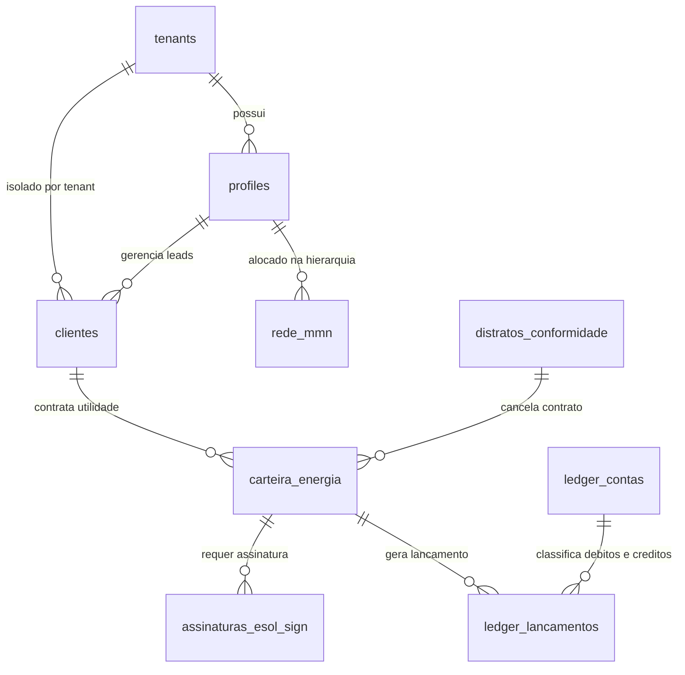

# 🗺️ Mapa Completo do Ecossistema Esol Energy (v10 — Definitivo com Recorrência e Resiliência B2B/B2C)

> Documento oficial de engenharia, arquitetura de negócios, conformidade legal, engenharia financeira e especificação técnica do ecossistema Esol Energy.
> Este documento é o mapa de construção unificado e serve como referência absoluta para todas as implementações de código.

---

## 1. VISÃO DO NEGÓCIO

### O que é a Esol Energy
Uma **plataforma 360° de energia renovável (EnergyTech)** que atua como um ecossistema digital unificado conectando consumidores, consultores de venda, instaladores, engenheiros credenciados e fornecedores de tecnologia. A captação de clientes e expansão da força comercial é impulsionada por um modelo de **Marketing Multinível (MMN) sem taxa de adesão**, baseado em **comissões recorrentes sólidas (royalties de energia)** e **override igualitário em 7 níveis** para crescimento sustentável.

### Pilares Fundamentais de Engenharia & Negócios
1. **Faturamento Direto Triangulado (Split de Pagamentos):** Proteção tributária em mais de 60% por meio do faturamento direto do distribuidor de equipamentos para o cliente, cindindo as notas fiscais de hardware e serviços.
2. **Camada de Resiliência de APIs (Provider Abstraction Layer):** Banco de dados centralizado e proprietário. A Esol detém a propriedade absoluta dos dados do cliente e roteia leads dinamicamente via painel administrativo, permitindo trocar de parceiro fornecedor (usina/comercializadora) sem impacto na rede MMN ou interrupção na telemetria.
3. **Foco 100% em Renda Passiva Recorrente (Royalties de Energia):** Produtos de consumo e utilidade (Geração Distribuída e Mercado Livre de Energia) remuneram a rede exclusivamente sobre a recorrência mensal, gerando uma carteira de renda passiva sólida para os parceiros comerciais.
4. **Selo Verde Esol:** Certificação ecológica exclusiva para os sistemas físicos instalados e homologados pela própria Esol Energy. Garante conformidade com a Lei 14.300/2022, origem limpa e redução de CO₂, sendo vetado para produtos de terceiros por razões de segurança jurídica.
5. **Motor de Assinatura Próprio (Esol Sign - R$ 0/mês):** Validação jurídica interna conforme a MP 2.200-2/2001 e Lei 14.063/2020, eliminando tarifas por documento assinado.
6. **Mecanismo Anti-Fraude e KYC:** Validação facial (Face Match) e cadastral integrada no onboarding do cliente para proteção legal da rede.
7. **Exatidão Centesimal:** Registro de todas as frações financeiras e energéticas com precisão de 4 casas decimais no banco de dados.
8. **Contabilidade em Partida Dobrada (Ledger):** Livro-razão imutável utilizando hashes SHA-256 para auditoria de comissões e splits tributários.
9. **Dois Motores de Comissão (Motor 1 e Motor 2):** Motor 1 (sobre preço de venda) para produtos próprios e Motor 2 (sobre receita/spread da Esol) para intermediações de parceiros, garantindo margem de lucro constante de 54-64% para a Esol.

---

## 2. PERFIS DE USUÁRIO DO ECOSSISTEMA (6 Perfis)

| Perfil | Função | Participa do MMN? |
| :--- | :--- | :--- |
| 👤 **Cliente Final** | Adquire sistemas, compra componentes ou assina planos de desconto de energia. | Opcional (indica e ganha descontos) |
| 🤝 **Consultor / Corretor** | Vende sistemas solares, prospecta contratos recorrentes e constrói equipe de vendas. | ✅ Sim |
| 🔧 **Instalador** | Executa obras de engenharia, instalações físicas e vistorias de O&M. | ✅ Sim |
| 📐 **Engenheiro Parceiro** | Realiza estudos de viabilidade técnica, dimensionamento e assina ART. | ❌ Não (recebe taxa de serviço por projeto) |
| 🏢 **Integrador White-Label** | Licencia a tecnologia Esol para rodar sob marca própria com catálogo personalizado. | ❌ Não (parceria de revenue share) |
| ⚙️ **Administrador** | Gerencia backoffice, conciliação contábil, aprovações e roteamento de APIs. | N/A |

---

## 3. PORTFÓLIO (11 Categorias em 3 Canais de Venda)

### 🟢 CANAL 1 — MMN (8 Categorias com Override Igualitário em 7 Níveis)

| # | Categoria | Tipo de Produto | Motor de Comissão | Modelo de Faturamento |
| :--- | :--- | :--- | :--- | :--- |
| 1 | 🏠 **Sistema Solar Completo** | Projeto turnkey (equipamentos + serviços + ART + Selo Verde) | **Motor 1** (15% TDTC) | Faturamento único / Financiamento |
| 2 | 🛒 **Loja Esol (Produtos)** | E-commerce de kits, inversores, painéis, baterias, EV chargers e IoT. | **Motor 1** (por SKU) | Compra única |
| 3 | ⚡ **Energia por Assinatura (GD)** | Assinatura de créditos solares de usinas parceiras (B2C/B2B leve) | **Motor 2** (36% receita) | **100% Recorrente Mensal** |
| 4 | 🔌 **Mercado Livre de Energia (MLE)** | Agenciamento/migração de PMEs para comercializadora varejista | **Motor 2** (36% receita) | **100% Recorrente Mensal** |
| 5 | 📊 **Monitoramento Remoto** | SaaS de telemetria e análise de desempenho de usinas físicas | **Motor 1** (25% TDTC) | Assinatura mensal |
| 6 | 🔧 **Manutenção (O&M)** | Assistência corretiva, reparos e substituição de inversores | **Motor 1** (10% TDTC) | Serviço único |
| 7 | 🧹 **Limpeza de Painéis** | Lavagem química e física especializada de módulos solares | **Motor 1** (12% TDTC) | Serviço único |
| 8 | 🛡️ **Seguros Solares** | Seguro de danos e perda de receita para sistemas instalados | **Motor 2** (36% receita) | **Recorrente Mensal** |

*Nota: A categoria de "Usados" foi eliminada por falta de escalabilidade inicial. Equipamentos de Internet das Coisas (IoT) foram integrados na Loja Esol (SKUs de automação/medição) e no canal de indicações corporativas B2B.*

### 🟡 CANAL 2 — INDICAÇÃO CORPORATIVA DIRETA (2 Produtos B2B)
leads estratégicos de grande porte repassados ao comercial interno da Esol. Paga comissão de indicação única (2% a 5% da margem Esol) para o consultor direto, sem espalhar na rede MMN.

| # | Categoria | Descrição |
| :--- | :--- | :--- |
| 9 | 💡 **Eficiência Energética & IoT** | Projetos de engenharia e instalação de IoT industrial para redução de perdas energéticas em grandes empresas. |
| 10 | 🏗️ **Usina Solar de Investimento** | Construção e homologação de fazendas solares (GD Comercial) de R$ 500k a R$ 5M+ para investidores. |

### 🔵 CANAL 3 — LICENCIAMENTO (1 Produto)

| # | Categoria | Descrição |
| :--- | :--- | :--- |
| 11 | 🏢 **White-Label** | Licenciamento da infraestrutura digital da Esol para integradores regionais que desejam atuar sob marca própria. |

---

## 4. DETALHAMENTO DE PROCESSO DOS PRODUTOS CHAVE

### 4.1 🏠 Sistema Solar Completo & Selo Verde Esol (Categoria #1)
O cliente final contrata a solução turnkey onde a Esol cuida do dimensionamento, engenharia, fornecimento, logística, instalação e homologação.

```
JORNADA COMPLETA DO CLIENTE — DO PRIMEIRO CONTATO À GERAÇÃO

1. DIMENSIONAMENTO (Motor de Cálculos — Módulo 3)
   O consultor coleta a conta de luz do cliente e o sistema calcula:
   • Consumo médio mensal (kWh)
   • Tarifas da concessionária local (Enel, CPFL, Cemig, etc.)
   • Irradiação solar da cidade (horas de sol pico/dia)
   • Quantidade de painéis necessários (kWp)
   • Potência do inversor
   • Área de telhado necessária (m²)
   • Cálculo do Fio B (Lei 14.300/2022)
   • COSIP do município
   • Payback (em quantos meses o sistema se paga)
   • Economia total em 25 anos
   Resultado: PROPOSTA COMERCIAL em PDF gerada automaticamente

2. ESCOLHA DO KIT (Via Loja Esol)
   O consultor ou cliente escolhe entre:
   • Kit Pronto (combo pré-configurado pelo admin)
   • Kit Personalizado (monta componente por componente)
   O sistema valida compatibilidade e calcula preço do kit.

3. PRECIFICAÇÃO DO SISTEMA (Motor Reverso — Módulo 3)
   O sistema calcula o preço final do PROJETO COMPLETO:
   • Custo do kit (da Loja Esol, com margem do produto)
   • Custo de instalação (mão de obra do instalador)
   • Custo de engenharia (projeto + ART do engenheiro)
   • Frete e logística
   • Impostos (conforme regime tributário vigente da Esol)
   • Overhead operacional
   • TDTC (comissão da rede MMN — 15%)
   • Lucro mínimo configurado pelo administrador
   → O Motor Reverso GARANTE que o lucro mínimo é sempre respeitado.

4. FINANCIAMENTO (se o cliente não pagar à vista)
   O app conecta com financeiras parceiras:
   • BV Financeira, Santander, Solfácil, SOL Fácil, etc.
   • Parcelas que custam MENOS que a conta de luz antiga
   • O cliente ECONOMIZA desde o mês 1, mesmo financiando

5. CONTRATO (Esol Sign — Módulo 14)
   • Assinatura eletrônica com KYC/Face Match
   • Contrato tríplice: Cliente + Esol + Instalador

6. PEDIDO DO KIT (Da Loja Esol → Distribuidor)
   • Kit comprado do distribuidor (Aldo Solar, BelEnergy, Sou Energy)
   • Faturamento DIRETO do distribuidor para o cliente (Split Triangular)
   • Componentes: Painéis + Inversor + Estrutura + Cabos + Proteção

7. PROJETO DE ENGENHARIA
   • Engenheiro parceiro elabora o projeto elétrico e estrutural
   • Emite a ART (Anotação de Responsabilidade Técnica) no CREA
   • Projeta a disposição dos painéis no telhado
   • Calcula o dimensionamento dos cabos e proteções

8. INSTALAÇÃO
   • Instalador credenciado executa a obra (1 a 3 dias)
   • Checklist fotográfico obrigatório no app (antes/durante/depois)
   • Laudo de conclusão em PDF com fotos

9. HOMOLOGAÇÃO (Junto à Concessionária)
   • A Esol ou o engenheiro envia a documentação para a concessionária
   • A concessionária troca o relógio por um medidor bidirecional
   • A partir deste momento, a energia gerada vira CRÉDITOS na conta
   • Prazo: 30 a 90 dias dependendo da concessionária

10. GERAÇÃO E SELO VERDE! 🎉
    • O cliente começa a gerar energia e ver créditos na conta
    • A conta de luz cai para o custo de disponibilidade
    • O cliente recebe digitalmente e em uma placa física o Selo Verde Esol
```

#### Números reais de referência:

| Porte | Potência | Painéis | Investimento | Economia Mensal | Payback | Economia 25 anos |
| :--- | :--- | :--- | :--- | :--- | :--- | :--- |
| Casa pequena | 3-5 kWp | 6-10 | R$ 12.000-20.000 | R$ 250-450 | 3-4 anos | R$ 75.000-135.000 |
| Casa grande | 6-10 kWp | 12-20 | R$ 20.000-40.000 | R$ 450-900 | 3-5 anos | R$ 135.000-270.000 |
| Comércio | 15-50 kWp | 30-100 | R$ 50.000-180.000 | R$ 1.500-6.000 | 3-5 anos | R$ 450.000-1.800.000 |
| Indústria | 50-500 kWp | 100-1.000 | R$ 180.000-1.500.000 | R$ 6.000-60.000 | 4-6 anos | R$ 1.800.000-18.000.000 |

*   **Selo Verde Esol:** Certificação ecológica registrada no banco de dados Esol. Ao concluir a instalação física de um sistema turnkey próprio da Esol, o cliente recebe em seu painel digital e na ART do projeto a chancela do *Selo Verde Esol*, atestando a origem limpa dos componentes, compensação de CO₂ estimada e conformidade legal com a Lei 14.300/2022. Para fins de segurança jurídica, essa chancela é **estritamente restrita** a projetos integralmente vistoriados e validados pelo corpo técnico de engenharia da Esol.
*   **Split Triangular de Pagamento:** Ao fechar a venda, o banco distribuidor liquida o valor do kit diretamente para o distribuidor homologado (ex: Aldo Solar) e o valor de serviços de engenharia/MMN para a Esol, isentando a Esol de tributar o hardware físico.

---

### 4.2 🛒 Loja Esol (Categoria #2)
E-commerce oficial para venda de partes físicas e equipamentos solares sem necessidade de contratação de serviços associados.
*   **MODO 1: KITS PRONTOS (Combos pré-configurados pelo admin)**
    Pacotes com preço fechado, calculado pelo Motor Reverso com margem individual.
    *   *Exemplo:* Kit Solar Residencial 5kWp (10x Painéis + 1 Inversor + Cabos + Estrutura) custa R$ 11.200 do distribuidor. Com lucro_alvo de 20%, o preço de venda é de R$ 14.000.
*   **MODO 2: KIT PERSONALIZADO (Monte seu Kit - Diferencial Esol)**
    O consultor ou cliente seleciona no aplicativo o painel (SKU A), inversor (SKU B) e estrutura (SKU C). O sistema realiza a validação técnica de compatibilidade elétrica (Ex: potência do painel compatível com limites de MPPT do inversor) e calcula o preço sob o Motor Reverso baseando-se no custo individual de cada SKU + margem de lucro_alvo configurada no painel administrativo para cada produto.
*   **MODO 3: COMPONENTES AVULSOS**
    Componentes solares individuais (Painéis, Inversores, Stringbox, cabos e fixadores), baterias residenciais (ex: BYD), carregadores veiculares de várias potências e equipamentos IoT de telemetria.
*   **Automação e IoT:** Inclusão de medidores inteligentes de energia IoT no rol de produtos físicos da loja, permitindo que instaladores ou clientes comprem para equipar usinas existentes.

---

### 4.3 ⚡ Geração Distribuída / Energia por Assinatura (Categoria #3)
Modelo voltado ao mercado B2C e B2B de baixa tensão (Grupo B - residências e pequenos negócios).
*   **100% Recorrência Sem Adesão:** Sem taxa de adesão ou taxas de setup. A Esol conecta o cliente com usinas parceiras (ex: Órigo Energia, Re Energisa, Juntos Energia).
*   **Remuneração:** O cliente recebe créditos mensais na sua fatura da distribuidora (Enel, CPFL, Cemig) e paga um boleto para a usina correspondente aos créditos consumidos com 10-20% de desconto.
*   **Margem Esol:** A usina parceira paga para a Esol uma comissão mensal (ex: 5% a 10% da receita faturada do cliente). Desta receita da Esol, **36%** é enviado para o Motor 2 e distribuído na rede MMN (15% direto ao consultor + 3% por nível em 7 níveis).

---

### 4.4 🔌 Mercado Livre de Energia (Categoria #4)
Modelo voltado ao mercado B2B de alta e média tensão (Grupo A - indústrias, comércios médios e supermercados).
*   **100% Recorrência:** A Esol atua como corretora/agente de comercializadoras varejistas (ex: Enel Comercializadora, Clarke Energia, Auren).
*   **Remuneração:** O cliente passa a pagar duas faturas: uma para a distribuidora local (pelo uso dos fios e postes) e outra para a comercializadora varejista (pela energia no atacado). A economia líquida de energia varia de 15% a 35%.
*   **Margem Esol:** A comercializadora repassa à Esol um valor mensal recorrente por MWh consumido (ex: R$ 3,00/MWh) ou uma porcentagem da fatura de energia do cliente. Deste repasse, **36%** é injetado no Motor 2 do MMN (15% para o vendedor + 3% por nível).
*   **Temporal Safety (Segurança Contratual):** O banco de dados Core da Esol monitora o período de fidelidade (lock-in) de cada contrato de energia (ex: 24 a 36 meses) e os prazos legais de aviso prévio de 180 dias. Se houver necessidade de troca de comercializadora por infração de contrato, o sistema avisa o momento exato de realizar a portabilidade para o novo parceiro sem quebrar regras contratuais.

---

### 4.5 🏗️ Usina Solar para Investimento (Categoria #10 — Indicação B2B)
Um investidor de grande porte contrata a Esol para desenvolver uma usina solar que gerará créditos para o mercado livre ou para compensação distribuída.

```
MODELO DE NEGÓCIO DA USINA SOLAR B2B

O INVESTIDOR:
  • Adquire ou aluga um terreno.
  • Investe R$ 500.000 a R$ 5.000.000+ na construção da usina.
  • A usina gera energia e injeta na rede da concessionária.
  • Os créditos gerados são distribuídos entre vários consumidores.

A ESOL ENERGY:
  • Coordena ou elabora o projeto de engenharia da usina.
  • Fornece os kits/equipamentos via distribuidores parceiros.
  • Cuida da homologação junto à concessionária.
  • Usa a rede MMN para encontrar os consumidores para os créditos (Cat. #3).

A Esol recebe comissão de intermediação direta do investidor (2% a 5% da margem líquida).
```

#### Números reais de referência (Usina de 500 kWp):
*   **Investimento Total:** R$ 1.650.000 (Equipamentos: R$ 1.200.000 | Terreno: R$ 200.000 | Instalação e Engenharia: R$ 250.000)
*   **Geração Mensal:** ~65.000 kWh/mês (Atende cerca de 130 residências)
*   **Receita Líquida do Investidor:** R$ 49.450/mês
*   **Payback:** ~33 meses (~2,8 anos) | ROI: ~36%/ano
*   **Receita Total em 25 anos:** ~R$ 14.800.000
*   **Regulação:** Lei 14.300/2022 (Fio B progressivo).

---

## 5. MODELO DE REDE (MMN) E DOIS MOTORES DE COMISSÃO

### 5.1 Motor Reverso com Proteção de Margem
A fórmula do Motor Reverso garante que o valor final do projeto turnkey ou kits da loja cubra todos os impostos, custos, custos de distribuição MMN (TDTC) e garanta a margem de lucro mínima definida pela Esol:

$$\text{Preço Final (P)} = \frac{C_{\text{fixos}}}{1 - (tributo + overhead + garantia + \text{TDTC}) - lucro_{\text{alvo}}}$$

O administrador configura o `lucro_alvo` (lucro mínimo) e o percentual de comissão da rede (TDTC) por SKU ou tipo de produto no Cockpit Contábil.

---

### 5.2 Override Igualitário — Inovação Esol
Diferente das estruturas tradicionais decrescentes onde os níveis mais profundos pagam percentuais menores, a Esol utiliza **Override Igualitário**: todos os níveis da rede acima do vendedor direto recebem a mesma comissão. Isso motiva a construção de profundidade e a liderança active, sem alterar o custo total da empresa se comparado a um modelo decrescente tradicional.

---

### 5.3 Motor 1: Comissão sobre Preço de Venda
Aplicado a produtos e serviços próprios nos quais a Esol controla a precificação final.

```
OVERRIDE DE 1% POR NÍVEL (Linha Premium & Hardware)
  Cat │ Produto                      │ TDTC  │ Direto │ Override (N1=N2=...=N7)
  ────┼──────────────────────────────┼───────┼────────┼───────────────────────
  #1  │ 🏠 Sistema Solar Completo    │  15%  │    8%  │  1% × 7 níveis = 7%
  #5  │ 📊 Monitoramento Remoto      │  25%  │   18%  │  1% × 7 níveis = 7%

  #2 — LOJA ESOL (TDTC por SKU configurado pelo administrador):
      │ Kits Prontos / Personalizados │  *   │    *   │  1% × 7 níveis = 7%
      │ Baterias / Carregadores EV    │  *   │    *   │  1% × 7 níveis = 7%
      │ Componentes avulsos / IoT     │  *   │    *   │  1% × 7 níveis = 7%
      * = Admin define lucro_alvo e TDTC por produto no Cockpit. O override é sempre 1% por nível.

OVERRIDE DE 0,5% POR NÍVEL (Linha Serviços)
  Cat │ Produto                      │ TDTC  │ Direto │ Override (N1=N2=...=N7)
  ────┼──────────────────────────────┼───────┼────────┼───────────────────────
  #6  │ 🔧 Manutenção                │  10%  │  6,5%  │  0,5% × 7 níveis = 3,5%
  #7  │ 🧹 Limpeza Painéis           │  12%  │  8,5%  │  0,5% × 7 níveis = 3,5%
```

---

### 5.4 Motor 2: Comissão sobre Receita da Esol (Recorrência Pura)
Aplicado a produtos em que a Esol atua como corretora/intermediadora e recebe spread ou comissão da distribuidora parceira.
*   **Base de Cálculo:** Comissão líquida recebida pela Esol.
*   **Distribuição da Receita (TDTC = 36% da receita da Esol):**
    *   **Vendedor Direto:** 15% da receita Esol.
    *   **Override (N1 a N7):** 3% da receita Esol por nível (21% no total).
    *   **Margem Operacional/Lucro Esol:** 64% da receita recebida da parceira.

```
EXEMPLOS PRÁTICOS DE RECORRÊNCIA DO MOTOR 2:

1. Energia por Assinatura (GD):
   Fatura do cliente: R$ 600/mês → Comissão parceira para a Esol (5%): R$ 30,00/mês
   └─ Direto (15%): R$ 4,50/mês
   └─ Override por nível (3%): R$ 0,90/mês por nível
   └─ Margem Retida Esol (64%): R$ 19,20/mês

2. Mercado Livre de Energia (MLE):
   Consumo do cliente: 20 MWh/mês → Comissão parceira para a Esol (R$ 4,00/MWh): R$ 80,00/mês
   └─ Direto (15%): R$ 12,00/mês
   └─ Override por nível (3%): R$ 2,40/mês por nível
   └─ Margem Retida Esol (64%): R$ 51,20/mês

3. Seguros Solares:
   Mensalidade do seguro: R$ 200/mês → Corretagem parceira para a Esol: R$ 30,00/mês
   └─ Direto (15%): R$ 4,50/mês
   └─ Override por nível (3%): R$ 0,90/mês por nível
   └─ Margem Retida Esol (64%): R$ 19,20/mês
```

---

### 5.5 Canal de Indicação Corporativa (Produtos B2B)
Não há distribuição multinível (sem 7 níveis). O consultor recebe uma taxa de indicação direta calculada sobre a margem da Esol.

| Categoria | Produto | Comissão de Indicação | Sobe 7 níveis? |
| :--- | :--- | :--- | :--- |
| **Cat #9** | 💡 Eficiência Energética | 2% a 5% da margem líquida Esol | ❌ Não (apenas direto) |
| **Cat #10** | 🏗️ Usina Solar de Investimento | 2% a 5% da margem líquida Esol | ❌ Não (apenas direto) |

---

## 6. SIMULAÇÃO FINANCEIRA CONSOLIDADA

### O que o Consultor Ganha (Comissão Direta):
*   🏠 Sistema Solar de R$ 30.000 (8% direto) $\rightarrow$ **R$ 2.400,00** (Faturamento único)
*   🛒 Kit avulso 5kWp de R$ 14.000 (8% direto) $\rightarrow$ **R$ 1.120,00** (Faturamento único)
*   🔋 Bateria BYD de R$ 12.000 (8% direto) $\rightarrow$ **R$ 960,00** (Faturamento único)
*   🚗 Carregador EV de R$ 4.500 (11% direto) $\rightarrow$ **R$ 495,00** (Faturamento único)
*   📊 Monitoramento de R$ 59,00/mês (18% direto) $\rightarrow$ **R$ 10,62/mês** (Recorrente)
*   🔧 Manutenção de R$ 500 (6,5% direto) $\rightarrow$ **R$ 32,50** (Único)
*   🧹 Limpeza de R$ 400 (8,5% direto) $\rightarrow$ **R$ 34,00** (Único)
*   ⚡ Energia Assinatura (comissão Esol R$ 30/mês) $\rightarrow$ **R$ 4,50/mês** (Recorrente)
*   🔌 Mercado Livre (comissão Esol R$ 80/mês) $\rightarrow$ **R$ 12,00/mês** (Recorrente)
*   🛡️ Seguro (corretagem Esol R$ 30/mês) $\rightarrow$ **R$ 4,50/mês** (Recorrente)
*   💡 Indicação Eficiência (margem Esol R$ 1.400) $\rightarrow$ **R$ 70,00** (Único B2B)
*   ⚡ Indicação Usina (margem Esol R$ 200.000) $\rightarrow$ **R$ 10.000,00** (Único B2B)

---

### Simulação Mensal — Consultor Ativo com Equipe:
```
GANHOS PESSOAIS (Vendas diretas do consultor):
  • 1 sistema solar completo (turnkey)      = R$ 2.400,00
  • 1 carregador EV de parede               = R$   495,00
  • 20 clientes ativos de monitoramento     = R$   212,40/mês
  • 10 clientes recorrentes de assinatura   = R$    45,00/mês
  • 3 serviços de manutenção                = R$    97,50
  • 2 serviços de limpeza                   = R$    68,00
  • 5 seguros solares ativos                = R$    22,50/mês
  ─────────────────────────────────────────────────────────────
  TOTAL PESSOAL:                              R$ 3.340,40

OVERRIDE DA EQUIPE (Rede de 5 pessoas nos níveis abaixo):
  • 5 sistemas solares: 5 × R$ 30.000 × 1%  = R$ 1.500,00
  • 5 carregadores EV: 5 × R$ 4.500 × 1%    = R$   225,00
  • Monitoramento: 100 clientes × 1%        = R$    59,00/mês
  • Assinaturas: 50 clientes × R$ 30 × 3%   = R$    45,00/mês
  ─────────────────────────────────────────────────────────────
  TOTAL OVERRIDE:                             R$ 1.829,00

  ═════════════════════════════════════════════════════════════
  GANHO TOTAL DO MÊS:                         R$ 5.169,40
  Sendo R$ 383,90 de RENDA PASSIVA recorrente mensal acumulada.
  ═════════════════════════════════════════════════════════════
```

---

### 6.2 PILAR OPERACIONAL & FINANCEIRO: MODELAGEM MATEMÁTICA E DRE DE SUSTENTABILIDADE DO MMN RECORRENTE

Para garantir a viabilidade operacional e a solvência de caixa da Esol Energy em longo prazo, o ecossistema opera sob o princípio da **Sustentabilidade Centesimal Blindada**. A distribuição de comissões na rede MMN do Motor 2 é matematicamente limitada, impedindo que o crescimento geométrico da rede gere passivos superiores à receita bruta recebida.

Abaixo está o detalhamento matemático completo, as fórmulas de fluxo de caixa, as simulações de escala geométrica e a DRE contábil gerencial projetada para o novo sistema.

---

#### 1. Equações de Fluxo de Caixa Unitário (GD e MLE)

A receita da Esol sobre os produtos de utilidade recorrente provém do **Spread de Compensação** (GD) ou da **Taxa de Intermediação por Volume** (MLE).

##### **Equação 1.1: Geração Distribuída (GD) — Faturamento Mensal do Cliente**
Seja $F_c$ o faturamento total da conta de luz do cliente na concessionária sem impostos adicionais, e $C_{inj}$ a parcela correspondente à energia injetada em créditos pela usina solar parceira ($C_{inj} \approx 0,90 \times F_c$).
*   O cliente recebe o desconto contratado $D_{pct}$ (ex: $15\% = 0,15$) sobre os créditos injetados.
*   O valor cobrado do cliente pela usina/geradora ($V_{cob}$) é:
    $$V_{cob} = C_{inj} \times (1 - D_{pct})$$
*   A Esol recebe da usina parceira a comissão contratada de repasse $R_{pct}$ (ex: $7\% = 0,07$) sobre os créditos injetados:
    $$Rec_{bruta} = C_{inj} \times R_{pct}$$

##### **Equação 1.2: Mercado Livre de Energia (MLE) — Faturamento Mensal por Consumo**
Seja $C_{mwh}$ o consumo mensal da PME em MWh (ex: $25\text{ MWh}$) e $T_{com}$ a tarifa de intermediação fixa repassada pela comercializadora à Esol por MWh ativo (ex: $R_{com} = \text{R\$ } 4,00/\text{MWh}$):
    $$Rec_{bruta} = C_{mwh} \times T_{com}$$

##### **Equação 1.3: O Split Contábil (Regra de Ouro do Motor 2)**
Toda receita que entra no caixa da Esol proveniente do Motor 2 ($Rec_{bruta}$) é fracionada em duas partes imutáveis:
1.  **MMN Pool ($Split_{mmn} = 36\%$):** Destinado à remuneração dos consultores.
2.  **Esol Retained ($Split_{esol} = 64\%$):** Destinado ao caixa corporativo.

$$\begin{aligned}
Split_{mmn} &= Rec_{bruta} \times 0,36 \\
Split_{esol} &= Rec_{bruta} \times 0,64
\end{aligned}$$

---

#### 2. Distribuição Centesimal das Comissões MMN (7 Níveis)

A comissão de $36\%$ alocada ao MMN é dividida de forma igualitária para evitar o colapso financeiro da rede e incentivar a liderança ativa.

*   **Vendedor Direto (Nível 0):** Recebe $15\%$ da $Rec_{bruta}$.
*   **Linha de Liderança (Nível 1 ao Nível 7):** Recebe $3\%$ da $Rec_{bruta}$ por nível (totalizando $21\%$).

##### **Tabela Centesimal de Fluxo Financeiro (GD vs. MLE)**

A tabela abaixo simula o faturamento e a distribuição de centavos exatos para um cliente residencial de GD e uma empresa comercial de MLE.

| Parâmetro | Cenário A: GD B2C (Residencial) | Cenário B: MLE B2B (Supermercado) |
| :--- | :--- | :--- |
| **Métrica do Cliente** | Conta de Luz: R\$ 600,00/mês | Consumo: 25 MWh/mês (Fatura: ~R\$ 20k) |
| **Crédito Gerado / Injetado** | R\$ 540,00 em créditos solar | 25 MWh de energia |
| **Desconto do Cliente** | 15% de economia (Economiza: R\$ 81,00) | 20% de economia (Economiza: R\$ 4.000,00) |
| **Comissão Bruta Recebida Esol**| 7% do crédito = **R\$ 37,8000** | R\$ 4,00/MWh = **R\$ 100,0000** |
| **Split MMN Total (36%)** | **R\$ 13,6080** | **R\$ 36,0000** |
| ├── N0: Consultor Direto (15%) | R\$ 5,6700 | R\$ 15,0000 |
| ├── N1: Indicador / Líder 1 (3%) | R\$ 1,1340 | R\$ 3,0000 |
| ├── N2: Líder 2 (3%) | R\$ 1,1340 | R\$ 3,0000 |
| ├── N3: Líder 3 (3%) | R\$ 1,1340 | R\$ 3,0000 |
| ├── N4: Líder 4 (3%) | R\$ 1,1340 | R\$ 3,0000 |
| ├── N5: Líder 5 (3%) | R\$ 1,1340 | R\$ 3,0000 |
| ├── N6: Líder 6 (3%) | R\$ 1,1340 | R\$ 3,0000 |
| └── N7: Líder 7 (3%) | R\$ 1,1340 | R\$ 3,0000 |
| **Split Esol Retido (64%)** | **R\$ 24,1920** | **R\$ 64,0000** |
| ├── Buffer de Inadimplência (10%)| R\$ 3,7800 | R\$ 10,0000 |
| └── Lucro Líquido Esol (54%) | R\$ 20,4120 | R\$ 54,0000 |

---

#### 3. Projeção Geométrica de Escala e Custo Limite (Sustentabilidade MMN)

Diferente de sistemas de MMN insustentáveis que utilizam matrizes binárias ou de ciclo fechado, o modelo da Esol possui uma **Barreira de Pagamento Capped** (Limite Teto).
Como o total pago à rede está travado em $36\%$, o custo total da Esol com comissão por cliente **nunca** excederá $36\%$, independente do tamanho da rede ou do número de níveis abaixo dele. 

##### **Prova Matemática de Limitação:**
Se um cliente fechar no nível $K$ de uma rede, a Esol pagará comissão para o indicador imediato (nível $K$) e para os 7 níveis acima (nível $K-1$, $K-2$, ..., $K-7$).
Se a árvore contiver 100 níveis, os níveis superiores a $K-7$ não recebem comissão por aquela transação específica. O custo marginal de comissionamento de qualquer cliente no ecossistema é constante e igual a:
$$\text{Custo Marginal} = 15\% + (7 \times 3\%) = 36\%$$
Isso garante o **Índice de Sustentabilidade Criptográfica (ISC) da Esol = 1,00 (Sem Risco de Caixa)**.

##### **Simulação Geométrica de Expansão de Rede (Duplicação por Fator 3):**
Se cada consultor recrutar 3 novos consultores ativos, e cada um trouxer uma média de **5 clientes ativos de GD** (comissão média Esol: R\$ 37,80/mês):

$$\begin{aligned}
\text{Consultores por Nível (N)} &= 3^N \\
\text{Total de Consultores na Rede} &= \sum_{N=0}^{7} 3^N = 3.280 \text{ consultores}
\end{aligned}$$

*   **Total de Clientes Ativos na Carteira Global:** $3.280 \times 5 = 16.400\text{ clientes}$
*   **Faturamento Mensal Recebido pela Esol:** $16.400 \times \text{R\$ } 37,80 = \text{R\$ } 619.920,00/\text{mês}$
*   **Repasse Total pago para a Rede MMN (36%):** $\text{R\$ } 223.171,20/\text{mês}$
*   **Caixa Retido pela Esol (64%):** $\text{R\$ } 396.748,80/\text{mês}$
    *   *Buffer de Segurança de Inadimplência (10%):* R\$ 61.992,00/mês
    *   *Margem Livre de Caixa / Lucro da Esol (54%):* R\$ 334.756,80/mês

---

#### 4. Demonstrativo de Resultados do Exercício Projetado (DRE Gerencial do Novo Ecossistema)

Abaixo está o DRE gerencial projetado para a Fase 2, considerando uma rede estável de 1.000 consultores ativos trazendo 5 clientes de GD e 1 cliente de MLE cada um.

```
DEMONSTRATIVO DE RESULTADOS DO EXERCÍCIO (DRE GERENCIAL ANUAL PROJETADO)
Base: 5.000 clientes GD ativos (comissão R$ 37,80) + 1.000 clientes MLE ativos (comissão R$ 100,00)

  RECEITA OPERACIONAL BRUTA (ROB) ───────────────────────► R$ 3.468.000,00
  ├── Receita GD Assinatura (5.000 x R$ 37,80 x 12)        R$ 2.268.000,00
  └── Receita MLE Varejista (1.000 x R$ 100,00 x 12)       R$ 1.200.000,00

  (-) Deduções e Impostos Fiscais (Simples Nacional 6%) ─► R$  (208.080,00)
  ────────────────────────────────────────────────────────────────────────
  RECEITA OPERACIONAL LÍQUIDA (ROL) ─────────────────────► R$ 3.259.920,00

  (-) CUSTO DOS SERVIÇOS PRESTADOS (CSP) ────────────────► R$ (1.248.480,00)
  ├── Repasse MMN N0 (15% da Receita Bruta)                 R$  (520.200,00)
  └── Repasse MMN N1-N7 (21% da Receita Bruta)              R$  (728.280,00)
  ────────────────────────────────────────────────────────────────────────
  LUCRO BRUTO ───────────────────────────────────────────► R$ 2.011.440,00 (61,7% da ROL)

  (-) DESPESAS OPERACIONAIS (SG&A e Infraestrutura) ─────► R$  (144.000,00)
  ├── Servidores (Supabase Team + Cloudflare Workers)      R$   (36.000,00)
  ├── APIs de KYC e Bureau de Crédito                      R$   (48.000,00)
  └── Suporte ao Cliente, Marketing e Administrativo       R$   (60.000,00)

  (-) PROVISÕES / BUFFER DE INADIMPLÊNCIA (10% ROB) ─────► R$  (346.800,00)
  ────────────────────────────────────────────────────────────────────────
  LUCRO LÍQUIDO ANUAL DA ESOL ENERGY ────────────────────► R$ 1.520.640,00 (46,6% da ROL)
```

Este DRE prova a sustentabilidade estrutural do negócio: mesmo pagando comissão de 7 níveis na rede e provisionando 10% para inadimplência, a Esol Energy mantém um Lucro Líquido anual de **R\$ 1.520.640,00** (cerca de R\$ 126.720,00 mensais) na Fase 2 de crescimento, garantindo solidez para investir no desenvolvimento contínuo da tecnologia.

---

## 7. COMPARATIVO COMPETITIVO (Esol vs. iGreen)

| Métrica | iGreen | Esol Energy | Vantagem Esol |
| :--- | :--- | :--- | :--- |
| **Taxa de Entrada** | R$ 1.200,00 | **R$ 0,00** | Renda democrática |
| **Catálogo de Produtos** | 2 categorias | **8 categorias MMN** | Portfólio abrangente |
| **Loja de Hardware** | ❌ Não possui | **✅ Sim (4 modos de compra)** | E-commerce próprio |
| **Kit Personalizado** | ❌ Não possui | **✅ Sim (Montagem Inteligente)** | Flexibilidade de escolha |
| **Indicações Corporativas** | Não disponível | **✅ 2 (Usinas e Eficiência)** | Alta comissão B2B |
| **Níveis de Profundidade** | 5 níveis (decrescente) | **7 níveis (igualitário)** | Maior ganho na base |
| **Comissão Nível 7 vs N1** | Nível 7 reduzido | **Nível 7 = Nível 1 (1%)** | Justo e igualitário |
| **Garantia de Margem** | Margem flutuante | **✅ Motor Reverso com Trava** | Proteção contra prejuízo |
| **Resiliência do Fornecedor** | Preso a um parceiro | **✅ Camada de Rota Dinâmica** | Blindagem contra quebra |
| **Selo Verde** | Certificação terceirizada | **✅ Selo Verde Esol (Turnkey)** | Autoridade de marca |

---

## 8. MÓDULOS DA PLATAFORMA DIGITAL (15 Módulos)

### Módulo 1: SITE PÚBLICO (Landing Page & Simulador B2C)
*   **Landing Page de Alta Conversão:** Estrutura responsiva com depoimentos, blog de notícias do mercado solar e FAQ.
*   **Simulador Simplificado:** Entrada de consumo em R$ e localização (Estado) para calcular a economia aproximada em usina solar, geração por assinatura ou mercado livre.
*   **Captura de Leads:** Integração direta com o CRM do consultor que compartilhou o link personalizado.

### Módulo 2: PAINEL DO CONSULTOR (CRM & Extrato de Recorrência)
*   **Dashboard Comercial:** Acompanhamento do funil de vendas, leads pendentes, propostas enviadas e convertidas.
*   **Link de Indicação Exclusivo:** Geração de convites para novos consultores (link de cadastro na árvore de rede).
*   **Minha Carteira de Energia:** Exibição da receita passiva acumulada e telemetria da carteira de clientes (MWh gerados pelos clientes do MMN).

### Módulo 3: MOTOR DE CÁLCULOS (Engine de Dimensionamento & Roteador de Leads)
*   **Engine de Dimensionamento:** Motor de cálculo técnico parametrizado com tabelas tarifárias da ANEEL (90+ concessionárias) e irradiação solar de 5.500+ municípios brasileiros.
*   **Roteador de APIs (Abstrator):** Camada de software que lê o consumo e o CEP do lead e redireciona os dados para o endpoint do fornecedor que oferece a maior comissão recorrente na região (Ex: Órigo em SP, Cemig Sim em MG).
*   **Validação de Compatibilidade:** Valida a compatibilidade elétrica de painéis (corrente/tensão de circuito aberto) com os limites de MPPT do inversor no kit personalizado.

### Módulo 4: REDE MMN (Gestão da Árvore de Profundidade)
*   **Árvore Hierárquica:** Processamento de relacionamentos de indicação em 7 níveis de profundidade estruturado no PostgreSQL via extensão `ltree`.
*   **Conciliação MMN:** Separação de comissões por categoria: 1% de override por nível (Motor 1) e 3% de override por nível (Motor 2).

### Módulo 5: FINANCEIRO & LEDGER CONTÁBIL
*   **Ledger Contábil de Partida Dobrada:** Registro de débitos e créditos imutáveis (com hashes SHA-256 de bloco de transação).
*   **Precisão Numérica:** Precisão de 4 casas decimais para evitar perdas ou inconsistências centesimais ao dividir frações de centavos entre múltiplos níveis da rede.
*   **Gestão de Saldos:** Controle de saques, tarifas bancárias de transferência e retenção provisória de comissões sob carência.

### Módulo 6: PÓS-VENDA & O&M
*   **Agendamento Técnico:** Acompanhamento de vistorias, manutenções corretivas e agendamentos de limpeza.
*   **Módulo de Telemetria:** Dashboard integrado com inversores físicos para monitorar a geração de energia em tempo real (SaaS de monitoramento).

### Módulo 7: LOJA ESOL (E-Commerce & Montagem de Kits)
*   **Catalogo Solar:** Gerenciamento de combos, painéis, inversores, estruturas, carregadores EV, baterias e sensores inteligentes.
*   **Checkout Reverso:** Cálculo de preço final do carrinho de compras usando a alíquota individual de comissão da rede (TDTC) e lucro_alvo do SKU configurado pelo administrador.

### Módulo 8: INICIATIVAS B2B (Módulo de Indicações Corporativas)
*   **Auditoria de Eficiência:** Formulário para indicar indústrias para consultoria energética e retrofit LED.
*   **Prospecção de Usinas:** Envio de dados de investidores de fazendas solares (GD Comercial).

### Módulo 9: PORTAL DO INSTALADOR (Aplicativo de Campo)
*   **Dashboard Operacional:** Visualização de ordens de serviço pendentes, em andamento e concluídas.
*   **Checklist Fotográfico de Qualidade:** Envio obrigatório de fotos da estrutura mecânica, cabeamento CC/CA, inversor e stringbox instalada. Liberação automática do pagamento de instalação somente após checklist aprovado.

### Módulo 10: PORTAL DA ENGENHARIA (Aprovação Técnico-Operacional)
*   **Fila de Projetos:** Engenheiros credenciados recebem dados de novos contratos para cálculo estrutural e projeto elétrico.
*   **Emissão de Documentação:** Centralizador de upload de memoriais descritivos e arquivos de Anotação de Responsabilidade Técnica (ART).

### Módulo 11: MÓDULO WHITE-LABEL
*   **Multi-Tenancy:** Customização visual (logos, cores primárias, domínio próprio) e catálogo próprio de produtos para integradores regionais licenciados.

### Módulo 12: COMUNICAÇÃO (WhatsApp e E-mail)
*   **WhatsApp Redirect:** Links parametrizados com dados dinâmicos do lead/proposta para facilitação do contato direto do consultor.
*   **E-mails Automáticos:** Disparo de notificações e contratos de forma gratuita via Resend ou Brevo.

### Módulo 13: MOTOR DE CONTRATOS (Esol Sign - R$ 0/mês)
*   **Esol Sign:** Motor próprio de assinatura digital, capturando assinaturas biométricas (selfie com documento de identidade) e dados técnicos do dispositivo (IP, geolocalização e data/hora oficial sincronizada pelo NTP.br).
*   **Verificação cadastral (KYC):** Validação automatizada de dados em bureaus governamentais para prevenção de fraudes em CPFs/CNPJs.

### Módulo 14: COCKPIT CONTÁBIL GERENCIAL (Módulo ERP)
*   **Planejamento Tributário:** Painel para alternância e monitoramento dos CNPJs ativos e regras do regime tributário (MEI, Simples Nacional ou Lucro Presumido).
*   **Integração Contábil:** Sincronização automatizada com ERP brasileiro (Omie/Bling) para controle de compras, faturamento triangular e eSocial de colaboradores.

### Módulo 15: ADMINISTRAÇÃO & BACKOFFICE CENTRAL
*   **Painel Admin:** Gerenciamento master de usuários, parametrização de comissões MMN, reajustes tarifários das concessionárias e conciliação financeira do ledger.

---

## 9. CONFORMIDADE LEGAL COMPLETA

### 9.1 Tributária
*   **Operação Triangular de Split:** Emissão de nota fiscal de mercadorias emitida pelo distribuidor diretamente ao consumidor final, associada à emissão de NFS-e de intermediação comercial emitida pela Esol (conforme a IN RFB 1.861/2018), eliminando a tributação de bitributação de mercadorias.
*   **Monitoramento MEI:** Alertas automáticos no Cockpit Contábil sobre a proximidade do teto de faturamento do MEI (R$ 81.000,00/ano) com fluxo assistido de transição para o Simples Nacional.

### 9.2 Trabalhista (Anti-Vínculo CLT)
*   Contratos de parceria comercial de corretores e instaladores cadastrados na rede MMN estruturados com base na Lei 13.467/2017 (Reforma Trabalhista) e no Código Civil Brasileiro.
*   Presença obrigatória de cláusulas de **não-exclusividade**, **não-pessoalidade** (o parceiro pode delegar a terceiros a venda/instalação) e **autonomia de horários** (sem subordinação trabalhista), com remuneração atrelada exclusivamente a resultados (comissões/faturamento).

### 9.3 Consumidor (CDC Art. 49) — Retenção & Cancelamento Inteligente
*   **Janela de Cancelamento:** Emissão automática de link de cancelamento no painel do cliente apenas nos primeiros 7 dias após a compra (Direito de Arrependimento).
*   **Fluxo de Retenção:** Ao clicar em cancelar, o sistema redireciona o cliente para um canal de atendimento direto no WhatsApp com um consultor especialista em retenção da Esol.
*   **Cancelamento Administrativo:** Se a rescisão persistir, o sistema executa o estorno no ledger contábil, debita temporariamente o saldo comissionado dos consultores da rede nos 7 níveis, estorna a NFS-e integrada no ERP e emite o distrato digital em PDF via *Esol Sign*.

### 9.4 LGPD (Lei 13.709/2018)
*   Criptografia assimétrica de dados pessoais sensíveis (Documentos e Selfie) no banco de dados Supabase via módulo `pgcrypto`.
*   Armazenamento de fotos de documentos em bucket privado (Cloudflare R2) com chaves de acesso assinadas que expiram em 10 minutos. Descarte total das imagens biométricas de KYC após a validação inicial do cadastro.

### 9.5 MMN Legal (Lei 13.966/2019)
*   Garantia contra pirâmides financeiras: A comissão da rede é gerada unicamente pela venda de produtos e serviços reais de energia e hardware.
*   Cadastro gratuito e voluntário, sem exigência de compra mínima de produtos ou kits iniciais para liberação de comissionamentos.

---

## 10. ARQUITETURA TÉCNICA E BANCO DE DADOS CORE

### 10.1 Infraestrutura de Nuvem (Custo Zero de Início)
*   **Hosting Front-End:** Cloudflare Pages (deploy contínuo de PWA e telas).
*   **Edge Functions:** Cloudflare Workers (execução rápida do Motor Reverso e Esol Sign).
*   **Cofre de Dados:** Banco de dados Supabase (PostgreSQL para dados relacionais, Auth para tokens JWT, Storage de PDFs).
*   **Armazenamento de Imagens:** Cloudflare R2 (storage de fotos e documentos com 10GB grátis).
*   **Integração ERP:** APIs RESTful (Bling ou Omie).

---

### 10.2 PILAR OPERACIONAL & TÉCNICO: ARQUITETURA DO BANCO DE DADOS CORE E MULTI-TENANCY

Para o novo sistema da Esol Energy, a estrutura de dados foi desenhada sob os pilares da **Alta Escalabilidade de Rede**, **Isolamento de Tenants (White-Label)** e **Imutabilidade Contábil**.



---

#### 1. Arquitetura de Isolamento White-Label (Multi-Tenancy)
O sistema compartilha o mesmo banco de dados PostgreSQL físico, mas garante o isolamento lógico estrito por meio de **Row Level Security (RLS)**.
*   A tabela `tenants` registra cada integrador licenciado (cores, logo, domínio).
*   Toda tabela operacional (clientes, carteiras, ledger) possui uma coluna `tenant_id`.
*   As políticas de RLS filtram automaticamente as linhas usando o parâmetro de contexto do Supabase:
    ```sql
    CREATE POLICY "Isolamento por Tenant" ON public.clientes
      FOR ALL USING (tenant_id = auth.jwt()->'user_metadata'->>'tenant_id'::uuid);
    ```

---

#### 2. Hierarquia de Rede MMN com `ltree`
Para processar árvores de indicação com milhões de consultores sem degradar a performance do banco de dados, o PostgreSQL utiliza a extensão nativa `ltree`.
*   O campo `path` armazena o caminho de indicação de forma indexada por árvore de sufixo (ex: `top.lider1_id.lider2_id.consultor_id`).
*   **Busca de Downline Completo (Todos os níveis abaixo):**
    ```sql
    SELECT usuario_id FROM public.rede_mmn WHERE path <@ 'top.lider1_id';
    ```
*   **Busca de Uplines (Os 7 níveis acima para pagamento de comissão):**
    ```sql
    SELECT usuario_id FROM public.rede_mmn WHERE path @> 'top.lider1_id.lider2_id.consultor_id' AND nivel >= (consultor_nivel - 7);
    ```

---

#### 3. Integridade Criptográfica do Ledger (Blockchain-like Ledger)
Para evitar fraudes ou edições de saldos de comissão de MMN por administradores mal-intencionados, cada linha na tabela `ledger_lancamentos` possui um campo `hash_transacao`.
*   O hash do lançamento $N$ é gerado concatenando o ID, o valor, as contas de débito/crédito, a data e o hash do lançamento anterior ($N-1$):
    $$\text{Hash}_N = \text{SHA256}(ID_N \ || \ \text{Hash}_{N-1} \ || \ \text{Valor}_N \ || \ \text{ContaDeb}_N \ || \ \text{ContaCred}_N \ || \ \text{Timestamp}_N)$$
*   Caso qualquer saldo histórico seja modificado manualmente via banco, a corrente de hashes é quebrada, acionando alertas vermelhos no painel do administrador.

---

#### 4. Esquema DDL Completo e Fiel (Supabase/PostgreSQL)

Abaixo está a estrutura SQL DDL completa para a inicialização e provisionamento do banco de dados do novo ecossistema.

```sql
-- Habilita extensões obrigatórias
CREATE EXTENSION IF NOT EXISTS ltree;
CREATE EXTENSION IF NOT EXISTS pgcrypto;

-- 1. Tabela de Tenants (Multi-Tenancy)
CREATE TABLE public.tenants (
  id uuid PRIMARY KEY DEFAULT gen_random_uuid(),
  nome_fantasia text NOT NULL,
  razao_social text NOT NULL,
  cnpj text UNIQUE NOT NULL,
  dominio text UNIQUE, -- Ex: 'marcaA.esolenergy.com.br'
  config_visual jsonb DEFAULT '{}'::jsonb, -- Configurações de cores, logo, favicon
  created_at timestamptz DEFAULT now(),
  updated_at timestamptz DEFAULT now()
);

-- 2. Perfis de Usuário (Profiles)
CREATE TABLE public.profiles (
  id uuid PRIMARY KEY REFERENCES auth.users(id) ON DELETE CASCADE,
  tenant_id uuid REFERENCES public.tenants(id) ON DELETE CASCADE,
  nome text NOT NULL,
  cpf_cnpj text NOT NULL,
  telefone text,
  avatar_url text,
  contrato_assinado boolean DEFAULT false,
  onboarding_completo boolean DEFAULT false,
  comissao_percent numeric(5, 2) DEFAULT 8.00, -- Margem individual corretor no Motor 1
  dados_bancarios jsonb DEFAULT '{}'::jsonb, -- PIX, Banco, Agência, Conta
  created_at timestamptz DEFAULT now(),
  updated_at timestamptz DEFAULT now()
);

-- 3. Cargos e Roles do Usuário
CREATE TYPE public.app_role AS ENUM (
  'admin',
  'corretor',
  'instalador',
  'engenheiro',
  'financeiro',
  'pos_vendas'
);

CREATE TABLE public.user_roles (
  id uuid PRIMARY KEY DEFAULT gen_random_uuid(),
  user_id uuid REFERENCES public.profiles(id) ON DELETE CASCADE,
  role public.app_role NOT NULL,
  created_at timestamptz DEFAULT now(),
  UNIQUE (user_id, role)
);

-- 4. Árvore de Hierarquia MMN
CREATE TABLE public.rede_mmn (
  id uuid PRIMARY KEY DEFAULT gen_random_uuid(),
  usuario_id uuid REFERENCES public.profiles(id) ON DELETE CASCADE UNIQUE,
  patrocinador_id uuid REFERENCES public.profiles(id),
  path public.ltree NOT NULL, -- Ex: 'top.user1_uuid.user2_uuid'
  nivel integer NOT NULL,
  created_at timestamptz DEFAULT now()
);
CREATE INDEX idx_rede_mmn_path ON public.rede_mmn USING gist(path);

-- 5. CRM: Cadastro de Clientes / Leads
CREATE TYPE public.cliente_status_tipo AS ENUM (
  'novo',
  'contato',
  'visita_agendada',
  'proposta_enviada',
  'negociacao',
  'contrato_assinado',
  'instalacao',
  'concluido',
  'perdido'
);

CREATE TABLE public.clientes (
  id uuid PRIMARY KEY DEFAULT gen_random_uuid(),
  tenant_id uuid REFERENCES public.tenants(id) ON DELETE CASCADE,
  corretor_id uuid REFERENCES public.profiles(id),
  nome_completo text NOT NULL,
  documento text NOT NULL, -- CPF/CNPJ criptografado
  contato_telefone text NOT NULL,
  contato_email text,
  cidade text NOT NULL,
  estado varchar(2) NOT NULL,
  status public.cliente_status_tipo DEFAULT 'novo' NOT NULL,
  created_at timestamptz DEFAULT now(),
  updated_at timestamptz DEFAULT now()
);

-- 6. Carteira de Energia (GD e MLE)
CREATE TYPE public.carteira_status AS ENUM (
  'novo',
  'analise_viabilidade',
  'aguardando_documentos',
  'proposta_enviada',
  'contrato_assinado',
  'protocolado_distribuidora',
  'homologado',
  'ativo',
  'suspenso',
  'cancelado'
);

CREATE TYPE public.mercado_tipo AS ENUM ('gd', 'mle');

CREATE TABLE public.carteira_energia (
  id uuid PRIMARY KEY DEFAULT gen_random_uuid(),
  tenant_id uuid REFERENCES public.tenants(id) ON DELETE CASCADE,
  cliente_id uuid REFERENCES public.clientes(id) ON DELETE CASCADE,
  corretor_id uuid REFERENCES public.profiles(id),
  tipo_mercado public.mercado_tipo NOT NULL,
  fornecedor_parceiro_id text NOT NULL, -- 'origo', 'reverde', 'clarke', 'enel'
  status public.carteira_status DEFAULT 'novo' NOT NULL,
  fatura_media_mensal numeric(15, 2) NOT NULL,
  consumo_mensal_kwh numeric(15, 2) NOT NULL,
  percentual_desconto_contratado numeric(5, 2) NOT NULL,
  data_assinatura date,
  data_inicio_fornecimento date,
  data_fim_fidelidade date,
  data_protocolo_denuncia date, -- MLE: Prazo de 180 dias de aviso prévio
  historico_faturas jsonb DEFAULT '[]'::jsonb, -- Array de faturas mensais para auditoria
  created_at timestamptz DEFAULT now(),
  updated_at timestamptz DEFAULT now()
);

-- 7. Esol Sign - Registro de Assinaturas Criptográficas
CREATE TYPE public.documento_categoria AS ENUM (
  'contrato_parceria',
  'termo_compromisso_equipe',
  'proposta_solar_turnkey',
  'adesao_gd',
  'denuncia_contrato_mle',
  'distrato_cancelamento'
);

CREATE TYPE public.kyc_status AS ENUM ('pending', 'approved', 'rejected', 'bypass');

CREATE TABLE public.assinaturas_esol_sign (
  id uuid PRIMARY KEY DEFAULT gen_random_uuid(),
  tenant_id uuid REFERENCES public.tenants(id) ON DELETE CASCADE,
  user_id uuid REFERENCES auth.users(id), -- Signatário
  tipo_documento public.documento_categoria NOT NULL,
  referencia_id uuid NOT NULL, -- Link genérico (propostas, clientes, carteira)
  conteudo_hash text NOT NULL, -- SHA-256 do contrato
  assinatura_url text NOT NULL, -- Assinatura física desenhada
  selfie_url text, -- Selfie KYC
  documento_frente_url text,
  documento_verso_url text,
  ip_origem text NOT NULL,
  user_agent text NOT NULL,
  latitude numeric(10, 8),
  longitude numeric(11, 8),
  timestamp_ntp timestamptz DEFAULT now(),
  facematch_status public.kyc_status DEFAULT 'pending',
  facematch_score numeric(5, 2),
  created_at timestamptz DEFAULT now()
);

-- 8. Plano de Contas do Ledger Contábil (Partida Dobrada)
CREATE TYPE public.ledger_tipo_conta AS ENUM ('ativo', 'passivo', 'patrimonio', 'receita', 'despesa');

CREATE TABLE public.ledger_contas (
  id uuid PRIMARY KEY DEFAULT gen_random_uuid(),
  tenant_id uuid REFERENCES public.tenants(id) ON DELETE CASCADE,
  codigo text NOT NULL, -- Ex: '1.1.01.01'
  nome text NOT NULL,
  tipo public.ledger_tipo_conta NOT NULL,
  saldo numeric(15, 2) DEFAULT 0.00 NOT NULL,
  created_at timestamptz DEFAULT now(),
  updated_at timestamptz DEFAULT now(),
  UNIQUE (tenant_id, codigo)
);

-- 9. Lançamentos Contábeis do Ledger com Hashing de Encadeamento
CREATE TABLE public.ledger_lancamentos (
  id uuid PRIMARY KEY DEFAULT gen_random_uuid(),
  tenant_id uuid REFERENCES public.tenants(id) ON DELETE CASCADE,
  data_lancamento timestamptz DEFAULT now() NOT NULL,
  descricao text NOT NULL,
  conta_debito_id uuid REFERENCES public.ledger_contas(id) NOT NULL,
  conta_credito_id uuid REFERENCES public.ledger_contas(id) NOT NULL,
  valor numeric(15, 2) NOT NULL CHECK (valor > 0),
  origem_tipo text NOT NULL, -- 'faturamento_pedido', 'repasse_mmn', 'cancelamento'
  origem_id uuid NOT NULL,
  hash_transacao text NOT NULL UNIQUE, -- SHA-256 encadeado
  hash_anterior text,
  created_at timestamptz DEFAULT now()
);

-- 10. Fluxo de Conformidade e Distratos
CREATE TABLE public.distratos_conformidade (
  id uuid PRIMARY KEY DEFAULT gen_random_uuid(),
  tenant_id uuid REFERENCES public.tenants(id) ON DELETE CASCADE,
  carteira_energia_id uuid REFERENCES public.carteira_energia(id) ON DELETE CASCADE,
  motivo text NOT NULL,
  descricao text,
  assinatura_distrato_id uuid REFERENCES public.assinaturas_esol_sign(id),
  estorno_comissoes_concluido boolean DEFAULT false,
  status text DEFAULT 'pendente' NOT NULL, -- 'pendente', 'aprovado', 'rejeitado'
  created_at timestamptz DEFAULT now(),
  updated_at timestamptz DEFAULT now()
);
```

---

#### 5. Triggers Globais e Automações de Segurança

##### **Automação 5.1: Recálculo em Partida Dobrada**
Sempre que um lançamento contábil é inserido, o saldo das contas envolvidas é atualizado de forma sincronizada:
```sql
CREATE OR REPLACE FUNCTION public.atualizar_saldos_contas_trigger()
RETURNS TRIGGER AS $$
BEGIN
  -- Debita valor da conta débito
  UPDATE public.ledger_contas 
  SET saldo = saldo + NEW.valor, updated_at = now()
  WHERE id = NEW.conta_debito_id;

  -- Credita valor na conta crédito (deduz se ativo/despesa, incrementa se passivo/receita)
  UPDATE public.ledger_contas 
  SET saldo = CASE 
    WHEN tipo IN ('ativo', 'despesa') THEN saldo - NEW.valor
    ELSE saldo + NEW.valor
  END, updated_at = now()
  WHERE id = NEW.conta_credito_id;

  RETURN NEW;
END;
$$ LANGUAGE plpgsql SECURITY DEFINER;

CREATE TRIGGER trg_atualizar_saldos_ledger
  AFTER INSERT ON public.ledger_lancamentos
  FOR EACH ROW
  EXECUTE FUNCTION public.atualizar_saldos_contas_trigger();
```

##### **Automação 5.2: Encadeamento de Hash (Integridade Criptográfica)**
Gera o hash encadeado do lançamento antes de salvar na tabela:
```sql
CREATE OR REPLACE FUNCTION public.gerar_hash_lancamento_trigger()
RETURNS TRIGGER AS $$
DECLARE
  v_hash_anterior text;
BEGIN
  -- Coleta o hash da última transação do tenant
  SELECT hash_transacao INTO v_hash_anterior
  FROM public.ledger_lancamentos
  WHERE tenant_id = NEW.tenant_id
  ORDER BY data_lancamento DESC, created_at DESC
  LIMIT 1;

  NEW.hash_anterior := COALESCE(v_hash_anterior, 'GENESIS_BLOCK');
  
  -- Calcula o hash SHA-256 concatenando os dados do lançamento
  NEW.hash_transacao := encode(digest(
    NEW.id::text || 
    NEW.hash_anterior || 
    NEW.valor::text || 
    NEW.conta_debito_id::text || 
    NEW.conta_credito_id::text || 
    NEW.data_lancamento::text,
    'sha256'
  ), 'hex');

  RETURN NEW;
END;
$$ LANGUAGE plpgsql SECURITY DEFINER;

CREATE TRIGGER trg_gerar_hash_lancamento
  BEFORE INSERT ON public.ledger_lancamentos
  FOR EACH ROW
  EXECUTE FUNCTION public.gerar_hash_lancamento_trigger();
END;
$$;
```


---

## 11. ESCALABILIDADE PROGRESSIVA (Gestão de Custos)

*   **FASE 1 (0 $\rightarrow$ 5.000 usuários):** Cloudflare Free + Supabase Free + WhatsApp Redirect + Resend Free (Custo total: **R$ 0,00/mês**).
*   **FASE 2 (5.000 $\rightarrow$ 50.000 usuários):** Cloudflare Free + Supabase Pro ($25/mês) + Bling ERP ($30/mês) (Custo total: **~R$ 280,00/mês**).
*   **FASE 3 (50.000 $\rightarrow$ 500.000 usuários):** Cloudflare Pro + Supabase Team ($619/mês) + Omie ERP Enterprise (Custo total: **~R$ 4.000,00/mês**).

---

## 12. RESUMO EXECUTIVO (Métricas de Excelência)

```
┌────────────────────────────────────────────────────────────────────────┐
│                   ESOL ENERGY — ARQUITETURA CORE v10                   │
├────────────────────────────────────────────────────────────────────────┤
│                                                                        │
│  PRODUTOS MMN:        8 categorias (turnkey, loja, GD, MLE,            │
│                       monitoramento, O&M, limpeza, seguros).           │
│  RECORRÊNCIA ENERGIA: 100% de comissões recorrentes (GD e MLE) via     │
│                       Motor 2 (sem taxa de adesão).                    │
│  SELAGEM ECOLÓGICA:   Selo Verde Esol restrito aos projetos turnkey    │
│                       próprios (Cat #1).                               │
│  RESILIÊNCIA DE APIs: Camada Abstrata Roteadora de Leads (Supabase DB) │
│                       independente de fornecedores.                    │
│  MMN HIERARQUIA:      7 níveis de Override Igualitário.                │
│  ARQUIVOS DE MÓDULO:  15 módulos funcionais de software.               │
│  CONFORMIDADE:        CLT (trabalhista) + LGPD + CDC + ANEEL.          │
│  INFRAESTRUTURA:      Cloudflare Workers + Supabase DB + Bling/Omie.   │
│                                                                        │
└────────────────────────────────────────────────────────────────────────┘
```

---

> [!IMPORTANT]
> Este é o **Mapa de Construção v10 (Definitivo)** — o "o quê" e o "com quê".
> O próximo passo direto na conversa é iniciar o planejamento detalhado das tarefas e do cronograma na implementação da arquitetura no backend.
